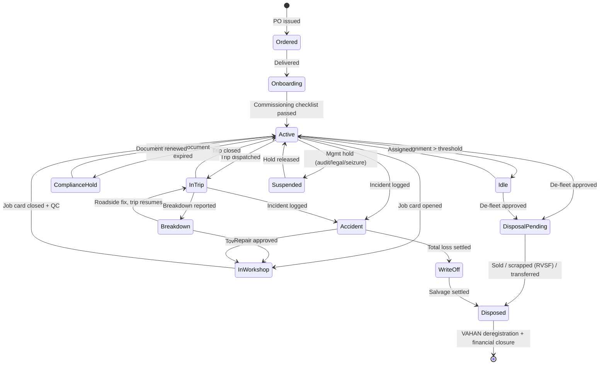
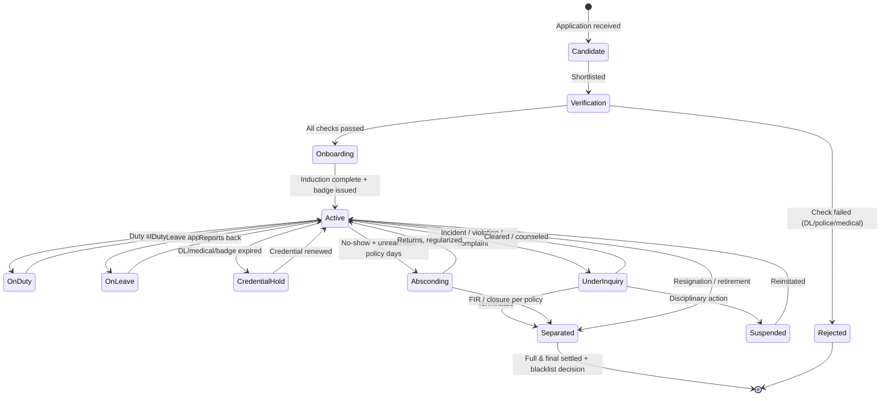
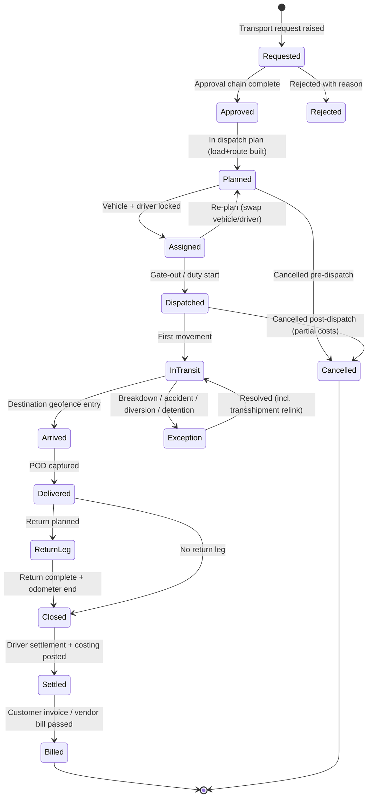

# Enterprise Fleet Management System (FMS)
## Phase 1 — Domain Research & Industry Analysis

| Document Control | |
|---|---|
| Document | Phase 1 of 6 — Domain Research & Industry Analysis |
| Product | Enterprise Fleet Management System (working name: **FleetOS** — final name TBD) |
| Version | 1.0 |
| Date | 13 July 2026 |
| Status | For review |
| Audience | Product, Design, Engineering, QA, DevOps, PMO |
| Market strategy | **India-first, global-ready** — deep Indian compliance as core; compliance engine architected as pluggable regional packs (US FMCSA/ELD, EU tachograph) |
| Downstream phases | Phase 2 BRD → Phase 3 PRD → Phase 4 System Design → Phase 5 UI/UX → Phase 6 Roadmap |

---

## 0. Executive Summary

### 0.1 What this document is

This is the research foundation for an enterprise-grade, modular Fleet Management System. Nothing in later phases (BRD, PRD, system design) should contradict what is documented here. It covers three things: **(A–F)** how transport departments actually operate across ten industry verticals, explained down to the level of documents, registers, cash flows, and edge cases; **(G–H)** a competitive analysis of 17 fleet software products with verified 2025–26 facts, and the white space they leave open; **(I)** a verified regulatory fact base (India, July 2026, plus US/EU basics) that the compliance engine must encode.

### 0.2 The market

The global fleet management software market is ~US$28–32B in 2025–26, growing at a 15–19% CAGR through 2030+. The India fleet management software market is ~US$1.69B (2025) → ~US$1.91B (2026), growing ~13% CAGR to ~US$3.5B by 2031; the India telematics-and-fleet-safety segment is growing even faster (~25% CAGR) because regulation (AIS-140 VLT mandate, VAHAN-linked fitness renewal, e-way bill, FASTag) has converted telematics from an optimization tool into compulsory infrastructure. Consolidation is active: Powerfleet has rolled up MiX Telematics and Fleet Complete (2.6M subscribers); Vontier is divesting Teletrac Navman; Motive filed for IPO in December 2025; LocoNav's India business was acquired by Sensorise in October 2025. The AI arms race (agentic assistants, AI maintenance triage, AI routing) is concentrated in Samsara, Motive, Geotab, and — in India — Fleetx.

### 0.3 The core insight

Fleet software today is fragmented into four families, and **no product unifies them for an enterprise transport department**:

| Family | Examples | What they do well | What they ignore |
|---|---|---|---|
| Telematics-first | Samsara, Geotab, Motive, Verizon Connect, Lytx | Live tracking, video safety, ELD | Transport requests, vendor fleets, billing, India compliance, workshop depth |
| Maintenance-first | Fleetio, AUTOsist | PM schedules, work orders, parts | Tracking (they integrate), trips, dispatch, compliance, vendor ops |
| Enterprise TMS | SAP TM, Oracle OTM | Freight planning, carrier settlement, ERP finance | Owned-fleet operations, drivers, workshop, employee transport; $250K–$1.5M implementations lock out mid-market |
| India-compliance-first | Fleetx, LocoNav, Fleetable, Fleetroot | FASTag/e-way bill/AIS-140, driver khata, tyres | Enterprise-grade RBAC/multi-entity, UX polish, employee transport, approval workflows, open APIs |

An enterprise transport department — whether in a cement plant, a mining contractor, a university, or an IT park — runs **owned vehicles + hired/vendor vehicles + employee transportation + statutory compliance + a workshop + fuel + budgets** as one department. Today it stitches this together from a telematics portal, Excel, WhatsApp groups, gate registers, and Tally. That stitched gap is the product.

### 0.4 Top findings (each is expanded in the body)

1. **The transport department is a cost center run like a mini-enterprise** — it has procurement (vehicles, spares, fuel, vendors), operations (trips, duties, dispatch), HR (drivers), finance (billing, settlements, budgets), and compliance (8–10 document types per vehicle). Software that models only "vehicles + trips" fails on day one.
2. **Hired/vendor vehicles are 30–70% of enterprise fleet movements** in manufacturing, FMCG, and mining — yet every major global product models only owned assets. Vendor fleet management (rate cards, placement compliance, hire billing, deductions) is the single largest functional white space.
3. **Compliance is a dependency graph, not a document list.** In India, a permit is valid only while fitness, insurance, and tax are live; fitness renewal is blocked without an AIS-140 VLT linked in VAHAN; an expired document cascades into vehicle-assignment blocks. The compliance engine must model these dependencies and hard-block allocation.
4. **Fuel is the #1 cost (30–45% of operating cost) and the #1 leak.** Fuel management must reconcile four sources: fuel-card/pump transactions, tank-sensor readings, odometer/GPS distance, and cash bills — mismatch detection is the feature, not the report.
5. **Driver settlement (advance/khata) is the operational heartbeat of Indian fleets** — advances at trip start, expense capture en route, reconciliation at trip end. Only Fleetable and Fleetx model it; no global product does.
6. **Employee transportation (corporate cab/shift roster) is a separate discipline** with safety-critical rules (women's safe-drop, escort, OTP-verified drop) that generic FMS products don't touch; specialist ETS tools don't do fleet maintenance/compliance. A modular platform can own both.
7. **Universal complaint patterns against incumbents**: 3–5 year auto-renewing contracts with punitive exit terms (Samsara, Motive, Verizon, Lytx, Teletrac); false AI alerts; support that decays after sale; hardware lock-in; opaque pricing. A hardware-agnostic, transparent-pricing, monthly-contract challenger attacks all five simultaneously.
8. **"Real-time" that isn't**: 2–5 minute ping intervals are a top India complaint (5–7 km blind spots). Ingestion architecture must support ≤10-second AIS-140 streams at 10K+ vehicle scale.
9. **Approval workflows are the enterprise wedge.** Government, universities, and corporates cannot adopt a tool without requisition → approval → duty-slip → log-book chains and audit trails; no incumbent offers a configurable approval engine.
10. **Tyres are the #2 or #3 cost in mining/construction** and have a full lifecycle (fitment → rotation → retread ×2–3 → scrap → warranty claim) that only Fleetable attempts; global products treat tyres as a maintenance line item.
11. **The workshop is a business inside the business** — job cards, bay scheduling, mechanic productivity, spare parts inventory with min/max levels, outside-repair POs. Fleetio is the benchmark; nobody integrates workshop + telematics + compliance + vendor fleet in one system.
12. **AI expectations are now table stakes at the top end**: Samsara Agent Studio, Motive Atlas/"Hey Motive", Geotab Ace, Oracle/SAP copilots, Fleetx AI truck routes. A 2026-launched product must ship with an AI layer (document OCR, fuel-anomaly detection, predictive maintenance triage, NL queries) in its first year, not as a roadmap slide.

### 0.5 Product principles derived from research (carried into all later phases)

**P1 Modular monolith of domains** — every module (Trips, Fuel, Maintenance, Vendor, ETS, Compliance…) independently licensable; enterprises buy in slices. **P2 Owned + hired duality** — every operational object (vehicle, driver, trip, expense) works identically for owned and vendor-supplied resources. **P3 Compliance as a blocking engine**, not a reminder list. **P4 Approval-workflow engine as platform infrastructure** — any object can carry a configurable multi-level approval chain. **P5 Hardware-agnostic telematics** — ingest AIS-140 devices, OEM feeds, and third-party APIs (Geotab's openness, not Samsara's lock-in). **P6 India-deep, globally abstracted** — regulatory packs are plugins; India pack ships first. **P7 Offline-tolerant mobile** — drivers, mechanics, and gate guards work in low-connectivity environments. **P8 Every money event lands in a ledger** — cost-per-km must be computable from day one. **P9 Transparent per-vehicle pricing, monthly exit** — weaponize incumbents' contract abuse. **P10 AI-native from v1** — OCR, anomaly detection, NL query. **P11 Auditability everywhere** — government/PSU-grade logs. **P12 UX for low digital literacy** — driver/gate apps usable by non-English, first-time smartphone users (voice, vernacular, icons).

---

## 0.6 How the user's 16-phase brief maps to the 6 delivery phases

| Delivery phase | Covers brief phases | Deliverable |
|---|---|---|
| **Phase 1 (this doc)** | Brief Phase 1 (domain research, 40 topics) + Phase 2 (industry analysis) | Research document |
| Phase 2 — BRD | Brief Phase 3 (user research/roles) + Phase 7 (business rules) + stakeholder/KPI/pain-point analysis | Business Requirements Document |
| Phase 3 — PRD | Brief Phases 4, 5, 6, 8, 9, 10 (modules, feature breakdown, workflows, reports, notifications, dashboards) + 15 (AI) | Product Requirements Document |
| Phase 4 — System Design | Brief Phases 11, 12, 13 (database, API, NFR) | System Design Document |
| Phase 5 — UI/UX | Brief Phase 14 | Screen-by-screen UX spec |
| Phase 6 — Roadmap | Brief Phase 16 + MVP split, estimates, risks | Roadmap & delivery plan |

---

# PART A — How Transport Departments Operate, by Industry Vertical

Fleet operations differ more by vertical than by fleet size. The same 100-vehicle count means completely different software in a cement plant versus a BPO campus. This section documents the operating reality of each of the ten target verticals; the synthesis table in A.11 drives modularity decisions.

## A.1 Manufacturing companies

**Fleet profile.** A plant transport department typically controls three sub-fleets: (1) *material movement* — hired trucks/trailers for inbound raw material and outbound finished goods (FG), usually 60–90% vendor-supplied; (2) *in-plant/utility* — owned tractors, forklifts, water tankers, ambulances, fire tenders; (3) *people movement* — employee buses, staff cars, guest vehicles. The department head usually reports to Plant Administration or Supply Chain.

**How it actually works.** Outbound: Sales/despatch raises a dispatch plan against sales orders → transport raises **indents** (vehicle placement requests) on contracted transporters per lane rate cards → transporter confirms placement (usually on WhatsApp/phone) → vehicle reports to gate → security does **gate-in** (driver DL, RC, capacity check) → weighbridge tare → loading bay per **loading slip** → weighbridge gross → invoice + **e-way bill** + LR (lorry receipt/consignment note) issued → gate-out. Inbound mirrors it with POs. Every gate movement is entered in a physical or SAP-linked register. Detention starts arguing the moment a truck waits: contracts define free time (e.g., 24h) and detention rates (₹1,500–3,000/day); disputes are settled monthly from gate timestamps.

**What they measure.** Vehicle placement TAT (indent→gate-in), loading TAT (gate-in→gate-out; a common KPI target is <6–8 hours), placement compliance % by vendor, freight cost/tonne and /unit, OTIF delivery, detention paid vs recovered.

**Chronic pain.** Indents on WhatsApp mean zero placement accountability; weighbridge and gate systems don't talk to freight billing; freight-bill verification against rate cards is manual Excel (3–5% overbilling leakage is common); e-way bill Part B updates missed when vehicles are swapped mid-route.

**Software must provide:** indent/placement workflow with vendor apps, gate + weighbridge integration, rate-card engine with auto freight-bill verification, detention clock from geofence/gate timestamps, e-way bill API integration, employee shuttle sub-module.

## A.2 Construction companies

**Fleet profile.** Two asset classes with different physics: *on-road* (tippers, transit mixers, boom pumps, trailers, pickups) measured in km, and *off-road plant & machinery* (excavators, loaders, graders, cranes, batching plants, DG sets) measured in **engine hours**. Assets are owned, leased, or hired from plant-hire vendors on **wet hire** (with operator + fuel) or **dry hire** (bare machine) terms. Fleets are distributed across project sites; a central Plant & Machinery (P&M) department owns the ledger.

**How it actually works.** Each asset is allocated to a project and its cost is **booked to that project's cost code** — internally "hired" to the project at a notional rate, so project P&L absorbs usage. Site engineers log daily utilization (hours run, idle, breakdown) in a daily log/timesheet; diesel is issued from site **bowsers** (mobile tankers) against issue slips; PM is triggered by hour-meter (e.g., every 250/500/1000 hours). Inter-site transfers need transfer memos, ODC (over-dimensional cargo) permissions for machine movement, and trailer arrangements. Hired machines are billed monthly on shift basis (8/10/12-hr shifts) with minimum-hours guarantees; disputes center on breakdown deductions and idle time.

**What they measure.** Utilization % (run hours ÷ available hours), fuel per hour by machine, owning vs hiring cost per hour, breakdown downtime, project-wise P&M cost vs budget.

**Chronic pain.** Site diesel theft (bowser stock never reconciles), hour-meter readings faked or forgotten, idle machines at one site while another hires, hire bills unverifiable against actual logged hours, PM missed because hour data lives on paper.

**Software must provide:** dual km/hour metering, project/cost-center allocation and internal hire rates, bowser (mobile tank) stock + issue reconciliation, hire billing with shift/minimum-hour logic, transfer workflow, hour-based PM, idle-asset visibility across sites.

## A.3 Mining companies

**Fleet profile.** Production-critical HEMM (heavy earth-moving machinery — dumpers 35–100T, excavators, drills, dozers, graders, water sprinklers) plus on-road despatch trucks; frequently a mix of departmental (owned) fleet and **mine development operator (MDO)/contractor fleets paid per tonne or per tonne-km**. Operations run 24×7 in 2–3 shifts.

**How it actually works.** The shift in-charge allocates operators and machines at shift start (a **shift allocation board**); production haulage is counted in **trips** from face to crusher/stockpile, converted to tonnes via standard bucket/body factors or weighbridge; the mine ends each shift with a production-vs-fleet reconciliation. Diesel is dispensed at on-site fuel stations or by browsers directly into machines — dispensing per machine per shift is logged and is the #1 audit item. Tyres for dumpers (₹3–8 lakh each) are the second-biggest consumable; tyre life is tracked in hours/km with pressure and rotation discipline. DGMS (Directorate General of Mines Safety) regulates operator fitness, machine certifications, brake/audit tests; statutory registers are mandatory. Contractor payments = measured output (tonnes moved, verified by weighbridge/survey) × rate, with penalties for shortfall.

**What they measure.** Trips/shift/machine, tonnes and tonne-km, fuel/tonne, machine availability % and utilization % (availability × usage is the classic OEE-style split), tyre cost per hour, breakdown MTTR/MTBF, HSE incidents.

**Chronic pain.** Trip counts disputed between contractor and mine (manual chit-based counting), diesel pilferage at dispensing, tyre records on paper, hour-meters tampered, DGMS registers maintained retrospectively before inspections.

**Software must provide:** shift-based operations (allocation, handover), trip counting with geofenced face→dump cycles, dispensing-station fuel module, tyre lifecycle with per-tyre history, availability/utilization analytics, contractor output billing, statutory register outputs.

## A.4 FMCG companies

**Fleet profile.** Almost entirely **vendor fleets**. Primary distribution (plant → C&FA/depot: 9–32T trucks, contracted lanes) and secondary distribution (depot → distributor/retailer: SCVs/LCVs like Tata Ace/407, often **market vehicles** hired daily). Some categories add reefer cold chain. Company owns few or no trucks but runs the control tower.

**How it actually works.** Daily dispatch planning from depot: orders are cubed into loads → indents to attached vendors or the spot market → per-lane or per-trip rates from a **rate card** (primary) and per-drop/per-case rates (secondary) → LR + invoice + e-way bill → delivery with **beat-wise multi-drop routes** → POD collection (signed challans; increasingly ePOD) → returns of crates/damaged stock flow back → monthly **freight reconciliation**: bills verified against rate card + fuel-escalation clause (diesel price indexation) + detention + shortage/damage **debit notes**. Placement compliance (did the vendor place the truck he confirmed?) directly hits fill rate.

**What they measure.** Placement compliance %, vehicle utilization (weight/volume fill %), freight cost per case/tonne, OTIF, POD cycle time, damage/shortage claims %, secondary cost per drop.

**Chronic pain.** POD paperwork lost → billing delays 30–60 days; rate-card+escalation math in Excel; no visibility of market-vehicle whereabouts; multi-drop route sequencing left to drivers; crate losses unaccounted.

**Software must provide:** indent→placement→trip→ePOD→freight-bill chain, rate cards with diesel-escalation formulas, claims/debit-note management, multi-drop route planning, returnable-asset (crate) tracking, vendor scorecards.

## A.5 Logistics companies / 3PL

**Fleet profile.** The fleet **is the revenue engine** — owned trucks + attached (owner-driver vehicles under the company's brand) + market vehicles brokered per trip. FTL and PTL/parcel (hub-and-spoke with linehaul + first/last mile).

**How it actually works.** Customer booking/contract → trip creation → vehicle+driver assignment → **driver advance** issued at trip start (cash/UPI/fuel card — typically 60–70% of estimated trip expense: diesel, tolls, food, unloading labour) → en-route expenses accumulate in the driver's **khata** → POD collected at delivery → trip closes with **driver settlement** (advances vs actuals, shortage deductions, incentive) → customer invoiced against POD (billing cycles 30–90 days; POD delay = working-capital pain) → **per-trip and per-vehicle P&L** computed: revenue − (fuel + driver + toll + loading/unloading + maintenance allocation + EMI + insurance amortization). Attached vehicles are paid per trip minus commission; market vehicles brokered at spot rates with margin.

**What they measure.** Vehicle revenue/month, loaded vs empty km (deadhead %), trip P&L, fuel efficiency (km/l) by vehicle+route, driver settlement variance, POD-to-invoice cycle days, vehicle utilization days/month, EMI coverage.

**Chronic pain.** Driver advance leakage and disputed settlements; empty return legs (30–40% deadhead is common); diesel price swings vs fixed customer rates; POD chase; trip profitability discovered months late in Tally.

**Software must provide:** full trip lifecycle with advance/expense/settlement ledger, POD/ePOD with billing linkage, per-vehicle P&L in real time, attached/market vehicle brokerage, return-load visibility, fuel-efficiency analytics.

## A.6 Warehouse operations

**Fleet profile.** Three fleets in one campus: (1) **yard fleet** — trailers/trucks waiting at docks, shunters moving them; (2) **MHE** — forklifts, reach trucks, BOPTs, hand pallet trucks (electric: battery-cycle-driven; diesel/LPG: hour-driven); (3) **shuttle fleet** — fixed runs between DC ↔ stores/plants.

**How it actually works.** Inbound trucks report → **gate-in with token/RFID** → parked in yard slots → **dock scheduling** assigns door + time window → loading/unloading → gate-out; the yard is managed like a queue with TAT targets per vehicle class. MHE runs shift-wise with operator checklists (forklift daily inspection is a safety mandate), battery charging/swap schedules for electric MHE, and hour-based PM. Reefer trailers need temperature monitoring while parked.

**What they measure.** Yard TAT and dock turnaround, dock utilization %, MHE availability and utilization, battery cycles, detention avoided, gate throughput/hour.

**Chronic pain.** Trucks lost in the yard ("where is vehicle X?"), detention because dock scheduling is a whiteboard, forklift checklists pencil-whipped, battery abuse (opportunity charging) killing battery life.

**Software must provide:** gate + yard slot management, dock appointment scheduling, MHE module (hour PM, operator checklists, battery cycle log), shuttle trip management, TAT analytics. (Full WMS is out of scope; FMS owns the vehicle-side.)

## A.7 Government organizations

**Fleet profile.** Departmental **pool vehicles** (staff cars, jeeps, buses, ambulances, utility trucks) with a **sanctioned strength** (approved vehicle count per office), allotted vehicles for entitled officers, and hired taxis supplementing the pool under DGS&D/GeM rate contracts.

**How it actually works.** Every vehicle maintains a statutory **log book** (movement register): each duty records requisition reference, officer, purpose (official/private — private use is chargeable per km), km out/in, fuel drawn. Duties are requested via **requisition slips**, approved by an authorized officer, then a **duty slip** is issued to the driver. Fuel comes from authorized pumps against fuel coupons/cards with monthly ceilings; repairs above a threshold need quotations and sanction; annual maintenance through empanelled garages. Disposal is by **condemnation**: a survey/condemnation board certifies the vehicle (age/km criteria, e.g., typical norms like 15 years, plus mandatory scrapping of >15-year government vehicles since April 2023), then auction via MSTC/GeM. Budgets are line-itemed (POL — petrol/oil/lubricants; repairs; hire charges) and audited by internal audit/CAG; misuse of vehicles is a standard audit paragraph.

**What they measure.** Km/month per vehicle vs ceiling, POL consumption vs norms (km/l norms per model), downtime, hire expenditure vs pool capacity, log-book completeness.

**Chronic pain.** Paper log books (illegible, retro-filled), fuel coupon fraud, duty allocation disputes (seniority/rotation), condemnation files taking years, zero utilization data to justify fleet right-sizing.

**Software must provide:** digital log book + requisition→approval→duty-slip workflow, private-use recovery billing, fuel ceilings and POL norms, condemnation workflow with board approvals, empanelled-garage repairs with sanction limits, audit-grade immutable trails, Hindi/vernacular UI.

## A.8 Universities & educational institutions

**Fleet profile.** Student transport buses on fixed routes with stops, staff shuttles, VC/administration cars, event/utility vehicles. Peak-load twice daily; term-calendar driven; safety-regulated (school-bus norms: speed governors, first-aid, attendant, CCTV, GPS — AIS-140 applies to institutional buses as public service vehicles in most states).

**How it actually works.** Routes and stops are published before each term; students subscribe to a stop and pay term-wise **transport fees** (route-distance slabs); each bus has a driver + attendant with per-route attendance (students board/deboard scanned or marked); parents demand live location and delay alerts. Special duties (sports, excursions, exam centers) are requested by departments via requisition and approved by the transport officer. Drivers are permanent staff or outsourced with duty rosters. Vehicle documents (permit — contract carriage/educational institution permit, fitness, insurance, PUC) are inspection-prone.

**What they measure.** Route occupancy vs capacity, fee collection vs route cost, on-time %, safety incidents, per-km cost per route.

**Chronic pain.** Route planning by hand each term; parents calling the transport office all morning; fee-defaulter boarding control; substitute-driver scramble on absence; document expiry discovered at police checks.

**Software must provide:** route/stop/subscription management with fee integration, parent app (live bus, ETA, boarding notifications), student boarding attendance, special-duty requisition workflow, driver roster with substitution, compliance calendar.

## A.9 Corporate companies (employee transportation / ETS)

**Fleet profile.** IT/BPO/GCC campuses running shift-based employee pickup/drop with **vendor-supplied cabs/shuttles** (rarely owned), plus an executive car pool. Scale: hundreds to thousands of trips/day; 24×7 for BPOs.

**How it actually works.** HRMS/WFM publishes shift rosters → transport team (or software) builds **routes** by clustering employees' home geocodes within a zone and shift time → routes assigned to vendor cabs per contract (billing models: **per km**, **per trip**, **fixed + km**, or dedicated-vehicle monthly with km caps) → driver runs pickups in sequence; employees confirm boarding via OTP/app → drop at campus; reverse for logout. **Safety rules are non-negotiable and audited**: women employees cannot be picked first/dropped last without a **security escort/guard**; OTP-verified safe-drop confirmation; driver verification (police check, badge); panic buttons; route deviation alerts. No-shows, cancellations, and ad-hoc bookings (late-night, adhoc client visits) flow through an employee app with approval rules. Monthly **vendor billing reconciliation** against GPS-measured km and trip logs is a full-time job; disputes over dead-km (garage→first pickup) are standard.

**What they measure.** On-time pickup %, employee wait time, occupancy/seat utilization, cost per employee per trip, safe-drop compliance %, vendor SLA adherence, billing disputes resolved.

**Chronic pain.** Roster churn (shift swaps at 8pm for a 4am pickup), manual routing in Excel taking hours nightly, escort compliance proof, vendors billing more km than GPS shows, no-show leakage.

**Software must provide:** HRMS roster ingestion, auto-routing/clustering engine, employee app (booking, tracking, OTP boarding/drop, SOS), escort management, vendor contract billing engine with GPS-verified km, no-show and adhoc-booking workflows, compliance audit pack.

## A.10 Transport contractors (fleet owners)

**Fleet profile.** 10–500 owned trucks/buses/tankers/tippers serving the verticals above under **dedicated contracts** (vehicles committed to one client, monthly fixed + per-km), **per-trip contracts**, or spot/market loads. This persona is both our customer and our customers' vendor — the same data model must serve both sides.

**How it actually works.** Revenue side: contracts with rate cards (per km/tonne/trip/fixed+variable, diesel-escalation clauses), trip execution, POD, monthly invoicing with annexures per trip, chasing receivables 30–90 days. Cost side per vehicle: EMI, driver salary+bhatta (trip allowance), diesel, tolls (FASTag), tyres, maintenance, insurance, permits/taxes. The owner's mental model is **per-vehicle monthly P&L** ("this truck earned ₹2.4L, spent ₹1.9L"). Drivers run on the khata system (advances vs expenses, settled per trip or monthly); driver churn of 30–50%/year makes records messy. Compliance load is highest here: national/state permits, fitness, tax across states, AIS-140 devices per state rules.

**What they measure.** Revenue/vehicle/month, loaded km %, km/l by vehicle+driver, cost/km, EMI coverage ratio, receivable days, driver retention.

**Chronic pain.** Everything in diaries/Tally; billing annexure preparation takes days; diesel theft; FASTag/toll reconciliation against trips; multi-state compliance patchwork; no idea which vehicle/route/client is actually profitable.

**Software must provide:** contract + rate-card billing with annexures, per-vehicle P&L, driver khata/settlement, FASTag transaction reconciliation to trips, multi-state compliance calendar, receivables tracking.

## A.11 Synthesis — what varies by vertical (drives modularity)

| Dimension | Mfg | Constr. | Mining | FMCG | 3PL | Whse | Govt | Univ | Corp ETS | Contractor |
|---|---|---|---|---|---|---|---|---|---|---|
| Fleet economics | Cost center | Cost center (project-booked) | Production asset | Cost center | **Profit center** | Cost center | Budget head | Fee-funded | Cost center | **Profit center** |
| Owned vs hired | 20/80 | 60/40 | 50/50 | 5/95 | 60/40 | Mixed | 80/20 | 70/30 | 5/95 | 100/0 |
| Usage meter | km | **km + hours** | **hours + trips/tonnes** | km | km | hours (MHE) | km | km | km | km |
| Core workflow | Indent→gate→dispatch | Allocation→log→hire bill | Shift→trips→output bill | Indent→ePOD→freight recon | Trip→settlement→invoice | Gate→yard→dock | Requisition→duty→log book | Route→subscription→attendance | Roster→route→safe drop | Contract→trip→P&L |
| Killer feature | Rate-card freight verification | Bowser fuel + hour PM | Tyre lifecycle + shift ops | Placement + claims | Driver khata + trip P&L | Dock/yard TAT | Approval + audit trail | Parent app | Auto-routing + escort | Per-vehicle P&L |
| Compliance emphasis | e-way bill, gate | ODC moves, hour certs | DGMS, dispensing audit | e-way bill, POD | Permits, multi-state | Forklift safety | CAG audit, GeM | School-bus norms, AIS-140 | Police verification, safe-drop | Full India stack |
| Primary buyer | Plant admin/SCM head | P&M head | Mine ops head | Logistics head | Owner/COO | DC head | Dept. secretary/admin | Registrar/Transport officer | Admin/Facilities head | Owner |

**Modularity conclusion:** a common core (vehicles, drivers, trips, compliance, fuel, maintenance, GPS, approvals, reports) + vertical packs (Gate & Weighbridge, Project/P&M, Mining Ops, ETS, Education, Government Audit, Contractor Billing) — packaged so each vertical activates 6–10 modules, never all 40.

# PART B — The 40 Domain Topics, In Depth

Each topic follows the same skeleton: **what it is → how it works in practice → process → data & documents → KPIs → edge cases & failure modes → what the FMS must do.** "In practice" is written India-first; global variants are noted where they change the design.

## B.1 How transport departments work

A transport department is a **mini-enterprise inside the enterprise**, typically organized as: **Transport Head** (policy, budget, vendor contracts) → **Fleet Manager(s)** (asset health, compliance, drivers) and **Transport Coordinators/Dispatchers** (daily allocation, trip execution) → **Workshop Manager** (maintenance) → supporting roles: fuel clerk, document/compliance clerk, billing clerk, security gate (functionally part of the flow though organizationally separate). In vendor-heavy operations a **Vendor Manager** owns transporter relationships. The department's four permanent tensions: (1) service level vs cost (spare capacity is expensive; shortage stops the business); (2) owned vs hired mix; (3) compliance risk vs operational pressure ("the permit expires tomorrow but the load must go"); (4) data honesty — most inputs (km readings, fuel issues, trip counts) are self-reported by people with incentives to misreport. Budgets are annual with heads for fuel/POL, maintenance, tyres, hire charges, insurance, taxes/permits, driver salaries; the transport head is measured on cost per km/tonne/employee-trip and on zero business interruption. **FMS implication:** the product must mirror this org (role-based workspaces), encode the control loops (approvals, reconciliations, exception alerts), and treat every self-reported number as verifiable against a second source (GPS, sensor, gate log).

## B.2 Complete transport workflow (end-to-end)

The universal spine, regardless of vertical: **Demand → Request → Approval → Planning → Allocation → Execution → Confirmation → Reconciliation → Billing/Costing → Analytics.**

1. **Demand** arises: a sales order to ship, a material indent, an employee roster, an officer's tour, a student route.
2. **Request** is formalized — transport request/vehicle requisition/indent with quantity, date-time, origin-destination, load/passenger details, cost center.
3. **Approval** — by entitlement rules (who may request what) and budget (cost center owner sign-off); auto-approval below thresholds.
4. **Planning** — dispatcher consolidates requests into trips/routes/loads (clubbing, load planning, route selection).
5. **Allocation** — vehicle + driver (or vendor indent) assigned against availability, compliance validity, capacity, and duty-hour rules.
6. **Execution** — gate-out, tracking, en-route events (fuel, toll, halts, incidents), milestone updates.
7. **Confirmation** — POD/ePOD, passenger drop confirmation, duty-slip closure with km/hours.
8. **Reconciliation** — actual vs plan: km (odometer vs GPS), fuel, toll (FASTag vs route), expenses vs advance, detention.
9. **Billing/Costing** — vendor hire bills verified and passed; customer invoices raised; internal cost allocation to cost centers.
10. **Analytics** — utilization, cost, service level, compliance feed back into planning.

**Failure modes:** steps 2–3 skipped (verbal orders → no audit trail), step 8 skipped (leakage never detected), step 9 running 30–60 days late (working capital). **FMS implication:** the trip object must carry the full chain (request-id → approval-id → trip-id → POD-id → bill-line-id) so any rupee is traceable to a demand.

## B.3 Complete lifecycle of a vehicle

**Stages: Need identification → Procurement → Onboarding/Commissioning → Active operation → Mid-life events → De-fleet decision → Disposal → Closure.**

- **Procurement:** requirement note (replacement or expansion, justified by utilization/cost data) → budget approval → buy vs lease vs hire evaluation → OEM/dealer quotes → PO → delivery. Financing: outright, hire-purchase/loan (EMI), or operating lease (FMO — fleet management operator — leases are growing in corporate India).
- **Onboarding:** temporary → permanent registration (RC via VAHAN), HSRP plates, insurance policy, initial fitness (new transport vehicle CF = 2 years), permit application, AIS-140 VLT fitment + VAHAN linkage where mandated, FASTag issuance, fuel card enrollment, body-building for chassis-bought trucks (tipper body, tanker calibration + PESO/legal metrology certification where applicable), branding, tool kit, first-aid/fire extinguisher, speed governor for specified categories, assignment of asset code and cost center, opening odometer, driver familiarization. Only after a **commissioning checklist** passes does the vehicle enter the allocable pool.
- **Active operation:** trips, PM cycles, repairs, document renewals, driver rotations, accidents/claims — 8–12 years for trucks, 5–8 for cars, hour-based for machinery.
- **Mid-life events:** re-registration on interstate transfer, permit changes, body modification, engine overhaul (capitalizable), repainting, ownership transfer within group entities.
- **De-fleet decision:** triggered by economics (maintenance cost/km crossing threshold, typically when annual maintenance > 60–70% of a new vehicle's EMI), regulation (fitness failures; NCR age caps 10y diesel/15y petrol; 15-year ATS-test economics under the scrappage policy), or utilization collapse.
- **Disposal:** internal transfer, resale (auction/dealer/buyback), or scrappage at an RVSF (Registered Vehicle Scrapping Facility) yielding a Certificate of Deposit that carries tax concessions on replacement (up to 15% MV-tax concession for transport vehicles). Government fleets: condemnation board → MSTC/GeM auction. Closure = deregistration in VAHAN, insurance cancellation/refund, FASTag closure, permit surrender, final cost-of-ownership report.

**KPIs:** total cost of ownership (TCO)/km, lifecycle utilization, resale realization vs depreciated book value, downtime %. **Edge cases:** written-off vehicles (total loss) exiting mid-life via insurance settlement; theft (FIR → untraceable certificate → claim); vehicles seized by authorities; lease returns with damage charges. **FMS implication:** vehicle master must be a **state machine** (§C.1) with document/hardware checklists gating state transitions, full event history, and financial closure reports.

## B.4 Fleet operations (daily rhythm)

Daily fleet operations follow a **morning-to-night control loop**: (05:00–09:00) vehicle readiness — drivers report, daily walk-around inspection (tyres, lights, leaks, documents onboard; DVIR in US parlance), fuel top-up, dispatch of pre-planned trips; (09:00–17:00) live control — track running trips, handle exceptions (breakdowns, delays, diversions, ad-hoc demands), afternoon maintenance slotting for returned vehicles; (17:00–22:00) closure — trips closed with km/POD, fuel issues logged, next-day plan frozen, vehicles parked/secured; night ops for 24×7 verticals run shift-wise with formal **shift handover** (open trips, vehicles down, pending issues). Weekly rhythm: PM planning, vendor bill verification, compliance calendar review, driver duty roster. Monthly: utilization/cost review, budget variance, vendor scorecards, insurance/permit renewals batch.

**Control-room concept:** larger fleets run a control tower with wallboards — vehicles by status (running/idle/workshop/breakdown), alerts queue, exception SLAs. **KPIs:** fleet availability % (target 90%+), on-time dispatch %, first-hour readiness, exception closure time. **Failure modes:** morning inspections pencil-whipped; handover verbal; idle vehicles invisible until month-end. **FMS implication:** a live operations board (by status, by location), digital inspection checklists with photo proof, shift handover snapshots, and an exception queue with aging are core Dashboard/Trip module requirements — not reports after the fact.

## B.5 Vehicle allocation process

Allocation = matching a demand to a specific vehicle (and usually driver). **Inputs:** demand attributes (date-time, O-D, load type/weight/volume or passenger count, equipment needs — reefer/tanker/ODC/AC bus), vehicle attributes (class, capacity, body type, current location, odometer, fuel state), and **eligibility gates**: compliance validity (insurance/fitness/permit/PUC live — hard block), maintenance status (not in workshop, no overdue critical PM), permit geography (state permit vs national permit for the route), driver pairing feasibility, and utilization fairness (rotate vehicles to equalize wear; government fleets rotate by seniority rules).

**Practice:** small fleets allocate from memory; disciplined ones use a T-card board or Excel grid (vehicles × days). Priority rules resolve contention: business-critical > scheduled > ad-hoc; senior entitlement in government/corporate pools. When owned capacity is short, allocation **spills to vendor indent** automatically — the decision point where owned-vs-hired cost comparison should happen but rarely does. **Edge cases:** double allocation of the same vehicle (the classic failure — two coordinators, one vehicle); allocation to a vehicle that returned late/broken from the previous trip; load needing capacity that exists only on paper (body modified); driver refuses route (no night driving, region familiarity). **KPIs:** allocation lead time, allocation changes per trip, owned-fleet first-fill %, contention rate. **FMS implication:** availability must be computed, never asserted — a vehicle is available only if (no overlapping trip) ∧ (not in workshop) ∧ (compliance valid through trip window) ∧ (driver pairable within duty-hour rules). Overlap prevention is a database-level constraint, not a UI warning (see business rules, Phase 2).

## B.6 Trip management

The **trip is the atomic operational and costing unit** — everything (fuel, toll, expenses, POD, delays, driver pay components) hangs off it. Trip types: one-way delivery, round trip, multi-drop (beat), shuttle (fixed loop), duty (time-based, e.g., "car with driver 9–6"), and long-haul multi-day.

**Lifecycle:** Planned → Dispatched (gate-out, odometer start photo) → In-transit (GPS milestones, halt logs, e-way bill Part B live, toll crossings) → Arrived (geofence at destination) → Unloading/POD → Return leg (if any) → Closed (odometer end, km reconciliation GPS-vs-odometer, expense capture) → Settled (driver settlement + costing posted) → Billed (customer/vendor as applicable). Multi-day trips add **night-halt logging** (location, security) and en-route advances.

**Data:** trip-id, request linkage, vehicle, driver(s), O-D + waypoints, planned vs actual timestamps per milestone, planned vs actual km, load details (LR no., invoice, e-way bill no., weight), expenses (fuel/toll/loading/misc), documents (LR, POD, challans), events (halts >X min, deviations, overspeed). **KPIs:** on-time %, planned-vs-actual km variance, trip cycle time, cost per trip, POD turnaround. **Edge cases:** vehicle swap mid-trip (breakdown — e-way bill Part B must be updated); driver swap; trip cancelled after dispatch (partial costs); multi-pick multi-drop with per-leg PODs; detention converting a 1-day trip into 3 (validity of e-way bill — extension window is 8 hours around expiry); force-closure of trips the driver never closed. **FMS implication:** trips need a state machine with re-planning operations (swap vehicle/driver, split, extend) that preserve the audit chain, geofence-driven auto-milestones to remove driver dependence, and a costing hook so every closed trip emits cost-ledger entries automatically.

## B.7 Driver management

**Lifecycle: Sourcing → Verification → Onboarding → Deployment → Development → Separation.** Verification is safety-critical: DL authenticity via **SARATHI**, police verification (mandatory in ETS/school transport), medical fitness (eyesight, BP; DGMS-prescribed for mining), background/address check, previous-employer reference. Onboarding: badge/ID, uniform, induction (routes, vehicle class familiarization, safety policy), bank/UPI details for settlements, assignment to depot/site. **License classes matter**: LMV/HMV/transport endorsement, hazardous-goods endorsement (spark-arrester/HAZMAT training for tankers), PSV badge for passenger vehicles — allocation must match vehicle class to license class.

**Deployment:** duty rosters (§B.20), trip assignments, attendance (often biometric at depot), leave management coordinated with roster gaps. **Compensation structures** (the FMS must model all): fixed salary; salary + per-km incentive; salary + trip bhatta (allowance); per-trip contract rate; outsourced (vendor payroll). **Development:** refresher training, defensive driving, violation-triggered coaching (from telematics scores), medical renewals, license renewal tracking (transport DL renewal cycles + hazardous endorsement annual). **Separation:** full & final = pending settlements − advances − damage recoveries; exit interview captures churn reasons (30–50% annual churn in Indian trucking; retention is a board-level metric).

**KPIs:** driver availability %, absenteeism, km/driver/month, safety score, violations per 1,000 km, settlement disputes, retention. **Edge cases:** driver absconding mid-trip with vehicle/advance (SOP: track, immobilize where lawful, FIR); DL suspension discovered mid-employment; duplicate identity across vendors; medical failure of a long-tenured driver. **FMS implication:** driver master with verified-document vault, class-based eligibility matrix consumed by allocation, duty-hour ledger, khata (advance/expense/settlement) ledger, scorecard, and a blacklist shared across sites/vendors.

## B.8 Fuel management

Fuel is 30–45% of fleet operating cost, and the domain's deepest fraud surface. **Issue channels** (all must be modeled): (1) retail pumps — cash/card/**fuel cards** (§B.40) / OEM-app payments; (2) **own dispensing station** (mines/plants/large depots) with stock ledger: tanker purchase receipts → decantation into storage → dip-stick/ATG stock readings → machine-wise issues; (3) **bowser** (mobile tanker) issues at construction/mine sites; (4) en-route filling from driver advance (cash bills).

**The reconciliation square** — four independent measurements that must agree within tolerance: (a) issued quantity (pump/card/bowser record), (b) tank received quantity (fuel-level sensor delta, where fitted), (c) distance/work done (GPS km or engine hours), (d) expected consumption (vehicle-model norm km/l, seasonally adjusted, load-adjusted). Mismatches signal: short-filling by pump, siphoning from tank (sensor shows sudden drop while stationary), bills without fills (card swiped, no fuel), odometer inflation, or a genuinely sick engine. **Practice:** fleets set km/l norms per vehicle model+route type; drivers exceeding norm earn incentive, below-norm triggers inquiry — so norms are also an HR object.

**KPIs:** fleet km/l (or l/hour for machinery), fuel cost/km, norm adherence %, theft events detected, stock variance % at own stations. **Edge cases:** sensor drift/calibration (tank geometry makes level→litre nonlinear); cold/hot fuel volume variation; generator/PTO usage consuming fuel without km (reefer units, cranes — needs PTO-hour metering); shared bowser issuing to vendor machines; VAT/GST differences making inter-state filling strategy material. **FMS implication:** a fuel ledger unifying all four channels per vehicle, sensor-feed integration, norm engine with exception queue, own-station stock module (purchases, dips, issues, variance), and driver-advance fuel bills OCR'd into the same ledger.

## B.9 Preventive maintenance (PM)

PM converts breakdowns (unplanned, expensive, service-disrupting) into scheduled service. **Trigger types:** distance (every 10,000 km oil change), time (every 6 months), engine hours (every 250 h for machinery), condition-based (brake-pad wear, oil analysis, fault codes/DTC via telematics), and statutory (speed-governor calibration, tanker/PESO tests, crane load tests). Real fleets run **composite schedules per model**: Service A (minor) / B (intermediate) / C (major overhaul) with task checklists and standard parts kits per service type.

**Process:** schedule engine computes next-due per vehicle (whichever trigger hits first) → due-list surfaces 7–15 days/1,000 km ahead → maintenance planner books a **workshop slot aligned with operations** (the eternal negotiation: dispatcher wants the vehicle, workshop wants it now) → job card raised with pre-defined task list → parts reserved → work done → quality check/road test → vehicle released, next-due recomputed. Compliance-grade fleets enforce a **maintenance lock**: PM overdue beyond grace (e.g., 15% over interval) auto-blocks allocation.

**Data:** service schedules per model, per-vehicle counters (km/hours since last), job cards, parts+labour cost, downtime hours. **KPIs:** PM compliance % (done on time), schedule adherence variance, breakdown rate vs PM compliance (the correlation proves the program), maintenance cost/km, mean downtime per PM. **Edge cases:** odometer replaced/reset (counter continuity must be preserved via offsets); vehicle idle for months (time triggers fire without usage — rubber ages regardless); PM done outside (highway workshop) needing retro entry; warranty periods routing work to dealer workshops instead. **FMS implication:** multi-trigger schedule engine, due-list with operational calendar awareness, auto job-card generation, allocation-blocking rules with override-by-approval, and counter-integrity handling.

## B.10 Breakdown handling

A breakdown is a **service-recovery race with a cost meter running** (stranded load, detention, e-way bill expiry, customer SLA). **SOP:** driver reports (call/app SOS with GPS auto-location + photos) → control room triages severity: (i) drivable-to-workshop, (ii) roadside-repairable, (iii) needs towing → dispatch response: own mobile mechanic van, network garage (highway tie-ups), OEM roadside assistance (under warranty/AMC), or crane/towing vendor → **load rescue decision**: transship to replacement vehicle (update e-way bill Part B; arrange labour) vs repair-in-place → repair executed with en-route payment (driver advance/UPI/company account) → vehicle resumes or is towed → post-mortem: root cause (was PM overdue? tyre burst from under-inflation? driver abuse?), cost booking, downtime record.

**Data:** breakdown ticket (time, location, symptom, severity), response timeline (reported→attended→resolved), costs (repair, towing, transshipment, detention), root cause code, linked job card. **KPIs:** breakdowns per lakh km, MTTR, first-response time, repeat-breakdown rate (same vehicle/system within 30 days — a workshop quality metric), breakdown cost per event. **Edge cases:** night/remote breakdowns (safety of driver + load; night-halt security); refrigerated load with dying reefer (hierarchy: rescue reefer first); accident-vs-breakdown reclassification (insurance implications); driver-caused damage (recovery from settlement per policy); breakdown of a **vendor vehicle** carrying our load (whose cost? contract clause). **FMS implication:** driver-app SOS with offline queue, breakdown ticket workflow with severity SLAs, garage-network directory with geo-search, transshipment sub-flow that re-links load documents to the rescue vehicle, and root-cause analytics feeding the PM engine.

## B.11 Accident management

Accidents combine an emergency response, a legal process, an insurance claim, and an HR action — four tracks that must run in parallel from one incident record.

**Track 1 — Emergency (first hour):** driver/witness reports (app SOS, call) → injury triage, ambulance/hospital, police intimation (legally required for injury/third-party damage), site safety (traffic, spill/HAZMAT protocol for tankers), photographs + witness details, protect the load. **Track 2 — Legal:** FIR/GD entry where applicable; driver's statement; MACT (Motor Accidents Claims Tribunal) exposure for third-party injury/death — cases run for years and need document discipline (DL validity, fitness, permit, insurance on accident date — an expired document can void insurer liability and land the owner personally liable). **Track 3 — Insurance:** immediate intimation to insurer (delays beyond 24–48h invite repudiation) → claim registration → surveyor inspection **before repairs begin** → estimate approval → repair (cashless network garage or reimbursement) → claim settlement minus depreciation/excess (unless zero-dep/IMT add-ons); total-loss route if repair > ~75% of IDV. **Track 4 — Internal:** incident investigation (root cause: fatigue? overspeed from telematics? brake fault from workshop history?), driver counseling/suspension/recovery per policy, safety-committee review, corrective actions.

**Data:** incident record (time, place, GPS/video evidence from dashcam if fitted, parties, injuries, vehicles), document snapshot as-on-date, claim record (number, surveyor, estimates, settlement), legal case tracker, cost ledger (repair, legal, third-party, downtime). **KPIs:** accidents per million km, claim cycle time, claim recovery %, repeat-driver incidents, MACT exposure outstanding. **Edge cases:** unattended damage discovered at gate-in (no incident report — gate inspection becomes evidence); vendor vehicle accident carrying our load (liability split per contract); driver flees scene; hit-and-run against us (Solatium fund); telematics data subpoenaed. **FMS implication:** one incident object linking all four tracks, immutable evidence vault (photos, video, documents as-on-date snapshot), claim-milestone tracking with insurer SLAs, and automatic correlation with telematics (speed/braking in the 60s before impact).

## B.12 Compliance (the discipline as a whole)

Fleet compliance in India spans **vehicle documents** (RC, insurance, fitness, permit, PUC, tax receipts, AIS-140 certificate, speed-governor certificate, tanker calibration/PESO, reflective-tape/HSRP), **driver credentials** (DL class, badge, medical, hazardous endorsement, police verification), **trip documents** (LR/consignment note, invoice, e-way bill, gate passes, ODC permissions), **entity obligations** (GST/GTA treatment, TDS on freight, labour codes for drivers, motor transport workers registration), and **site/industry rules** (DGMS for mines, school-bus norms, factory gate rules). Two structural truths drive design:

1. **Compliance is a dependency graph.** Permit validity requires live fitness + insurance + tax. Fitness renewal requires an ATS slot and — in many states — an active AIS-140 device linked in VAHAN. E-way bill requires vehicle number with live documents; an expired fitness voids registration (Sec 56 MV Act) which voids insurance defense. The engine must model *depends-on* relationships, not flat expiry dates.
2. **Enforcement is now digital and automatic.** VAHAN-linked e-challans fire from ANPR cameras and toll plazas without human stops; PUC/insurance lapses generate challans by mail; states block fitness/permit renewal in VAHAN for non-compliant vehicles. The old "manage the checkpoint" model is dead; the database must be clean.

**Practice:** a compliance clerk maintains a renewal calendar (Excel), files renewals 15–30 days ahead, tracks challans, and answers audits. Multi-state fleets juggle state-specific tax (some states demand entry tax/border tax), state AIS-140 empanelment differences, and permit reciprocity. **KPIs:** % vehicles fully compliant today, expiries next 30/60/90 days, challans outstanding (count, ₹), renewal cost vs budget, audit findings. **FMS implication:** a compliance engine with document registry + dependency graph + hard allocation blocks + renewal workflows (with agent/vendor assignment and government-fee vs service-fee cost split) + challan sync via aggregator APIs + regulatory packs per country/state (P6).

## B.13 Permit management

Permits authorize *commercial use* of a vehicle in a geography. **Types (MV Act 1988):** state **goods carriage permit** (Sec 79); **National Permit** (Sec 88(12)) for goods vehicles across states — valid 5 years, with annual authorization (~₹1,000) plus **composite fee ₹16,500/year** paid into the national permit account; **contract carriage permit** (Sec 74) for passenger vehicles hired as a whole (staff buses, cabs); **stage carriage** (Sec 72) for fixed-route bus services; **All India Tourist Permit** (AITP Rules 2023); **temporary permits** (Sec 87, ≤4 months) for seasonal/special movements; private service vehicle permits for employer-owned employee buses. Age caps apply in several states (national permit commonly ≤12 years — verify per state).

**Practice:** permits are obtained via state transport department/VAHAN with supporting documents (RC, fitness, insurance, tax); the *annual* national-permit authorization renewal is the recurring task fleets miss (5-year headline validity misleads). Routes/regions on the permit must match actual operations — a state-permit vehicle taking an interstate load is a detention risk. Permit conditions bind driver hours (Sec 91) and vehicle condition. **Edge cases:** permit transfer on vehicle sale; replacement of vehicle under the same permit (permit is quasi-property in bus routes); permit suspension after challans/accidents; composite-fee proof demanded at borders. **KPIs:** permit validity coverage, authorization renewals on time, permit-related detentions/fines. **FMS implication:** permit registry typed by section, geography-validity model consumed by trip allocation ("this vehicle cannot legally take this route"), dual-cycle renewals (5-year permit + annual authorization + annual composite fee), and document images accessible to drivers offline for checkpoints.

## B.14 Insurance

**Structure (India):** third-party (TP) liability is mandatory (Sec 146; penalty ₹2,000/₹4,000 repeat, plus total exposure in accidents); **own damage (OD)** optional; commercial "package policy" = TP + OD. TP premiums are government-fixed (MoRTH/IRDAI schedule; unchanged since June 2022, revision proposed 10–25% but not confirmed gazetted as of mid-2026 — treat as imminent). OD pricing is market-driven off **IDV** (insured declared value = ex-showroom minus age-depreciation grid). **Fleet-relevant add-ons/endorsements:** IMT-23 (covers lamps/tyres/bumpers/paint otherwise excluded), legal liability to paid driver & cleaner (mandatory to buy for employees), zero depreciation, engine protection, IMT-47 (overturning for cranes), downtime/loss-of-profit covers, and telematics-based Pay-As-You-Drive products (IRDAI-approved since 2022 — a future premium-optimization lever for tracked fleets).

**Practice:** enterprises negotiate **fleet policies** (single policy, declared vehicle schedule, mid-term additions/deletions with pro-rata premium) with brokers; renewal is an annual negotiation armed with claims history (claim ratio drives loading/discount; NCB applies per vehicle). Claims discipline: intimation ≤24–48h, surveyor before repair, network-garage cashless preferred, salvage and depreciation deductions reconciled. **KPIs:** premium per vehicle vs market, claim ratio, claim cycle days, claim leakage (repudiations, deductions), uninsured-day count (must be zero). **Edge cases:** vehicle sold but policy not transferred; endorsement lag on added vehicles (an uninsured gap); driver DL invalid on accident date voiding claim; total-loss settlements retiring a financed vehicle (insurer→financier flow). **FMS implication:** policy registry (fleet + individual), IDV and NCB tracking per vehicle, endorsement workflow for fleet changes, claim tracker integrated with the accident object, renewal negotiation pack auto-generated (claims history, fleet schedule), and a hard rule: **no allocation with lapsed insurance**.

## B.15 Pollution Certificate (PUC)

Every vehicle needs a **Pollution Under Control certificate** after its first year from registration (CMVR Rule 115(7)): default validity **6 months**, and **12 months for BS-IV/BS-VI vehicles** per the statutory proviso — though state practice varies (some centers still issue 6-month PUCs to BS-VI vehicles; the engine must support per-state configuration). Testing happens at authorized centers (petrol pumps, kiosks) in minutes; certificates are issued in the national standardized format and **push to VAHAN in real time**, which is exactly why lapses now auto-generate e-challans from ANPR/toll-plaza reads. Penalty: Sec 190(2) — standard e-challan ₹10,000, plus possible 3-month license disqualification; Delhi has additionally moved to deny fuel to vehicles without valid PUC (April 2026 state measure — watch for spread). **Practice:** for a 200-vehicle fleet, PUC is a high-frequency chore (potentially 400 renewals/year); fleets batch it via vendors who visit the depot. **Edge cases:** vehicle failing the test (repair loop before retest); PUC for idle/workshop vehicles (still required if registered); CNG/EV differences (EVs exempt). **FMS implication:** high-frequency renewal automation (batch scheduling by depot, vendor assignment, cost capture ~₹60–150/test), VAHAN-status cross-verification via aggregator API, and challan correlation (a PUC-lapse challan should auto-link to the gap in the document timeline).

## B.16 Fitness Certificate (CF)

Transport (commercial) vehicles require periodic fitness certification: **new vehicle CF = 2 years; renewals every 2 years until the vehicle is 8 years old, then annually** (GSR 714(E)). Since **1 Oct 2024**, fitness testing for HGV/MGV/LMV-transport must happen at **Automated Testing Stations (ATS)** where one is operational in the jurisdiction (GSR 663(E)) — machine-tested brakes, suspension, emissions, lights instead of RTO eyeballing; coverage is still a patchwork, so manual testing persists in many districts. The **CMVR Sixth Amendment 2026** (May 2026) tightens ATS integrity: geo-tagged video capture of the vehicle during testing and a bar on repair shops owning an ATS in the same district (recent — verify gazette before hard-coding). Renewal is **blocked in VAHAN in many states unless an AIS-140 VLT is active and linked** — the compliance dependency graph in action. Fees: ~₹200 grant/renewal + test fees (₹600–1,000+ for MGV/HGV, ATS fees higher, state-varying); late renewal ~₹50/day; >15-year-old commercial vehicles face steeply hiked renewal fees (≈₹10,000–12,500 for HGV) as a scrappage nudge. Driving without CF voids registration (Sec 56 → Sec 192 prosecution) — and voids insurance defense.

**Practice:** fitness is a *physical* event: the vehicle must be washed, lights/tyres/reflectors fixed, taken to the ATS with an appointment, and often fails once (pre-inspection checklists cut failures). Downtime is 0.5–2 days per vehicle — fitness scheduling is an operations problem, not just a document problem. **KPIs:** CF validity coverage, first-pass rate at ATS, downtime per renewal. **FMS implication:** renewal workflow including *pre-fitness inspection checklist* + workshop slot + ATS appointment + result capture; age-based cycle logic (2y/2y/1y); dependency check (AIS-140 live, tax paid, insurance live); allocation hard-block on expiry.

## B.17 Toll management

Tolls are 8–15% of long-haul trip cost. **Landscape:** NH plazas (NHAI) + state plazas + bridges, all FASTag-enabled; **MLFF (barrier-free ANPR+FASTag) is live at a handful of plazas** (Choryasi NH-48 since May 2025; Daulatpura NH-48, Gharaunda NH-44, and AP NH-44 sites added in 2026) and GNSS distance-based tolling is legally enabled (Sept 2024 NH Fee Rules amendment) but not deployed at scale — plan for **hybrid FASTag+ANPR as the 2026–27 reality**, with a GNSS-ready abstraction. Toll rates vary by vehicle class (car/LCV/bus/truck/3-axle/4-6 axle/oversize), with monthly passes for commuters and return-journey discounts within 24h.

**The fleet problem is reconciliation, not payment:** (1) predict toll cost per route/vehicle-class at planning time (toll-aware routing — sometimes the longer toll-free road wins for empty return legs); (2) after the trip, match FASTag debits to the trip's GPS path — catching double deductions (a top India complaint), deductions for plazas the GPS never crossed, wrong vehicle-class charges (tag class vs actual), and personal detours on company toll; (3) reimburse cash tolls where FASTag failed (blacklist at plaza → double toll in cash). **KPIs:** toll cost/km by corridor, reconciliation match rate, disputed deductions recovered, cash-toll incidence. **Edge cases:** state plazas outside NETC settlement lag; exempt categories (defense, ambulances); plaza renamed/re-geofenced breaking match logic. **FMS implication:** toll-plaza master (geo-located, class-wise rates), route toll estimator, FASTag transaction ingestion (bank/NETC statements or aggregator API), GPS-path↔debit auto-matching with dispute queue, and trip-costing integration.

## B.18 FASTag

FASTag is the NPCI **NETC** RFID sticker (ISO 18000-6C) mandatory for toll lanes: plaza reader → acquirer bank → NPCI clearing → issuer bank debits the linked prepaid wallet/account; IHMCL is program manager. **Fleet-operational rules that matter:** KYC/KYV (Know Your Vehicle) requirements — incomplete KYC gets tags **blacklisted**; other blacklist triggers: low balance, tag-class/vehicle mismatch, loose/"tag-in-hand" tags, agency complaints. **Feb 2025 NPCI rules:** if a tag was blacklisted/low-balance ≥60 min before the read (and still 10 min after), the transaction declines (code 176) and the vehicle pays **double toll**; recharge within 10 min of crossing earns the penalty back; chargebacks only after a 15-day window. The **Annual Pass** (₹3,000 launched Aug 2025; ₹3,075 from Apr 2026; 200 crossings/1 year at NHAI plazas) applies **only to private cars/vans/jeeps — using it on commercial vehicles triggers immediate deactivation**; its only fleet relevance is on company-owned private-registered cars and detecting misuse.

**Fleet practice:** 50–500 tags across 1–3 issuer banks; a **central float** is maintained; finance tops up per vehicle or via fleet corporate accounts; drivers report blacklists at the worst moments. Monthly, finance downloads issuer statements and attempts trip-wise mapping — this is the reconciliation described in B.17. **KPIs:** blacklist incidents, double-toll penalties paid, average float idle balance, recharge TAT. **Edge cases:** tag damaged/windscreen replaced (re-issuance); vehicle sold with active tag (closure before transfer); one vehicle two tags (both debited); NETC downtime cash handling. **FMS implication:** tag registry per vehicle (issuer, status, balance where API available), low-balance/blacklist alerts pre-trip (a dispatch check: "FASTag healthy?"), recharge workflow with finance approval, statement ingestion + auto-reconciliation, and misuse detection (annual-pass on commercial, weekend personal use).

## B.19 GPS tracking

**Hardware tiers:** (1) **AIS-140 VLT devices** — mandatory for public service vehicles and national-permit goods vehicles (CMVR Rule 125H): GPS+IRNSS, embedded dual-profile eSIM, hard-wired panic buttons, feeds state VLT backends and Nirbhaya monitoring centers; state-wise empanelment means a device accepted in one state may not be in another (a genuine multi-state pain the product should abstract); (2) commercial OBD/wired trackers with richer IO (fuel sensor, temperature, door, CAN data); (3) OEM-embedded telematics (Tata Fleet Edge, Ashok Leyland iAlert, BharatBenz Truckonnect, Eicher Live — increasingly the default on new trucks); (4) SIM-based/phone tracking (consent-based cell triangulation or driver app) for market vehicles you don't own; (5) portable/magnetic trackers for hired assets.

**Data pipeline:** device → telemetry ingestion (typically 10-sec to 2-min pings; AIS-140 prescribes 10s in motion in many state specs) → normalization (each vendor's protocol differs; a **device-agnostic ingestion layer** is a core architectural asset) → stream processing: geofence in/out, overspeed, harsh events (accel/brake/corner from accelerometer), idling (ignition on, speed 0 > X min), route deviation, night driving, halt detection → storage: hot (live ops), warm (90-day replay), cold (compliance archive) → consumption: live map, trip auto-construction (ignition/motion based), alerts, scorecards, km truth (GPS km vs odometer vs claimed). **The India complaint to beat:** "real-time" that lags 2–5 minutes and devices that die silently — device-health monitoring (last-ping ageing, battery/power-cut alerts, tamper detection) is as important as the map. **KPIs:** fleet ping health %, alert precision (false-positive rate — the #1 user complaint on incumbent AI alerts), geofence event latency. **FMS implication:** multi-protocol ingestion, device-health console, configurable alert rules with per-site quiet hours, map with 5k+ concurrent vehicle rendering, trip auto-stitching, and an evidence-grade location archive (accident/legal replay).

## B.20 Driver duty allocation

Duty allocation assigns drivers to vehicles/trips/shifts under **hard legal and soft fairness constraints**. Legal (India): Motor Transport Workers Act 1961 — **8 h/day, 48 h/week** (extendable to 10/54 on approved long-distance routes), ≥30-min rest after 5 h continuous, spread-over ≤12 h, weekly rest day, overtime at 2× — now subsumed into the OSH Code 2020 (in force Nov 2025; state rules still rolling out, so **limits must be configurable, not hard-coded**). Sec 91 MV Act ties permit conditions to these hours. Global packs: US HOS (11 h driving/14 h window/30-min break/60-70 h in 7-8 days, ELD-enforced), EU 561/2006 (4.5 h → 45-min break, 9–10 h daily, tachograph).

**Practice:** depots roster drivers by shift with rotation (fairness on lucrative trips — long-haul bhatta pays more — and on hard duties like night shifts); spare-driver pool sized ~10–15% for absence; substitution cascades when a driver no-shows at 5 a.m.; long-haul uses single-driver-with-halts or two-driver relay; ETS adds gender-sensitive rules (escort pairing). **Duty ≠ trip:** a duty is the driver's work window (report time, vehicle, relief time); trips slot inside duties. **KPIs:** roster adherence, duty-hour violations, overtime cost, absenteeism, spare-pool utilization, fairness indices (bhatta distribution). **Edge cases:** duty spanning midnight (which day's 8 hours?); a breakdown extending duty past legal limits (documented exception + rest compensation); driver double-booked across depots; leave applied after roster freeze. **FMS implication:** roster builder with legal-rule validation, duty-hour ledger per driver fed by actual trip timestamps (not just plan), violation alerts *before* assignment (block, warn, or escalate — configurable), substitution workflow, and overtime/bhatta computation feeding payroll.

## B.21 Vendor fleet management

The largest functional white space in existing software (Finding 2). Enterprises engage transporters/plant-hire/cab vendors through a lifecycle: **empanelment → contracting → operations → performance → settlement → renewal/exit.**

- **Empanelment:** vendor KYC (GST, PAN, bank), fleet declaration (owned vehicles with RCs — many vendors overstate owned strength and sub-hire), driver roster with verifications, safety/compliance audit, site induction. Blacklist check across group companies.
- **Contracting:** rate cards by lane/vehicle-class/service (per km, per trip, per tonne, per month fixed+km, per shift for machinery, per employee-seat for ETS), **diesel-escalation clauses** (rate indexed to IOCL diesel price with a base date — the FMS must recompute applicable rate per trip date), free-time and detention rates, minimum guaranteed business / minimum placement obligations, penalties (non-placement, delay, damage), insurance/liability allocation, payment terms (15–60 days), security deposit.
- **Operations:** indents issued against contracts → vendor confirms with vehicle+driver details → placement tracked (the vendor's vehicle enters *our* operational flows: gate, trip, tracking via SIM/portable/driver-app since we don't own the device) → ePOD.
- **Performance:** monthly scorecards — placement compliance %, on-time %, transit damage, document compliance of vendor vehicles (their expired fitness is our gate risk), driver behavior. Scorecards feed business-share allocation (top vendor gets more indents) — this loop is what makes vendors improve.
- **Settlement:** vendor submits bills → **auto-verification against system trips** (rate card × actual km/trips + escalation + detention − penalties − damages) → deviations queue for negotiation → approved bills to AP with GST/GTA treatment (RCM vs FCM per contract — see B.12/GST) and TDS. Disputes concentrate on: detention proof, km disputes (vendor's odometer vs our GPS), and cancelled-after-placement charges.

**KPIs:** placement compliance, cost vs market benchmark, bill-verification leakage caught, settlement cycle days, vendor concentration risk. **Edge cases:** vendor supplies a sub-hired (market) vehicle against a dedicated contract; vehicle swapped after gate-in; vendor's driver fails gate verification; mid-contract rate renegotiation with retrospective effect. **FMS implication:** vendor portal (indents, placement, bills, scorecards), contract+rate-card engine as a first-class module, GPS-agnostic tracking options for non-owned vehicles, and a settlement engine that turns month-end fights into an exception queue.

## B.22 Third-party transport (using external carriers)

Distinct from B.21's *managed vendors*: this is **spot/market procurement** — brokers, load boards, market-vehicle aggregators — used when contracted capacity is short or lanes are irregular. **Practice:** the coordinator calls 2–5 brokers → negotiates a spot rate (market rates swing daily with diesel, season — festival/harvest tightness — and lane balance) → vehicle arrives with minimal paperwork (RC + DL photos on WhatsApp) → higher diligence needed (fake RCs, mismatched drivers, theft risk on high-value loads: verify via VAHAN/SARATHI APIs, insist on advance-only-after-loading, seal the load, track by SIM/driver app) → payment is often **advance 70–90% + balance after POD**, frequently cash/UPI, sometimes through the broker (commission inside). **Edge cases:** vehicle diverts/absconds with load (FIR + insurer + tracking); broker double-books the vehicle; spot vehicle arrives with an expiring e-way-bill-relevant document; unplanned transshipment. **KPIs:** spot vs contract cost premium, spot dependency % (a planning-failure signal), incident rate on spot vehicles. **FMS implication:** a lightweight spot-hire flow (quick vendor/vehicle/driver capture with API verification, rate + advance recording, driver-app tracking link), spot-rate history per lane to arm negotiation, and identical downstream flows (gate, trip, ePOD, settlement) so spot vehicles are not a data black hole.

## B.23 Cab management (pool cars & on-demand)

The corporate car pool: owned/leased sedans+SUVs and empanelled taxi vendors serving executive travel, airport transfers, client visits, and inter-office runs. **Practice:** requests via an app/admin desk with entitlement rules (grade decides car class and AC/self-drive rights); bookings are time-based duties (half-day/full-day/hourly + km slabs); a dispatcher assigns from the pool first, spills to vendor cabs; the driver logs duty start/end km and waiting time on a **duty slip**, signed by the passenger — this is the billing source. Vendor cab billing uses packages (e.g., 4h/40km, 8h/80km + extra-km/extra-hour rates + night charges + outstation per-day driver bhatta). Personal use of company cars is either an entitlement (CXO) or chargeable (recovered via payroll at per-km rates); fuel via fuel cards; misuse detection (weekend/odd-hour movement) via GPS. **KPIs:** pool utilization %, vendor spill %, cost per booking, duty-slip-to-billing accuracy, entitlement violations. **Edge cases:** multi-passenger clubbing to airport; no-show passenger (cancellation charges); outstation duties crossing state lines (permit/tax for the cab); driver overtime from late meetings. **FMS implication:** booking app with entitlement matrix, duty-slip digitization (OTP/e-signature by passenger), package-rate billing engine, personal-use recovery reports, and pool-vs-vendor cost optimization prompts.

## B.24 Employee transportation (ETS)

Covered as a vertical in A.9; here, the operational mechanics the module must implement. **Roster→route pipeline:** shift rosters arrive from HRMS (or Excel) with employee IDs, shifts, and home geocodes → routing engine clusters employees into routes per constraints: vehicle capacity, max ride time per employee (policy: e.g., ≤90 min), women-safety rules (no woman first-pick/last-drop without escort; some policies force women to be picked after a male co-passenger is aboard), zone boundaries, and vendor allocation shares → routes published to drivers (vendor apps) and employees (pickup time + OTP) the evening before. **Execution:** driver marks arrival → employee boards with OTP/QR → live ETA to remaining employees → campus gate-in logs arrival; logout mirrors it with **safe-drop confirmation** (OTP at drop; transport desk monitors last-drop completion for women employees — an auditable legal-duty-of-care artifact). **Ad-hoc layer:** shift swaps, late-night adhoc cabs (client calls), medical emergencies — approval-gated bookings hitting the same engine. **Billing:** per B.21 models; GPS-verified km including dead-km rules (garage→first pickup billable or not per contract). **KPIs:** on-time pickup %, avg ride time, occupancy %, safe-drop compliance 100%, cost/employee/month, no-show rate. **Edge cases:** employee address change mid-month; escort unavailable at 2 a.m. (route must re-sequence so a woman isn't last); vehicle breakdown mid-pickup chain (backup cab SLA); roster upload at 9 p.m. for 4 a.m. shift (routing must run in minutes, not hours). **FMS implication:** this is effectively a product-within-the-product (employee app, routing engine, escort logic, vendor billing) — modular boundary must be clean: it consumes core vehicle/driver/vendor/trip services.

## B.25 Route optimization

Three distinct optimization problems hide under one label: (1) **Point-to-point route selection** (long-haul): choose among 2–3 viable corridors using truck-legal roads (height/weight restrictions, no-entry time windows in cities, state border preferences), toll cost vs distance vs time, road quality (breakdown/tyre wear), and fuel-price geography; output = the *planned route* that toll estimation, ETA, and deviation alerts reference. (2) **Multi-stop sequencing** (TSP — FMCG beats, spare-part milk runs): order 10–40 drops to minimize distance/time within delivery windows and vehicle capacity. (3) **Fleet-level VRP** (ETS routing, secondary distribution): assign stops to vehicles *and* sequence them under capacity, time-window, ride-time, and driver-hour constraints — computationally the hard one (OR-Tools/VROOM-class solvers, heuristics at scale).

**India realities that break naive optimizers:** address quality is poor (geocoding by landmark; "near water tank" — the system needs a learned coordinates-override layer per delivery point); truck restrictions and city no-entry windows (e.g., day bans for HGVs) are poorly mapped — a curated restriction layer is a moat; planned-vs-driver-preferred routes differ for good reasons (dhaba stops, known police points) — capture *actual* chosen paths and learn from them (Fleetx's AI Truck Routes is exactly this play, built from its 600K-vehicle network). **KPIs:** planned-vs-actual km adherence, per-drop cost, window-hit %, deadhead %. **FMS implication:** route master with corridor library + learned actuals, pluggable VRP solver, restriction/no-entry layer, and route economics (toll+fuel+time) exposed at planning time.

## B.26 Dispatch planning

Dispatch planning is the **daily conversion of confirmed demand into an executable plan** — the dispatcher's morning. **Inputs:** approved transport requests/orders for the horizon (today+1/+2), available vehicles (from B.5 availability computation), available drivers (roster), vendor capacity commitments, dock/loading-bay slots, and constraints (customer delivery windows, e-way bill readiness, night-driving policy). **Process:** consolidate (club compatible orders into loads — B.29) → assign (vehicle+driver or vendor indent per load) → sequence (loading-bay slotting to avoid yard congestion) → publish (driver duty sheets, vendor indents, gate pre-authorization list, customer ASNs) → re-plan continuously as reality intervenes (vehicle fails morning inspection, vendor doesn't place, urgent order lands at 11 a.m.). A good dispatcher juggles ~50–200 daily movements; the plan changes 20–30% intraday — **re-planning speed, not plan perfection, is the design goal.** **KPIs:** plan stability %, dispatch on-time %, loading-bay TAT, unfilled-demand carryover, owned-fleet first-fill %. **Edge cases:** partial vehicle failure after loading (transship at gate); two urgent orders one vehicle (priority escalation to transport head); gate curfew forcing overnight yard hold. **FMS implication:** a dispatch board (demand lane / capacity lane / assignment canvas with drag-drop), violation-checking on every assignment (compliance, capacity, hours), one-click vendor spill, and publish-with-notifications. This screen is the daily home of the highest-frequency user — it deserves the most UX investment in the product.

## B.27 Transport request approval workflow

The governance layer that makes enterprises (especially government/PSU/corporate) adoptable. **Anatomy of a request:** requester (employee/department), need (goods movement / passenger duty / new route / ad-hoc cab), specifics (date-time, O-D, load/passengers, special needs), cost center to charge, justification. **Approval logic dimensions the engine must support:** (1) **entitlement check** — is this requester allowed this service class at all (grade-based car class; department allowed to request trucks); (2) **chain determination** — by requester's org unit, service type, and cost: e.g., ≤₹2,000 auto-approved; department head; then transport head for inter-city; parallel finance approval above ₹50,000; (3) **delegation & escalation** — approver on leave → delegate; no action in 4h → escalate (SLA timers); (4) **modification semantics** — approver can approve-with-changes (smaller vehicle, different date) which returns to requester for acceptance; (5) **budget integration** — commit against cost-center budget at approval, actuals at trip close. Post-approval the request enters dispatch planning (B.26); rejection requires a coded reason. **KPIs:** approval TAT, auto-approval %, rejection rate by reason, requests outside entitlement (attempted). **Edge cases:** retrospective requests (trip already done under emergency — a regularization flow with distinct audit flag); bulk requests (20 vehicles for an event) approved as one; approver is the requester (conflict rule routes upward). **FMS implication:** a **generic approval engine** (chains, conditions, SLAs, delegation, audit) as platform infrastructure (P4) — reused by fuel indents, maintenance estimates, purchase orders, vendor bills, and document renewals, not built per module.

## B.28 Vehicle requisition workflow

Requisition here = **asking for a vehicle as a resource** (vs B.27's asking for a transport service): a project site requisitions two tippers for a quarter; a department requisitions a pool car for a field officer; a subsidiary requisitions a bus from group fleet. **Flow:** requisition (duration, purpose, vehicle class, cost center) → transport head evaluates: allocate from pool (internal transfer with cost-recharge rate — ₹/day or ₹/km booked to the requesting cost center), redeploy an underutilized vehicle from another site (the utilization dashboard's main action), procure (buy/lease — triggers B.3), or hire (triggers B.21/22) → handover protocol: joint inspection (photos, existing damage), fuel level, odometer, document set, accessories checklist → period of use with the *holding* cost center charged → return protocol mirrors handover (damage delta = recovery). Government flavor: requisitions tie to sanctioned strength and officer entitlements; long-term requisitions need higher sanction. **KPIs:** requisition fulfillment TAT, pool fulfillment % (vs new hire/purchase), inter-site redeployments (asset sweating), damage recovery on returns. **Edge cases:** requisition extension conflicts with the next commitment; vehicle recalled early for emergency; cross-entity transfers needing re-registration/tax; site returns vehicle in unusable state. **FMS implication:** requisition object distinct from trip; internal-hire rate cards; handover/return digital checklists with photo evidence; cost-center recharging feeding P8's ledger.

## B.29 Load planning

Load planning decides **what goes on which vehicle, and how** — the bridge between orders and trips. **Constraints:** (1) weight — GVW minus tare = legal payload; axle-load limits matter for enforcement (overload fines are per-tonne and steep; overloading also voids insurance defense and destroys tyres — a hard-block business rule in Phase 2); (2) volume/dimensions — cubic capacity, door sizes, ODC rules when cargo exceeds body; (3) compatibility — food never with chemicals; HAZMAT segregation classes; fragile-on-top stacking rules; temperature zones in reefers; (4) sequence — LIFO loading for multi-drop (last drop loaded first); axle-balance for heavy single items; (5) commercial — don't club two customers who prohibit co-loading; FTL vs PTL economics (club until the clubbed cost beats two vehicles). **Practice:** In most Indian operations this is the loading supervisor's craft knowledge plus a challan; sophisticated shippers run cubing algorithms (3D bin packing) and generate load sheets/diagrams. Weighbridge integration closes the loop: planned weight vs actual gross-minus-tare, catching both overload risk and under-utilization. **KPIs:** weight utilization %, volume utilization %, overload incidents (must be zero), co-load savings, loading TAT. **Edge cases:** actual cargo ≠ order (production shortfall — re-plan at the dock); weight distribution legal but plaza-scale reads axle overload; customer refuses partial load. **FMS implication:** vehicle-body master (tare, GVW, dimensions, body type), load builder with weight/volume/compatibility validation, LIFO sequencing tied to route drops, weighbridge capture, and overload hard-stop at gate-out.

## B.30 Delivery confirmation (POD/ePOD)

The POD (proof of delivery) is **the commercial trigger**: no POD → no customer invoice → no vendor bill passing → working capital bleeds. Traditional flow: consignee signs+stamps the LR copy/delivery challan noting date, time, condition, shortages/damages; the paper rides back with the driver (days) or by courier (weeks); billing waits. **ePOD flow:** driver app captures geotagged+timestamped signature/OTP/photo of stamped document + damage/shortage annotations with photos + receiver name/designation → syncs instantly (offline-queued where no network) → triggers: customer notification, invoice release, vendor-bill eligibility, claims workflow for exceptions. **Exception taxonomy** the system must type: clean delivery; short delivery (quantity gap → claim/debit note); damaged (photos, joint remark — insurer/carrier liability decision later); refused (full/partial — return trip logistics, e-way bill for return leg); wrong delivery (rare, ugly); unattended delivery (left-at-gate with guard signature — dispute-prone). **India nuances:** consignees often refuse to sign vendor drivers' apps (channel conflict) — the paper-photo hybrid (photograph the stamped physical POD) is the pragmatic default; e-way bill closure facility (voluntary, from Aug 2026 API changes) will let delivery completion formally close the EWB. **KPIs:** POD cycle time (delivery→verified POD), ePOD adoption %, exception rate by type, invoice-release lag. **Edge cases:** consignee's stamp but unreadable signature (verification standards); multi-consignee drop with partial rejections; POD fraud (driver photographs pre-stamped blank). **FMS implication:** ePOD in driver app with hybrid capture modes, exception-typed workflow with claims linkage, POD→billing automation, and a POD vault searchable by LR/invoice/e-way bill for audits and MACT/insurance defense.

## B.31 Return trips

Every outbound leg creates a return-leg decision: **loaded return (backhaul), empty return (deadhead), or triangular routing** (A→B loaded, B→C repositioning/loaded, C→A loaded). Deadhead runs 30–40% of km in Indian FTL — the single biggest efficiency lever after fuel. **Sources of return loads:** own inbound demand (the plant that ships FG also receives raw material — matching outbound vehicles to inbound POs is the first, free win most enterprises miss because outbound and inbound teams don't share a screen); sister plants/group companies; contracted two-way lanes (round-trip rates priced lower per km); load boards/brokers for the open market (with the diligence burden of B.22); vendor-arranged backhauls (the transporter finds his own return load — priced into his rate). **Return-specific mechanics:** return-leg e-way bills (returned goods, rejected consignments need their own EWB), reverse logistics content (crates, pallets, empties, returned stock — B.4's FMCG returns), driver incentives skewing behavior (per-trip-paid drivers rush; km-paid drivers wander). **KPIs:** loaded-km ratio, backhaul fill %, revenue per round trip, empty-km cost. **Edge cases:** backhaul load delays departure beyond driver-hour/e-way-bill windows (the optimization can cost more than it saves — the engine must price waiting time); backhaul cargo incompatible with body/last cargo (chemical residue vs food); customer contract prohibits carrying others' freight. **FMS implication:** return-leg planning inside trip creation (not an afterthought), inbound-outbound matching view, backhaul marketplace hooks, and round-trip P&L (price the return leg into lane economics).

## B.32 Empty vehicle management

Beyond the return leg: **the standing empty problem** — vehicles idle at depots, sites, or stranded at outstation points. The management discipline: (1) **visibility** — a live "idle board": every vehicle idle >X hours with location, reason code (no demand / awaiting POD / driver rest / awaiting repair slot / held by customer), and idle age; (2) **repositioning economics** — moving an empty truck 300 km to demand costs real diesel+driver+toll; reposition only when expected revenue > repositioning cost + local-hire alternative (the FMS should compute this, not the coordinator's gut); (3) **utilization balancing** — chronic idleness at Site A while Site B hires vendors = the redeployment trigger (B.28); (4) **parking/yard discipline** — designated parking with security, battery-preservation starts for long-idle vehicles, PM-time triggers still running (B.9 edge case), insurance implications of unattended public parking. Outstation stranding is its own sub-problem: after delivery, no return load materializes; driver waits on bhatta; each waiting day is quantifiable loss vs deadhead return — fleets set max-wait policies (e.g., 24–48h then return empty). **KPIs:** idle hours per vehicle, idle-reason distribution, repositioning cost, stranded-vehicle days, fleet-wide utilization variance across sites. **FMS implication:** idle detection from telemetry (ignition-off duration at non-home geofence), reason-coding workflow, repositioning cost calculator, and idle-alerts wired to the utilization dashboard that justifies fleet right-sizing (the report every CFO asks for first).

## B.33 Fleet utilization

The composite metric family that answers "do we have the right fleet, rightly used?" **The hierarchy (each answers a different question):**

| Metric | Formula | Question |
|---|---|---|
| Availability % | (Fleet days − downtime days) ÷ fleet days | Is maintenance/compliance eating capacity? |
| Deployment % | Days with ≥1 trip ÷ available days | Is dispatch using what's available? |
| Time utilization % | Engaged hours ÷ shift hours | Within deployed days, how full? |
| Distance utilization | Actual km ÷ benchmark km/month | Is the asset sweating? (trucks: 8–10K km/mo target long-haul) |
| Capacity utilization % | Actual load ÷ rated capacity (weight & volume) | Are we hauling air? |
| Loaded-km ratio | Loaded km ÷ total km | Deadhead problem size |
| Revenue/asset (3PL) | ₹ per vehicle per month | The owner's number |

Utilization drives the three big decisions: **right-sizing** (chronic <60% deployment = shrink or redeploy), **owned-vs-hired mix** (own the base load, hire the peaks — utilization variance quantifies the split), and **replacement priority** (low-utilization + high-maintenance = first out). **Traps the FMS must handle:** utilization theater (empty km inflate distance utilization — always pair with loaded ratio); seasonal patterns (harvest/festival peaks — compare YoY not MoM); machinery uses hour-based equivalents (availability × utilization of scheduled shift hours). **KPIs:** the table above, plus utilization spread across sites (redeployment signal). **FMS implication:** utilization is computed from trip/telemetry/workshop data already captured — the module is analytics + drill-down + decision prompts ("Vehicle KA-01-AB-1234: 41% deployment for 3 months, ₹18.2k/month holding cost → redeploy/dispose candidates list").

## B.34 Cost per KM calculations

The industry's universal unit economics — and universally miscomputed (fuel-only "cost/km" hides 55–70% of true cost). **Full model:**

**Fixed costs (₹/month, incurred regardless of running):** EMI or lease rental or depreciation+cost-of-capital; insurance premium ÷ 12; permit/authorization/composite fee amortized; road tax amortized; fitness/PUC/compliance costs amortized; driver fixed salary (+ benefits); tracking/FASTag subscriptions; parking; admin overhead allocation. **Variable costs (₹/km or ₹/trip):** fuel (dominant); driver bhatta/incentives; tolls; tyres (amortized per km by tyre life — see B.38); maintenance & repairs (PM amortization + actuals); lubricants/consumables; loading/unloading where borne; en-route expenses. **Cost/km = (fixed ÷ monthly km) + variable per km** — which is why *utilization is a cost lever*: doubling monthly km nearly halves fixed cost/km. Variants: cost per tonne-km (freight), per hour (machinery), per seat-km / per employee-trip (ETS), per case (FMCG).

**Uses:** vendor-rate benchmarking (is ₹42/km hire cheaper than owning at ₹38 all-in? Only above N km/month), customer pricing floors, inter-cost-center recharge rates (B.28), replacement economics (cost/km trending up = aging signal), and driver/vehicle comparisons (same route, different drivers, 12% fuel gap). **Edge cases:** allocating shared costs (workshop overhead, spare vehicles) — activity-based allocation beats peanut-butter spreading; partial-month vehicles (added/disposed mid-month); machinery PTO hours consuming fuel without km. **FMS implication:** P8's ledger discipline exists for this — every cost event lands vehicle-tagged and period-tagged; the cost engine computes the full stack per vehicle/route/trip/cost-center monthly, with configurable allocation rules and an owned-vs-hired comparator surfaced at allocation time.

## B.35 Vehicle depreciation

Three depreciation "books" coexist and must not be confused: (1) **Accounting** (Companies Act/Ind AS): straight-line or WDV over useful life (commonly 8 years for commercial vehicles under Schedule II), residual ~5%; drives P&L and the asset register. (2) **Tax** (Income Tax Act): WDV block-of-assets at prescribed rates (15% general; historically higher incentive rates for commercial vehicles in specified windows); drives tax returns, not operations. (3) **Economic/market**: actual resale-value curve — steep first-year drop, brand/segment dependent (strong resale on Tata/Ashok Leyland trucks in secondary markets; EVs currently uncertain); drives replacement timing and insurance **IDV** (the IRDAI depreciation grid: 5% <6 months … 50% at 4–5 years, negotiable beyond). Operationally, depreciation feeds: cost/km fixed-cost stack (B.34 — use accounting depreciation + cost of capital, or actual lease rental), replacement analysis (economic value vs rising maintenance curve — the classic "cross-over year" chart), disposal pricing (reserve price = max(book value, market comp)), and insurance adequacy (IDV vs actual replacement cost gap). **Edge cases:** capital improvements mid-life (new body, engine overhaul — capitalized, extends life); impairment after major accident; grouped tax blocks obscuring per-vehicle tax values; leased vehicles (lessor depreciates; lessee books rentals — but still wants economic tracking). **FMS implication:** asset-accounting fields per vehicle (cost, capitalization date, method, life, residual, book value auto-computed), market-value estimate field (manual/API), IDV tracking, and the replacement-analysis report combining book value + market value + maintenance-cost trend + utilization.

## B.36 Spare inventory (parts)

Workshop effectiveness dies without parts discipline. **Structure:** parts master (OEM part numbers + aftermarket cross-references + local names — the same filter is "0986AF0068", "Bosch diesel filter", and "diesel ka filter"; cross-referencing is a real Fleetio complaint/gap to exploit), categorized (filters, brake, clutch, electrical, body, lubricants, batteries, tyres as separate lifecycle items), with fitment mapping (which parts fit which vehicle models — prevents wrong-part issue). **Stocking policy:** fast-movers (filters, brake linings, bulbs, belts) at min/max levels with reorder points sized from consumption history and lead time; slow-movers/insurance spares (gearboxes, turbos) stocked only for critical fleet or bought on demand; VED/ABC classification. **Flows:** purchase (indent → quotes → PO → GRN → quality check → bin) | issue (against job card only — the anti-leakage rule; returns of unused/old parts logged, old-part scrap value tracked) | transfers between site stores | physical count cycles with variance investigation. **Warranty layer:** parts under warranty (and vehicle-warranty parts) must route to claims, not consumption. **KPIs:** stock-out incidents causing vehicle-down days, inventory turns, dead stock value, issue-without-job-card violations (zero), variance %. **Edge cases:** cannibalization (parts robbed from a down vehicle — must be logged as inter-vehicle transfer, or histories corrupt); counterfeit parts entering via lowest-quote purchasing (vendor quality flags); returnable cores (old battery/starter exchanged against new — core credit tracking). **FMS implication:** inventory module scoped to fleet parts (not a general ERP store), hard-linked to job cards, with min/max alerts, multi-store, GRN-to-PO matching, and warranty-claim routing.

## B.37 Workshop management

The in-house garage is a production shop whose product is vehicle availability. **Objects & flow:** **Job card** (the central object): opened on PM due/breakdown/accident/defect report → symptoms + diagnosis → estimate (parts + labour + outside work) → approval (above thresholds — B.27's engine) → bay + mechanic allocation (skill-matched: engine/electrical/body/AC) → parts issued against the card → work executed with time logging (clock-on/clock-off per task feeds mechanic productivity) → outside-work POs where needed (machining, upholstery, authorized-dealer warranty work) → quality check + road test → closure (actual costs posted to vehicle) → vehicle released to pool. **Bay scheduling:** finite bays + finite skills vs the maintenance due-list and breakdown arrivals — the workshop manager's daily Tetris; jobs age-tracked with vehicle-down cost visible to force prioritization. **Labour economics:** standard times per task (OEM flat-rate references adapted locally) vs actual — mechanic efficiency %; overtime control; helper/mechanic pairing. **Outside vs inside decisions:** warranty work → dealer; specialized (fuel-injection pumps, crank grinding) → specialists; body/paint → often outside; the make-vs-buy per job should be costed. **KPIs:** vehicle-down hours per job, first-time-fix rate, repeat-repair rate (30-day), mechanic utilization/efficiency, cost per job vs estimate, PM-vs-breakdown workload ratio (healthy shops trend toward PM-dominated). **Edge cases:** job cards left open for weeks (parts awaited — status must show "waiting-parts" separately from "in-work"); diagnosis changes mid-job (estimate revision + re-approval); warranty rejection converting free work to paid; accident jobs waiting on surveyor approval (B.11 dependency). **FMS implication:** job-card lifecycle with parts/labour/outside-work costing, bay+mechanic scheduling board, estimate-approval integration, standard-time library, and workshop KPIs — Fleetio-grade depth is the benchmark to meet, integrated where Fleetio isn't (telematics DTCs auto-opening defect job cards; compliance holds).

## B.38 Tyre lifecycle

Tyres are the #2–3 fleet cost (₹25–60K per truck tyre; ₹3–8L for mining OTR) with a genuinely circular lifecycle: **Purchase → Fitment → Rotation → Removal → Retread (×1–3) → Refit → Scrap → Claim.** Each tyre is an individually tracked asset (serial/branded number, increasingly RFID) with a position history (which vehicle, which axle position, from-km to-km). **Mechanics:** new tyres fit on steer axles (safety-critical) → rotate to drive/trail positions per wear pattern (rotation schedules every 10–15K km); pressure discipline is the #1 life determinant (under-inflation = shoulder wear + blowouts + fuel penalty — TPMS sensors increasingly justify themselves); tread depth measured at inspections (remove at ~3mm for retreading viability — running to 1mm kills the casing); removed casings inspected → retreaded (₹8–15K, giving 60–80% of new-tyre life; 1–3 retreads per casing for well-maintained casings) → scrap sale by weight at end; manufacturer warranty claims for defects (proportionate credit on remaining tread). **The analytics that matter:** cost per km per tyre (new price + retread costs) ÷ total km across lives — the only honest tyre metric; brand/pattern comparison on same route+axle; per-vehicle abnormal-wear flags (alignment/suspension problems announce themselves in tyre wear first). **Edge cases:** tyre theft/swap (branded numbers audited at gate — mismatched serials at gate-in is a classic fraud catch); mixed fitment (radial+bias on same axle is illegal/unsafe); tube vs tubeless economics; casings lost at retreaders. **KPIs:** tyre cost/km, average life per brand-pattern-position, retread ratio, premature-removal %, blowout incidents. **FMS implication:** per-tyre asset registry with position/km history, inspection capture (pressure, tread) with mobile tooling, retread vendor round-trips, warranty claims, gate serial audits, and the brand-economics report purchasing needs. Only Fleetable attempts this domestically; global tools treat tyres as a parts line — differentiation opportunity.

## B.39 Battery lifecycle

Two distinct domains: **(1) Starter batteries (all vehicles):** purchase with warranty (12–36 months pro-rata) → fitment (serial-tracked, like tyres-lite) → health checks at PM (voltage, specific gravity, terminal condition) → failures cluster at 18–30 months; premature failures route to **pro-rata warranty claims** (the credit most fleets forget to collect) → replacement with **core exchange** (old battery returned against discount — scrap/core credit tracking) → charging discipline for idle vehicles (B.32: trickle-charge or periodic starts, else sulfation kills batteries during long idles). Fraud surface: battery swaps (good company battery ↔ dead private battery) — serial audits at gate/PM. **(2) Traction batteries (EVs & electric MHE):** the battery *is* 30–40% of asset value; lifecycle = capacity-fade management: cycle counting, depth-of-discharge policy, charging regime (opportunity vs scheduled; fast-charge trade-offs), State-of-Health (SoH) monitoring via BMS/CAN feed, thermal events, warranty terms tied to SoH thresholds (e.g., 70% at 8 years), second-life/disposal per battery-waste rules (EPR under Battery Waste Management Rules 2022). For MHE (A.6): battery-swap scheduling, charging-bay management, watering/maintenance logs. **KPIs:** battery life vs warranty by brand, premature-failure %, warranty credits recovered, EV SoH trend vs plan, charging-cost per km. **FMS implication:** serialized battery registry with warranty engine (pro-rata math automated), PM checklist integration, core-credit tracking; for EV pack (roadmap tie: Phase 16): BMS/SoH ingestion, charging-session logs, SoH-based residual-value analytics.

## B.40 Fuel card management

Fuel cards move fuel spend from cash (leaky, unaccountable) to instrumented credit. **India ecosystem:** OMC fleet programs — **IOCL XTRAPOWER, BPCL SmartFleet/FleetGo, HPCL DriveTrack Plus**, Jio-bp fleet solutions — plus bank/fintech fleet cards; typical features: vehicle-locked cards (card usable only against that registration number), product locks (diesel-only), per-transaction/daily/monthly limits, PIN/OTP at pump, geofenced station whitelists (program-dependent), loyalty rebates (0.5–1.5% — material at fleet scale), credit cycles, and transaction APIs/portals for data pull. Global equivalents (WEX, Fleetcor/Corpay, Shell/BP cards) are richer in controls and data (Level-3 line-item data) — the abstraction should assume card-program plugins. **Fleet practice:** cards issued per vehicle (not per driver — vehicles outlive drivers); limits set from route norms (a Delhi–Mumbai truck needs ~X litres; a city LCV needs Y/day); transactions flow to the fuel ledger (B.8) where the reconciliation square runs — card says 200L at Ambala, GPS says the vehicle was in Jaipur = fraud caught (skimmed card, colluding pump, or "ghost fill"); exceptions: odd-hour fills, fill volume > tank capacity (!), consecutive fills too close, station-off-route. **KPIs:** % fuel spend on-card (target >90%), exceptions per 1,000 transactions, rebate capture, card-misuse catches, reconciliation closure days. **Edge cases:** card at pump but vehicle at workshop (jerry-can fills for bowsers — a legitimate pattern needing whitelisting); OMC portal/API downtime (statement-file fallback); driver keeps card at separation (deactivation on exit checklist); dual-fuel vehicles (CNG+diesel). **FMS implication:** card registry (per vehicle, program, limits), OMC transaction ingestion (API/statement), auto-match to vehicle+trip+GPS position, exception queue, limit-management workflows, and rebate accounting.

---

*Part B complete: 40 topics documented. These feed directly into Phase 3 module specifications — each "FMS implication" paragraph becomes module requirements.*

# PART C — Canonical Lifecycles (State Machines)

These state machines are normative for Phase 3 (module specs) and Phase 4 (database design). States are exhaustive; transitions not shown are illegal.

## C.1 Vehicle lifecycle state machine

**Key rules bound to states:** `Allocable = Active only` (never InWorkshop, ComplianceHold, Breakdown, Accident, Suspended, DisposalPending). `ComplianceHold` is entered *automatically* by the compliance engine on expiry of any blocking document (insurance, fitness, permit, PUC-configurable, tax). Odometer/hour counters are monotonic per vehicle across all states (replacement handled via offsets). Every transition writes an immutable event with actor, timestamp, reason code.

## C.2 Driver lifecycle state machine

**Key rules:** `Assignable = Active` (and OnDuty for trip additions within the same duty); CredentialHold is automatic on DL/medical/badge expiry, and license-class eligibility is re-evaluated on every assignment (not just at onboarding). Separation requires khata settlement = 0 (advances recovered or written off with approval). Blacklist records (with reason) are checked at Candidate stage across all sites/vendors.

## C.3 Trip lifecycle state machine

## C.4 Work-order (job card) lifecycle

`Draft → Diagnosed → Estimated → PendingApproval → Approved → WaitingParts ⇄ InWork → OutsideWork ⇄ InWork → QC → RoadTest → Closed → CostPosted`, with `Rejected` (estimate) and `Cancelled` exits. Vehicle state is `InWorkshop` from Approved through RoadTest; "WaitingParts" is tracked distinctly because it is the workshop's biggest hidden delay.

## C.5 Document lifecycle (any compliance document)

`Applied → Active → ExpiringSoon (T−30/15/7 configurable) → Expired → RenewalInProgress → Active`, with `Suspended/Revoked` (authority action) and `NotApplicable` (per vehicle type) states. Expiry of a *blocking* document type fires the vehicle's `ComplianceHold` transition automatically (C.1) and driver's `CredentialHold` (C.2).

---

# PART D — Enterprise Challenges (Why This Is Hard)

**D.1 Data honesty.** Most operational inputs are self-reported by people whose pay or comfort depends on the numbers (drivers report km, mechanics report hours, vendors report placements). Design consequence: every critical figure needs a second, independent source (GPS vs odometer, sensor vs bill, gate timestamp vs claim) and variance analytics — the product's value is the *delta*, not the data entry.

**D.2 Connectivity & digital literacy.** Trips cross network dead zones; drivers may be first-generation smartphone users, non-English readers, often gloved/driving. Design consequence: offline-first mobile with sync queues; vernacular UI (minimum: Hindi + 2 regional languages at launch), voice and icon-first interactions; nothing operationally critical may *require* the driver app (fallback: IVR/missed-call/SMS patterns, coordinator entry).

**D.3 Multi-entity, multi-site sprawl.** Enterprises are groups: 4 legal entities, 12 plants, 30 sites, shared vehicles crossing them. Design consequence: organization hierarchy (group → entity → region → site → cost center) as a first-class dimension on every object; cross-entity transfers with financial recharging; consolidated + site-scoped reporting; entity-scoped statutory numbering.

**D.4 The vendor boundary.** Half the fleet isn't yours: you can't mandate devices, apps, or data standards on a market vehicle hired this morning. Design consequence: graceful degradation of tracking (device → SIM → driver-app → manual milestones) with confidence labeling, and vendor-facing UX so light a two-truck transporter uses it on a ₹6K phone.

**D.5 Compliance volatility.** Rules changed materially during the research window (GST 2.0 GTA rates Sept 2025, labour codes Nov 2025, CMVR ATS amendments May 2026, FASTag rules Feb 2025, annual-pass revision Apr 2026). Design consequence: compliance logic as versioned configuration (rules with effective-date ranges), never hard-coded; a regulatory-update operational process (who updates the rule packs, how customers are notified).

**D.6 Legacy integration.** Enterprises run SAP/Oracle/Tally, HRMS (SuccessFactors/Darwinbox), weighbridges (serial-port relics), gate systems, biometric devices, OMC fuel portals, insurer/broker systems, e-way bill/GST APIs, bank statements. Design consequence: integration platform (webhooks, file drops, API connectors, an iPaaS-friendly public API) is core scope, not phase 9; assume the weighbridge is a 2009 Windows PC.

**D.7 Migration & the Excel incumbent.** The real competitor is Excel + WhatsApp + diaries. Enterprises hold 5–15 years of vehicle history in spreadsheets of wildly varying hygiene. Design consequence: industrial-strength import tooling (templated, validating, forgiving), a "run both for a month" comfort path, and day-one value that doesn't depend on perfect masters (progressive data enrichment).

**D.8 Seasonality & burstiness.** Month-end dispatch surges, harvest/festival demand peaks, monsoon breakdown clusters, 4 a.m. ETS storms. Design consequence: capacity headroom in ingestion and routing engines; queue-based architecture; performance NFRs (Phase 4) specified at P95 under burst, not average.

**D.9 Security, safety & privacy tension.** Tracking drivers 24×7 collides with personal privacy (vehicles go home); dashcams face union pushback (a top Lytx complaint); women-safety data (home addresses, live locations of employees) is breach-catastrophic. Design consequence: privacy modes (off-duty masking), role-scoped location visibility, DPDP Act 2023 compliance (consent, purpose limitation), encryption of ETS PII, and configurable retention.

**D.10 Total cost of trust.** Government/PSU buyers need on-prem/India-region data residency, CERT-In empanelled VAPT, GIGW accessibility, Hindi UI, L1-tender-friendly modular pricing; corporates need SOC 2/ISO 27001, SSO, DPAs. Design consequence: deployment flexibility (SaaS multi-tenant default; single-tenant/on-prem enterprise tier) decided in Phase 4 architecture, not retrofitted.

**D.11 The alert-fatigue trap.** Incumbents' #1 UX failure: false AI alerts and unconfigurable noise training users to ignore everything. Design consequence: alert precision as a measured KPI of the product itself; per-site/per-role alert policies; severity tiers with distinct channels; ML-assisted suppression learning from dismissals.

**D.12 Change management.** Transport departments are relationship-driven, hierarchical, and burned by past IT projects. Design consequence: role-based progressive rollout (start with compliance + tracking wins, add workflows), champion tooling (adoption dashboards for the transport head), and WhatsApp-bridge features (share trip links/documents into WhatsApp) that meet users where they live instead of fighting it.

# PART E — Industry Terminology Glossary

Terms the product's UI, documentation, and data model should use correctly. (India-specific terms marked 🇮🇳; global marked 🌐.)

| Term | Meaning |
|---|---|
| AIS-140 🇮🇳 | Automotive Industry Standard mandating VLT device + panic buttons on public service & national-permit vehicles (CMVR 125H) |
| ANPR | Automatic Number Plate Recognition — camera enforcement & MLFF tolling |
| ATS 🇮🇳 | Automated Testing Station — machine-based fitness testing (mandatory for transport vehicles where operational, since Oct 2024) |
| Attached vehicle 🇮🇳 | Owner-driver's vehicle operating under a fleet company's brand/control without ownership transfer |
| Availability % | (Fleet days − down days) ÷ fleet days — capacity not eaten by workshop/compliance |
| Backhaul | Revenue load on the return leg |
| Bhatta 🇮🇳 | Driver's per-trip/per-day allowance (food/halt), part of settlement |
| Bowser | Mobile fuel tanker dispensing at sites |
| BS-VI 🇮🇳 | Bharat Stage VI emission norm (2020+ vehicles); affects PUC validity |
| C&FA 🇮🇳 | Carrying & Forwarding Agent — FMCG depot operator |
| Cabotage 🌐 | Foreign carrier operating domestic legs — EU/US rule area |
| CAN bus | Vehicle's controller network; source of rich telematics (rpm, fuel, DTCs) |
| CF 🇮🇳 | Certificate of Fitness for transport vehicles |
| CMVR 🇮🇳 | Central Motor Vehicles Rules, 1989 |
| Composite fee 🇮🇳 | Annual ₹16,500 national-permit fee for all-India goods operation |
| Consignment note / LR 🇮🇳 | Lorry Receipt — the carriage contract document; GTA definition hinges on it |
| Contract carriage 🇮🇳 | Permit type: whole-vehicle passenger hire (staff bus, chartered cab) |
| Core exchange | Old unit (battery/starter) returned against new-unit discount |
| Cost per km | Full fixed+variable operating cost ÷ km (B.34) |
| Dead km / Deadhead | Empty running (garage→pickup; return without load) |
| Dedicated fleet | Vendor vehicles committed exclusively to one client |
| Demurrage | Detention charge terminology in rail/port contexts |
| Detention | Vehicle held beyond free time at loading/unloading; charged per day/hour |
| DG set | Diesel generator — non-vehicle fuel consumer at sites |
| DGMS 🇮🇳 | Directorate General of Mines Safety — regulates mining fleet ops |
| DL classes 🇮🇳 | LMV, HMV/HTV, transport endorsement, hazardous endorsement, PSV badge |
| Dispatch | Converting demand into executed vehicle movements |
| Downtime | Hours/days a vehicle is unavailable for operations |
| DPDP Act 🇮🇳 | Digital Personal Data Protection Act 2023 — privacy law governing driver/employee data |
| Driver khata 🇮🇳 | Driver's running account: advances vs expenses, settled per trip/month |
| DTC | Diagnostic Trouble Code — fault code from vehicle ECU |
| Dry hire | Equipment hired bare (no operator/fuel) |
| DVIR 🌐 | Driver Vehicle Inspection Report (US FMCSA §396.11/13; electronic OK) |
| ELD 🌐 | Electronic Logging Device — US HOS enforcement hardware (49 CFR 395) |
| ePOD | Electronic proof of delivery |
| e-way bill 🇮🇳 | GST movement document >₹50K consignments; 1 day validity per 200 km |
| FASTag 🇮🇳 | NPCI NETC RFID toll instrument |
| First-time-fix | Workshop job resolved without repeat repair |
| Fleet policy | Single insurance policy covering a declared vehicle schedule |
| FMCG beat 🇮🇳 | Fixed retail delivery route/sequence |
| FTL / PTL | Full truckload / Part truckload (LTL in global usage) |
| Geofence | Virtual geographic boundary triggering events |
| GEM 🇮🇳 | Government e-Marketplace — public procurement portal |
| GRN | Goods Receipt Note — stores receipt against PO |
| GTA 🇮🇳 | Goods Transport Agency — GST category (5% no-ITC RCM/FCM or 18% ITC FCM post-Sept 2025) |
| GVW | Gross Vehicle Weight — legal max laden weight |
| Harsh events | Accelerometer-detected rash driving (braking/acceleration/cornering) |
| HEMM 🇮🇳 | Heavy Earth Moving Machinery (mining) |
| HOS 🌐 | Hours of Service — US driver-hour rules (11/14/60-70) |
| HSRP 🇮🇳 | High Security Registration Plate |
| Hub-and-spoke | PTL network: pickup → hub sort → linehaul → delivery hub → last mile |
| IDV 🇮🇳 | Insured Declared Value — OD insurance basis (ex-showroom minus depreciation grid) |
| IFTA 🌐 | US/Canada inter-jurisdiction fuel tax agreement, quarterly by miles per state |
| IMT-23 🇮🇳 | Motor tariff endorsement covering lamps/tyres/bumpers/paint in OD claims |
| Indent 🇮🇳 | Formal vehicle placement request to a transporter |
| IRNSS/NavIC 🇮🇳 | Indian satellite navigation — AIS-140 devices must support |
| Job card | Workshop work order — the maintenance costing unit |
| KYV 🇮🇳 | Know Your Vehicle — FASTag vehicle-verification requirement |
| Lane | Origin-destination pair as a commercial unit (rates per lane) |
| LCV/MCV/HCV | Light/Medium/Heavy commercial vehicle classes |
| Load board | Marketplace matching loads and trucks (spot market) |
| Loaded-km ratio | Loaded km ÷ total km |
| MACT 🇮🇳 | Motor Accidents Claims Tribunal — third-party injury litigation |
| Market vehicle 🇮🇳 | Spot-hired truck (vs owned/dedicated/attached) |
| MDO 🇮🇳 | Mine Developer & Operator — contractor running mine ops incl. haulage |
| MHE | Material Handling Equipment (forklifts, reach trucks, BOPT) |
| MLFF | Multi-Lane Free Flow — barrier-free tolling (ANPR+FASTag; GNSS future) |
| MTTR / MTBF | Mean time to repair / between failures |
| NCB | No Claim Bonus — insurance renewal discount per claim-free year |
| NETC 🇮🇳 | National Electronic Toll Collection (NPCI) |
| Night halt | Overnight stop on multi-day trips; security + bhatta implications |
| ODC 🇮🇳 | Over-Dimensional Cargo — special movement permissions; EWB 20 km/day validity |
| OD insurance | Own Damage cover (vs mandatory third party) |
| OSH Code 🇮🇳 | Occupational Safety & Health Code 2020 (in force Nov 2025; subsumes MTW Act) |
| OTIF | On Time In Full — delivery service metric |
| PESO 🇮🇳 | Petroleum & Explosives Safety Organisation — tanker/hazmat certification |
| Placement compliance | Confirmed indents actually served by vendor % |
| PM | Preventive maintenance |
| POD | Proof of delivery |
| POL 🇮🇳 | Petrol, Oil & Lubricants — government budget head for fuel |
| PSV badge 🇮🇳 | Public Service Vehicle driver authorization |
| PTO | Power Take-Off — engine powering equipment (crane, reefer, tipper) without motion |
| PUC 🇮🇳 | Pollution Under Control certificate |
| RCM / FCM 🇮🇳 | Reverse / Forward charge mechanism — who pays GST on freight |
| Retread | Re-rubberized tyre casing (60–80% of new life at 30–40% cost) |
| RFID tyre tag | Embedded chip for per-tyre identity |
| RVSF 🇮🇳 | Registered Vehicle Scrapping Facility |
| SARATHI 🇮🇳 | National driving-license database/portal |
| Shunter | Yard vehicle repositioning trailers at docks |
| SLD/Speed governor 🇮🇳 | Speed Limiting Device mandated on specified transport vehicles |
| SoH | State of Health — EV battery capacity vs new |
| Spot rate | Market price for a lane today (vs contract rate) |
| Stage carriage 🇮🇳 | Permit type: fixed-route, per-seat passenger service |
| Tachograph 🌐 | EU driving-time recorder (smart G2V2 current; vans 2.5–3.5t intl from Jul 2026) |
| Tare weight | Empty vehicle weight (gross − tare = payload) |
| TAT | Turnaround time |
| TCO | Total cost of ownership |
| Tonne-km | Freight work unit: tonnes × km |
| TPMS | Tyre Pressure Monitoring System |
| Transshipment | Load transfer to another vehicle mid-journey |
| Trip sheet / duty slip | Paper record of a duty: km out/in, times, signatures — digitization target |
| VAHAN 🇮🇳 | National vehicle-registration database/portal |
| VLT(D) 🇮🇳 | Vehicle Location Tracking (Device) — AIS-140 hardware |
| VRP | Vehicle Routing Problem — multi-vehicle route optimization |
| VTS | Vehicle Tracking System |
| Weighbridge | Vehicle scale at gates; tare/gross capture |
| Wet hire | Equipment hired with operator (and often fuel) |
| Yard management | Controlling trailer/truck queue between gate and dock |

---

# PART F — Best Practices Observed in High-Performing Fleets

**F.1 One number per vehicle per month.** Best-run fleets publish a single per-vehicle P&L or cost/km league table monthly, visible to all coordinators — sunlight beats process. The product should generate it with zero configuration.

**F.2 PM compliance ≥ 95% before anything else.** Fleets that fixed maintenance first report breakdown rates falling 40–60%, which then fixes utilization and cost. Recommended adoption sequence for customers mirrors this: masters → compliance → PM → trips → costing.

**F.3 The 3-source km rule.** Never trust one km figure: GPS km, odometer photo at trip close, and claimed km must reconcile within tolerance (±3%); exceptions queue for review. Same pattern for fuel (B.8's square) and toll (B.17).

**F.4 Hard blocks with logged overrides.** Compliance and safety rules must block operations (allocation of expired-insurance vehicle) — but reality needs a pressure valve: senior-role override with mandatory reason, notification to transport head, and audit flag. Blocks without overrides get systems abandoned; overrides without logs get people jailed.

**F.5 Vendor scorecards tied to business share.** Vendors improve when next month's indent allocation visibly follows last month's scorecard. The loop (score → share) should be automated policy, not annual review theater.

**F.6 Driver income transparency.** Fleets that show drivers their own khata (advances, expenses, incentives, deductions) in-app report measurably lower churn and fewer settlement disputes — the driver app should treat the driver as a user, not a sensor.

**F.7 Morning readiness ritual.** A 15-minute daily stand-up against the operations board (vehicles down, compliance reds, today's plan, yesterday's exceptions) is the highest-ROI process in the domain. The dashboard should be designed as this meeting's artifact.

**F.8 Photograph everything at handover boundaries.** Gate-in/out, trip start/close odometer, load before sealing, vehicle handover/return, tyre serials at fitment — timestamped geotagged photos convert every future dispute into a lookup.

**F.9 Fuel norms as living contracts.** km/l norms per model-route reviewed quarterly with driver participation; incentives above norm, inquiry below. Static norms rot; adversarial norms get gamed.

**F.10 Compliance calendar owned by a named person with T−30 discipline.** Renewals initiated 30 days out, tracked to closure; the metric is *zero expired-days*, not renewal count.

**F.11 Segregate duties.** The person who orders fuel doesn't reconcile it; the mechanic who fits parts doesn't approve purchases; the coordinator who books vendors doesn't pass their bills. RBAC design must make these separations natural.

**F.12 Standard operating procedures per exception.** Breakdown, accident, absconding, theft, strike, flood — printed one-page SOPs with phone trees. The product should encode these as guided workflows (the "what do I do now" wizard), because exceptions are handled by whoever answers the phone at 2 a.m.

**F.13 Right-size annually with data.** A formal fleet-size review (utilization + cost/km + hire spend) every budget cycle; the FMS should auto-produce the right-sizing pack (B.33).

**F.14 Retire on economics, not sentiment.** Replacement decided by maintenance-cost trend + downtime + resale curve crossing points (B.35), overriding "but it's our first truck" attachments.

**F.15 Treat WhatsApp as an interface, not an enemy.** Winning products push (trip links, documents, alerts) into WhatsApp and pull (vendor placements, POD photos) from it, while keeping the system of record inside. Fighting the channel loses; bridging it wins.

# PART G — Competitive Landscape (17 Products, Verified July 2026)

Facts below were verified against primary/secondary sources in July 2026; items that could not be verified are marked *(unverified)*. Full source list in Part J. **Note:** KeepTruckin from the brief's list **is** Motive (rebranded April 2022) — covered once as Motive.

## G.1 Market context

Global fleet management software: ~US$28–32B (2025–26), 15–19% CAGR band through 2030+; fleet telematics subsegment $10.4B (2025) → ~$22B (2032). India: FMS software $1.69B (2025) → $3.51B (2031) at ~13% CAGR; telematics & fleet safety growing ~25% CAGR on regulatory tailwind (AIS-140 + VAHAN-linked enforcement). Structural events: Motive filed for IPO Dec 2025 (ticker MTVE, ~$600M raise); Powerfleet rolled up MiX Telematics + Fleet Complete (2.6M subscribers, ~$405M revenue); Vontier is selling Teletrac Navman to Respida Capital at a distressed $220M valuation (closing ~Q2 2026); Sensorise acquired LocoNav's India business (Oct 2025); Samsara crossed $1.9B ARR (FY26).

## G.2 Product profiles

### G.2.1 Samsara — the platform benchmark
**Position:** mid-market/enterprise "Connected Operations Platform"; $1.62B revenue FY26 (+30%), 3,194 customers >$100K ARR; G2's #1 fleet management product every quarter of 2025. **Modules:** telematics, ELD, AI dashcams, coaching, asset tracking, maintenance, forms/training. **2025–26 AI:** Samsara Intelligence → **Agent Studio** (agentic AI, 15+ prebuilt agents, June 2026), AI maintenance agent (fault-code triage → auto work orders), Weather Intelligence, wearables. **Hardware:** proprietary, bundled; no BYOD. **Pricing:** ~$27–33/vehicle/mo core, $40–60 with cams; **36-month auto-renewing contracts, exit = full remaining balance.** **Enterprise:** best-in-class — SAML SSO, SCIM, scoped API tokens, audit logs, 350+ app marketplace. **Users love:** ease of use (91.8% G2 score), single dashboard, video exoneration. **Complaints:** contract lock-in (documented case: fleet downsized 37%, still paid ~$32K for unused devices), refused cancellations, false AI alerts, trailer-hardware durability. **Lesson for us:** the UX and marketplace bar; and the contract-abuse resentment to weaponize (P9).

### G.2.2 Geotab — the data/openness benchmark
**Position:** #1 commercial telematics vendor globally 4 years running (ABI); 5M+ subscriptions, 55K customers; reseller channel; strong in enterprise/government/EV. **Modules:** MyGeotab, GO devices + IOX bus, ELD, maintenance, fuel/EV analytics, safety; **Geotab Ace** GenAI copilot; GO Focus AI cams. **Hardware:** proprietary GO but **industry's best OEM/no-hardware story** (100+ EV models cloud-integrated) and most open SDK/API + 250–300 marketplace solutions. **Pricing:** ~$29–45/mo via resellers; often month-to-month — least lock-in among majors. **Users love:** data depth, integrations, hardware reliability. **Complaints:** UI buries functionality, reporting has a steep learning curve ("perishable skill"), support quality reseller-dependent. **Lesson:** openness wins enterprise trust; but data depth without UX curation creates its own churn — we must pair depth with curated role views.

### G.2.3 Motive (ex-KeepTruckin) — the driver-UX benchmark
**Position:** SMB-rooted, now mid-market/enterprise; ARR $501M (+28%), ~100K customers, IPO filed Dec 2025. **Modules:** ELD/compliance (category-best driver app), AI dashcam, telematics, maintenance, dispatch, **Motive Card (integrated fleet spend)** — the fuel-card+telematics fusion play. **2026 launches:** Atlas AI assistant, "Hey Motive" voice, Automations, AI Omnicam Plus (360°, 30+ on-device models), collision-avoidance dashcam. **Pricing:** ~$25–50/vehicle/mo, camera +$30; **3-year auto-renewing contracts ("financial trap" per reviews).** **Enterprise:** public API with the industry's first self-service developer portal; TMS/ERP integrations. **Users love:** driver app learnable in minutes; admin ease; fleets rate 4.7/5 (owner-operators 3.4/5). **Complaints:** auto-renewal, pricing opacity, false alerts (bridges, sun glare), Bluetooth dropouts → unassigned driving. **Lesson:** driver-app simplicity is a moat; card+telematics fusion validates our fuel-ledger unification (B.8/B.40).

### G.2.4 Verizon Connect — the cautionary scale tale
**Position:** SMB-to-enterprise generalist on the Fleetmatics/Telogis base; top-4 global. **Modules:** Reveal tracking, Integrated Video, maintenance, fuel, ELD, asset tracking, field service; 2025 adds were incremental (EV reports, video alert tuning) — visibly slower AI cadence than the top three. **Pricing:** ~$20–45/vehicle/mo, quote-only; **36-month minimum with auto-renewal; ETF ≈ remaining contract**; $150 install/move fees. **Users love:** GPS accuracy/no-lag, trip replay, deep canned-report library. **Complaints (persistent):** support (long holds), auto-renewal disputes, billing errors, cancellation difficulty; very low Trustpilot scores. **Lesson:** distribution scale cannot fix product-trust decay; support quality is a durable differentiator.

### G.2.5 Lytx — the video-safety specialist
**Position:** enterprise video-safety category creator (DriveCam); Permira-owned (>$2.5B, 2020). **Modules:** event recorders with machine vision (100+ risk indicators), managed review + coaching workflow, predictive risk score, fatigue detection (claimed 90% accuracy), Coach Assist GenAI; increasingly sold as a video layer into other platforms (Wialon deal). **Pricing:** ~$30–50/vehicle/mo, 3–5-year contracts. **Users love:** exoneration ROI (30–60% fewer preventable accidents; insurance offsets). **Complaints:** driver privacy backlash, slow support, hardware dying in-contract, auto-renewal surprises. **Lesson:** video is now a component, not a product — we should integrate video partners rather than build cameras; and driver-privacy design (D.9) is a buying criterion.

### G.2.6 Teletrac Navman — the distressed incumbent
**Position:** mixed fleets (construction/heavy equipment/government); ~700K units; being sold by Vontier at $220M — a distress signal. **Modules:** TN360 AI platform, Smart Dashcam, asset tracking, "Ask Navman" NL search, ACM financial/asset management update (Mar 2026). **Pricing:** custom; 36-month standard; early exit ≈ 97% of remaining balance. **Users love:** drill-down analytics, mixed-asset support. **Complaints:** unresponsive support, rigid contracts, updates breaking devices, dated hardware. **Lesson:** mixed-fleet (km+hours) capability matters (our construction/mining verticals) — and neglected incumbents shed enterprise accounts we can target.

### G.2.7 GPS Insight — the flexibility play
**Position:** SMB/mid-market North America; Accel-KKR roll-up (with InSight, Rhino, FieldAware). **Modules:** tracking, Netradyne-powered cameras, ELD/DVIR, maintenance, field service; smartphone-only tracking option. **Pricing:** published (rare): from $14.95/vehicle/mo; **month-to-month no-contract options** — the anti-Samsara. **Users love:** support (93% praise), ease, contract freedom. **Complaints:** accuracy lags in harsh conditions, fewer AI capabilities. **Lesson:** transparent pricing + no lock-in is a viable wedge even against giants — direct validation of P9.

### G.2.8 Fleet Complete (Powerfleet) — the channel play
**Position:** SMB via telco channels (AT&T, TELUS, Rogers, Telstra, DT); now inside Powerfleet's Unity platform (2.6M subscribers combined). **Modules:** FC Hub, tracking, FC Vision cams, ELD; integration into Unity is the current motion. **Pricing:** ~$20–45/vehicle/mo via carriers; month-to-month reported via channel. **Users love:** reliability, support, maintenance reminders. **Complaints:** ~2-minute update intervals (not real-time), pricey at scale, feature gaps. **Lesson:** telco/channel distribution is a go-to-market option in India too (Jio/Airtel enterprise) — and ping-interval honesty matters (Finding 8).

### G.2.9 Fleetio — the maintenance benchmark
**Position:** maintenance-first fleet ops SaaS; 8,000+ fleets; 110K-shop Maintenance Network; deliberately hardware-agnostic (integrates Samsara/Geotab/Motive rather than competing). **Modules:** assets, PM, inspections/DVIR, work orders, parts/PO, fuel, tires, warranty; **Smart Uploads** (AI document capture, −90% entry time); **Service Advisor AI** (Mar 2026 beta — repair-order assessment, priority triage). **Pricing:** transparent per-vehicle: $4/$7/$10/mo tiers (annual), 5-vehicle minimum, **unlimited users at every tier** (their killer pricing insight — seat-based pricing kills adoption in ops teams). **Enterprise:** SAML SSO, REST API + webhooks, deep telematics integrations. **Users love:** intuitive UI, everything-in-one-place, onboarding support. **Complaints:** complex initial setup for large fleets; parts/inventory gaps (no reorder recommendations, no barcode desktop scanning, weak cross-referencing); integration sync hiccups; needs a separate telematics product. **Lesson:** our workshop/parts module must exceed Fleetio's depth *and* close its two structural gaps: no telematics of record, no India compliance.

### G.2.10 AUTOsist — the simplicity floor
**Position:** budget maintenance tracking for small fleets; "digital glovebox." **Modules:** reminders, inspections, work orders, fuel import, documents, optional GPS/cams. **Pricing:** ~$5/vehicle/mo, unlimited users. **Users love:** cheap, instant onboarding. **Complaints:** integration gaps/data silos, limited customization; no AI motion at all in 2025–26. **Lesson:** defines the usability floor for our SMB-contractor tier — onboarding must be *this* easy even in an enterprise product (progressive complexity).

### G.2.11 SAP TM — the enterprise ceiling (freight)
**Position:** Gartner MQ TMS Leader 11 consecutive years; embedded in S/4HANA; buyers skew huge (~50% of customers >10K employees). **Modules:** freight planning/Transportation Cockpit, carrier tendering, freight costing & settlement (its crown jewel — tight FI integration), multimodal, EWM/Business Network integration; **Joule copilot** in TM + AI bordero document processing (FPS01, Mar 2026). **Cost reality:** $250K–$1M+ implementations, $800K–1.5M consulting common, 6–12 months; specialist scarcity. **Users love:** financial accuracy/auditability, consolidation savings. **Complaints:** brutal master-data demands, Fiori/GUI UI inconsistency, thin out-of-box analytics, TM↔EWM sync issues. **Why mid-market avoids:** cost/time/complexity with no business case for simple operations — SAP acknowledges it. **Lesson:** we are not a TMS-optimizer; our freight-settlement accuracy (rate cards, escalation, RCM/FCM) must be SAP-credible at 5% of the cost, and we should integrate to SAP FI rather than replace it.

### G.2.12 Oracle OTM — the optimization ceiling
**Position:** Gartner MQ Leader 18th time (2025), highest execution + furthest vision; large shippers/3PLs with complex multimodal networks. **Modules:** order-to-shipment optimization (bulk plan), rate management, settlement, GTM trade compliance, logistics network modeling, emissions; **agentic AI** for bulk-plan diagnostics, AI Agent Studio, ML ETA/transit-time prediction, Redwood UX rollout. **Cost:** ~$50K–500K+/yr subscription + SI fees often exceeding subscription; 6–12+ month projects. **Users love:** optimization depth, configurability. **Complaints:** implementation difficulty, SAP-ERP integration pain, steep learning curve, needs dedicated admins. **Lesson:** same as SAP — respect the ceiling, don't compete there; our VRP/route optimization targets *fleet-level daily dispatch*, not global multimodal network design.

### G.2.13 Fleetx — the India enterprise leader
**Position:** AI-first India fleet+logistics SaaS; 2,000+ businesses, 600K+ connected vehicles; UltraTech/Adani/Vedanta/Unilever-grade logos; ₹100Cr+ ARR, Series C ₹113Cr (2025). **Modules:** GPS+video telematics (ADAS/DMS), fuel monitoring with **native OMC pump integrations (HPCL/BPCL/IOCL/JioBP) for fill-vs-billed reconciliation**, TMS layer (indent→trip→ePOD→freight billing), maintenance, tyres, driver scorecards; **AI Truck Routes** (Nov 2025) learned from its own network's trips; e-way bill management, **FASTag-GPS toll/distance validation**, end-to-end AIS-140 VLTD supply+fitment+VAHAN linkage, geofence detention clocks. **Pricing:** quote-based; India benchmark ₹800–2,500/vehicle/mo for fuel-grade deployments *(self-published)*. **Users love:** tracking quality, single dashboard, 24/7 support. **Complaints:** device connectivity issues, "pricing on the higher side," feature overload/complexity. **Lesson:** our most direct competitor-analog; its gaps = our openings: no employee-transport module, no configurable approval-workflow engine, shallow multi-entity RBAC *(assessment)*, hardware-tied deployments, complexity complaints.

### G.2.14 LocoNav — the affordability play, disrupted
**Position:** full-stack affordable fleet tech; **India business acquired by Sensorise (Oct 2025)** — 10K customers/150K subscriptions transferred; founders now focused on MEA/SEA/LatAm; Sensorise launched Eagle.ai on the base. **Modules:** GPS, video telematics, fuel monitoring/pilferage, e-lock, EV fleet, FASTag/RTO services in-app, AIS-140 portfolio. **Users love:** price, service network breadth. **Complaints (heavy):** devices offline for extended periods, fuel-sensor malfunctions, delayed alerts, poor ticket responsiveness, billing disputes; acquisition adds continuity uncertainty. **Lesson:** the low-cost hardware-led model breaks on service economics; churn from the Sensorise transition is a near-term customer-acquisition pool.

### G.2.15 Fleetable — the India transport-ERP veteran
**Position:** 14+ years; transport accounting+operations ERP for Indian fleet owners/FTL/PTL transporters; 2,670+ networks claimed; thin independent review footprint *(flag)*. **Modules (India-deep):** FMS (PM, fuel, spares), **the market's deepest tyre lifecycle module** (purchase→allotment→inspection→retread→claims), TMS-FTL/PTL (booking→loading→POD→invoicing), **driver settlement/khata module**, **direct NIC e-way bill integration** (verify/update Part B/consolidate/extend in-app), FASTag charges auto-pulled into trip P&L, multi-branch. **Lesson:** proves demand for khata, tyres, and e-way-bill depth; its ceiling (dated UX, no telematics platform, no enterprise RBAC/API story) defines our "Fleetable done right at enterprise grade" opportunity.

### G.2.16 Fleetroot — the GCC niche
**Position:** Dubai-based IoT+last-mile+**rental/leasing management** for GCC SMEs; Azure-hosted. **Modules:** tracking, fuel waste analytics, PM, route optimization/delivery orchestration, rental module (contactless, dynamic pricing), leasing module. **Pricing:** AED 365–1,840/mo plans *(unit unclear — verify)*. Thin review base, no notable funding, no 2025–26 AI motion. **Lesson:** rental/leasing management is an adjacent module idea for our roadmap (FMO/leasing operators as a customer segment); GCC is a natural expansion geography with India-like operations.

### G.2.17 KeepTruckin
Former name of Motive (rebranded April 2022) — see G.2.3. Included here so the brief's list reconciles; any "KeepTruckin" references in customer conversations refer to Motive's ELD-era product line.

## G.3 Comparison matrix

Scoring: ● strong / ◐ partial / ○ weak-absent. (Assessment based on verified feature research; ◐/○ judgments are ours.)

| Capability | Samsara | Geotab | Motive | Verizon | Lytx | Teletrac | GPSI | FleetC | Fleetio | AUTOsist | SAP TM | OTM | Fleetx | LocoNav | Fleetable | Fleetroot |
|---|---|---|---|---|---|---|---|---|---|---|---|---|---|---|---|---|
| Live GPS/telematics | ● | ● | ● | ● | ◐ | ● | ● | ◐ | ○ | ◐ | ○ | ○ | ● | ● | ○ | ● |
| Video safety / AI cams | ● | ● | ● | ● | ● | ● | ◐ | ◐ | ○ | ◐ | ○ | ○ | ● | ● | ○ | ○ |
| Maintenance/workshop depth | ◐ | ◐ | ◐ | ◐ | ○ | ◐ | ◐ | ◐ | ● | ● | ○ | ○ | ◐ | ◐ | ◐ | ◐ |
| Parts inventory | ○ | ○ | ○ | ○ | ○ | ○ | ○ | ○ | ◐ | ◐ | ○ | ○ | ○ | ○ | ◐ | ○ |
| Tyre lifecycle | ○ | ○ | ○ | ○ | ○ | ○ | ○ | ○ | ◐ | ○ | ○ | ○ | ◐ | ○ | ● | ○ |
| Fuel reconciliation (multi-source) | ◐ | ◐ | ● | ◐ | ○ | ◐ | ◐ | ◐ | ◐ | ◐ | ○ | ○ | ● | ◐ | ◐ | ◐ |
| Trip/TMS (indent→ePOD→billing) | ◐ | ○ | ◐ | ◐ | ○ | ○ | ○ | ○ | ○ | ○ | ● | ● | ● | ◐ | ● | ◐ |
| Freight settlement / rate cards | ○ | ○ | ○ | ○ | ○ | ○ | ○ | ○ | ○ | ○ | ● | ● | ◐ | ○ | ◐ | ○ |
| Driver khata/settlement | ○ | ○ | ◐ | ○ | ○ | ○ | ○ | ○ | ○ | ○ | ○ | ○ | ◐ | ○ | ● | ○ |
| Vendor fleet mgmt (indent/placement/scorecards) | ○ | ○ | ○ | ○ | ○ | ○ | ○ | ○ | ○ | ○ | ◐ | ◐ | ◐ | ○ | ◐ | ○ |
| Employee transport (ETS) | ○ | ○ | ○ | ○ | ○ | ○ | ○ | ○ | ○ | ○ | ○ | ○ | ○ | ○ | ○ | ○ |
| Approval workflow engine | ○ | ○ | ◐ | ○ | ○ | ○ | ○ | ○ | ◐ | ○ | ● | ● | ○ | ○ | ○ | ○ |
| India compliance (FASTag/EWB/AIS-140/VAHAN) | ○ | ○ | ○ | ○ | ○ | ○ | ○ | ○ | ○ | ○ | ◐ | ◐ | ● | ● | ● | ○ |
| Global compliance (ELD/HOS/tacho) | ● | ● | ● | ● | ◐ | ● | ● | ● | ◐ | ○ | ◐ | ◐ | ○ | ○ | ○ | ○ |
| Multi-entity / enterprise RBAC | ● | ● | ◐ | ◐ | ◐ | ◐ | ○ | ○ | ◐ | ○ | ● | ● | ◐ | ○ | ◐ | ○ |
| Open API / marketplace | ● | ● | ● | ◐ | ○ | ◐ | ◐ | ◐ | ● | ○ | ● | ● | ◐ | ○ | ○ | ○ |
| Hardware-agnostic | ○ | ◐ | ○ | ○ | ○ | ○ | ◐ | ○ | ● | ● | ● | ● | ◐ | ○ | ● | ◐ |
| AI (agentic/GenAI shipped) | ● | ● | ● | ○ | ◐ | ◐ | ○ | ○ | ◐ | ○ | ◐ | ● | ◐ | ◐ | ○ | ○ |
| Transparent pricing | ○ | ◐ | ○ | ○ | ○ | ○ | ● | ◐ | ● | ● | ○ | ○ | ○ | ○ | ○ | ◐ |
| No/short contract lock-in | ○ | ◐ | ○ | ○ | ○ | ○ | ● | ◐ | ● | ● | n/a | n/a | ◐ | ◐ | ◐ | ◐ |

**Read of the matrix:** no column is strong across the middle band (parts→ETS→approvals→India compliance) — that band *is* our product. The top band (tracking/video) is commoditizing; the bottom band (API/pricing/contracts) is where trust is won.

## G.4 UX benchmarks worth copying (and their owners)

Samsara: single-pane dashboard, alert→evidence→coaching flow in 3 clicks. Motive: driver app learnable in minutes (big targets, dark mode, minimal text — our driver app's bar, plus vernacular). Geotab: exception-rule builder power (copy the capability, fix the discoverability). Fleetio: work-order UX and unlimited-user pricing psychology. Verizon: canned-report library breadth (300+ expectations at enterprise). Fleetx: single-dashboard-for-India-ops concept (fix its overload with role-based progressive disclosure). SAP TM: Transportation Cockpit's plan-board interaction model (Gantt + map + exceptions) — the pattern for our dispatch board (B.26).

## G.5 Complaint synthesis → product requirements

| Universal complaint (multi-vendor) | Frequency | Our requirement |
|---|---|---|
| 3–5 yr auto-renew contracts, punitive exits | Samsara, Motive, Verizon, Lytx, Teletrac | Monthly/annual terms, pro-rata downsizing, published exit policy (P9) |
| False AI alerts / alert fatigue | Samsara, Motive, Lytx, India devices | Alert precision KPI, per-site tuning, suppression learning (D.11) |
| Support decay post-sale | Verizon, Teletrac, Lytx, LocoNav, Geotab-resellers | Support SLAs in contract; in-app ticketing with published TATs; CSM for enterprise |
| Hardware lock-in / device failures in-contract | Samsara, Lytx, Teletrac, LocoNav | Hardware-agnostic ingestion (P5); device-health console; hardware-partner model |
| Billing errors/opacity | Verizon, Motive, LocoNav | Transparent per-vehicle-per-module pricing; self-serve billing portal |
| "Real-time" lag (2–5 min pings) | Fleet Complete, India market broadly | ≤10s ingestion capability; honest ping-health display (Finding 8) |
| Steep learning curve / buried features | Geotab, Fleetx, SAP, OTM | Role-based progressive disclosure; 15-minute onboarding per role |
| Implementation burden | SAP, OTM, Fleetio (large fleets) | Guided migration tooling (D.7); go-live in weeks not quarters |

# PART H — Opportunity Map (White Space → Our Modules)

Ranked by (market pain × absence of credible incumbent × fit with our verticals). Each opportunity names the Phase 3 module(s) that will own it.

| # | White space | Evidence | Owning module(s) |
|---|---|---|---|
| 1 | **Vendor fleet management** — indent→placement→scorecard→auto-verified settlement | 30–70% of enterprise movements are hired; only partial coverage in TMS giants and Fleetx; nobody does scorecard-to-business-share loops | Vendor Management, Contracts, Invoices |
| 2 | **Unified owned+hired operations** — same trip/costing model for any vehicle source | Every incumbent models owned assets only; enterprises live in the mix (P2) | Core platform |
| 3 | **Compliance dependency engine** — graph-based, allocation-blocking, VAHAN-verified | Incumbents do expiry reminders; enforcement is now automatic (B.12); nobody blocks operations | Compliance, Documents, Permits/Insurance/Fitness/PUC |
| 4 | **Employee transportation** with safety compliance (escort/OTP/safe-drop) inside an FMS | Zero of 17 products cover ETS; specialist ETS tools (MoveInSync-class) don't do fleet/compliance | Cab Booking, ETS/Routing |
| 5 | **Configurable approval-workflow engine** (requests, fuel, maintenance, purchases, bills) | Only SAP/OTM have it, at enterprise-ceiling cost; government/PSU/corporate adoption depends on it | Approvals (platform service) |
| 6 | **Driver khata/settlement + driver-as-user app** | Only Fleetable (dated) and partial Fleetx; churn economics make it a retention feature (F.6) | Driver Management, Trips, Payments |
| 7 | **Four-source fuel reconciliation** (card+sensor+GPS+norms) incl. own stations/bowsers | Fleetx does pump integration; nobody unifies bowser/station stock + card + sensor + norms with exception queues | Fuel |
| 8 | **Tyre & battery lifecycle at enterprise grade** | Fleetable-only (tyres, dated); mining/construction verticals bleed here (B.38–39) | Tyres, Battery, Inventory |
| 9 | **FASTag/toll auto-reconciliation to trips** | Fleetx validates; nobody offers dispute queues + double-deduction recovery at scale | Toll/FASTag |
| 10 | **Workshop + telematics + compliance integration** (DTC→job card; fitness→pre-inspection→ATS slot) | Fleetio (workshop) and telematics vendors don't own each other's halves | Maintenance, Workshop |
| 11 | **Gate & weighbridge integration** (placement→gate-in→tare/gross→gate-out chain) | Plant reality; served today by bespoke SI work on SAP; no product | Gate/Yard (vertical pack) |
| 12 | **Government/institution pack** — digital log book, duty slips, condemnation, POL norms, CAG-grade audit | No incumbent addresses it; large, sticky, tender-driven segment | Requests, Approvals, Audit, Reports |
| 13 | **Transparent pricing + monthly terms + hardware-agnostic** as *positioning* | The complaint synthesis (G.5) is unanimous; GPS Insight/Fleetio prove viability | Commercial model, ingestion layer |
| 14 | **AI on operations exhaust**: OCR (documents/bills/PODs), fuel-anomaly detection, predictive maintenance triage, NL query in vernacular | Table stakes at top end (G.2); nobody does it India-deep (Hindi voice queries, OCR of handwritten LRs) | AI layer (cross-module) |
| 15 | **Mixed-metering (km+hours) with project cost-coding** | Teletrac's niche, weakly held; construction/mining underserved | Vehicles, Projects pack |

**Positioning statement (carried to Phase 2/3):** *The operating system for enterprise transport departments — owned and hired fleets, people and goods movement, compliance and cost — modular, hardware-agnostic, India-deep, and priced without handcuffs.*

---

# PART I — Regulatory Fact Base (Verified July 2026)

Normative inputs for the compliance engine. Each fact carries a confidence tag: **[V]** verified against primary/official or multiple reputable sources; **[C]** conflicting/state-varying — implement as configuration; **[U]** unverified/evolving — track before hard-coding.

## I.1 India — vehicle documents

- **PUC:** exempt 1st year from registration; then 6-month default validity, **12 months for BS-IV/BS-VI** (CMVR 115(7)) [V]; state practice varies on BS-VI period [C]. Penalty: Sec 190(2), standard challan ₹10,000 [V]. Real-time VAHAN push; ANPR auto-challans live in metros [V]; Delhi fuel-denial linkage from Apr 2026 [V, state-specific].
- **Fitness (CF):** new transport vehicle 2y; renewals 2y until vehicle age 8, then 1y (GSR 714(E)) [V]. ATS-only testing for HGV/MGV/LMV-T from 1 Oct 2024 where ATS operational (GSR 663(E)) [V]; CMVR Sixth Amendment 2026: geo-tagged test video, ATS ownership bar (May 2026) [U — verify gazette]. Fees ₹200 + test fees ₹600–1,000+ [C]; >15-year renewal fees ≈₹10,000–12,500 HGV [C]. No CF ⇒ registration void (Sec 56) ⇒ Sec 192 [V].
- **Permits:** National Permit 5y validity + annual authorization ~₹1,000 + **composite fee ₹16,500/yr** [V]; contract carriage (Sec 74), stage carriage (Sec 72), AITP (2023 rules), temporary (Sec 87, ≤4 months) [V]; NP age cap ≤12y commonly applied [C].
- **AIS-140:** CMVR 125H — VLT + panic buttons on public service vehicles and national-permit goods vehicles; hazmat via Rules 129/90; 2/3-wheelers exempt [V]. State-wise empanelment, backends, and retrofit deadlines (no single central date; VAHAN blocks fitness/permit renewal in many states) [C]. Device: GPS+IRNSS, dual-profile eSIM, feeds state backends [V].
- **Scrappage:** no blanket 15-year CV ban; 15y → ATS test → pass = ~annual renewals at high fees; fail/no-renew = EOL → RVSF [V]. Incentives: scrap value ~4–6%, MV-tax concession ≤15% (transport), reg-fee waiver [V]; Delhi-NCR separate 10y diesel/15y petrol EOL [V]. Govt vehicles >15y mandatorily scrapped (Apr 2023) [V].
- **Insurance:** TP mandatory (Sec 146; ₹2,000/₹4,000 penalties) [V]; TP rates fixed by MoRTH/IRDAI — **unchanged since 1 Jun 2022; 10–25% hike proposed, not confirmed gazetted as of mid-2026** [U]; IDV depreciation grid; IMT-23 and paid-driver legal liability endorsements standard for fleets [V]; PAYD telematics products IRDAI-approved since 2022 [V].

## I.2 India — tolling & movement

- **FASTag/NETC:** NPCI clearing, IHMCL program manager, ISO 18000-6C RFID [V]. Blacklist triggers: balance, KYC/KYV, class mismatch, loose tag, agency complaints [V]. **Feb 2025 rules:** 60-min/10-min blacklist windows (code 176), double toll, 10-min recharge cure, 15-day chargeback cooling [V].
- **Annual Pass:** ₹3,000 (Aug 2025) → **₹3,075 from 1 Apr 2026**; 200 crossings/1yr; ~1,150 NHAI plazas; **private cars/vans/jeeps only — commercial use ⇒ deactivation** [V].
- **MLFF/GNSS:** barrier-free ANPR+FASTag live at Choryasi (May 2025), Daulatpura, Gharaunda, AP NH-44 sites (2026) [V]; GNSS distance tolling legally enabled (Sept 2024 rules amendment, 20 km/day private free allowance) but not scaled — end-2026 full-rollout statements are aspirational [U]. Design abstraction: toll source = plaza-debit today, distance-billing-ready.
- **E-way bill:** ₹50K threshold (state intrastate variations to ₹2L) [V]; validity **1 day/200 km** (ODC 20 km/day) [V]; extension window 8h around expiry; **total cap 360 days & no EWB on documents >180 days old (both from 1 Jan 2025)** [V]; EWB 2.0 dual portal (2025) [V]; **from 1 Aug 2026: Ship-to GSTIN mandatory in IRN/EWB APIs + voluntary EWB closure on delivery** [V — build into ePOD flow]. Sec 129: tax + up to 200% penalty on violations [V].
- **GST on transport (post-22 Sept 2025 "GST 2.0"):** GTA = consignment-note issuer; options now **5% without ITC (RCM or FCM)** or **18% with ITC (FCM)** — the 12% option abolished [V]; RCM when recipient is factory/registered/body-corporate etc.; Annexure V-type FCM declaration; agri/milk/foodgrain exemptions continue; vehicle hire to GTA exempt [V]. Engine must model RCM/FCM per contract + ITC treatment.

## I.3 India — people

- **Driver hours:** MTW Act 1961: 8 h/day, 48 h/week; 10/54 on approved long routes; 30-min rest after 5 h; spread-over ≤12 h; weekly rest; 2× overtime [V]. **Labour Codes in force 21 Nov 2025** (OSH Code subsumes MTW Act); state rules still rolling out — **implement limits as configurable rule packs with effective dates** [C].
- **DPDP Act 2023:** consent/purpose limitation on driver & employee personal data; ETS home-address/live-location data classified sensitive in design [V — rules phasing].

## I.4 Government data access

- No open public API to VAHAN/SARATHI; bulk-data policy scrapped (2020) [V]. Legitimate access: API Setu/NIC consent-based RC/DL verification; DigiLocker; authorized aggregators (Surepass, IDfy, Signzy, Masters India et al.) for RC/DL/challan APIs; challan coverage varies by state [V]. **Design consequence:** verification-service abstraction with pluggable providers + caching + provider-failure fallbacks.

## I.5 Global packs (Phase-2 geography readiness)

- **US:** ELD mandate (49 CFR 395) with FMCSA-registered devices (revocations happen — device-list monitoring needed); HOS 11 h driving / 14 h window / 30-min break after 8 h / 60-70 h in 7-8 days, 34-h restart, sleeper splits, 150 air-mile exemption [V]. DVIR §396.11/.13, electronic OK (2025 final rule) [V]. IFTA quarterly fuel tax by jurisdiction miles [V].
- **EU:** Reg 561/2006 + Mobility Package: 4.5 h → 45-min break; 9 h daily (10 h ×2/wk); 56 h/wk, 90 h/fortnight; 11 h daily rest (9 h reduced ≤3×/wk); 45 h weekly rest not in cab [V]. Smart tachograph G2V2: new vehicles since Aug 2023, intl HDV retrofit done Aug 2025, **vans 2.5–3.5 t international in scope from 1 Jul 2026** [V].

---

# PART J — Sources

**Company/financial:** Samsara FY26 & Q1 FY27 results (samsara.com); Samsara Agent Studio (CCJ Digital); Motive S-1 (SEC) & IPO coverage (CNBC); Motive Vision 26 (gomotive.com; Work Truck Online); Geotab 5M-subscription & ABI-ranking releases (geotab.com); Powerfleet–Fleet Complete acquisition (ir.powerfleet.com); Vontier–Teletrac Navman divestiture (Location Business News; Businesswire TN360 ACM); Lytx–Permira (permira.com); GPS Insight–Accel-KKR (sagemount.com); Fleetio 2025 results & Service Advisor launch (GlobeNewswire); Fleetx Series C & AI Truck Routes (fleetx.io; Tribune India); Sensorise–LocoNav (Autocar Professional); SAP TM Gartner MQ & FPS01 notes (news.sap.com; SAP Community); Oracle OTM MQ & AI docs (oracle.com; docs.oracle.com).

**Pricing/reviews:** vendor pricing pages (fleetio.com, gpsinsight.com, autosist.com); tech.co, expertmarket, business.com, SelectHub reviews; G2/Capterra/TrustRadius/Trustpilot review themes per product; TruckersReport forums; Spytec/AirPinpoint pricing analyses.

**Market size:** Fortune Business Insights, Technavio, Precedence Research, GM Insights, MarketsandMarkets (global); Mordor Intelligence, MarkNtel, Marqstats (India).

**Regulatory:** NPCI NETC FAQs & Feb-2025 circular coverage (npci.org.in; Business Standard; BusinessToday); IHMCL KYV circular; PIB annual-pass releases; NHAI MLFF announcements (Business Standard; Tribune); CMVR 115(7)/GSR 714(E)/GSR 663(E) via LiveLaw, TeamLease RegTech, Policybazaar; CMVR Sixth Amendment 2026 (TaxHeal — verify gazette); MoRTH AIS-140 circulars (morth.nic.in; state VLT portals); e-way bill rules (ClearTax, Razorpay, Paytm, IncorpX — Rule 138 CGST); GST 2.0 GTA analyses (Lakshmikumaran & Sridharan; ATMS Advisors); MTW Act 1961 (India Code); Labour Codes commencement (JSA; DLA Piper; labour.gov.in); scrappage policy (S&P Global; Policybazaar); TP premium rules 2022 (thc.nic.in; IRDAI); FMCSA HOS/ELD/DVIR (fmcsa.dot.gov); EU tachograph & driving time (transport.ec.europa.eu; ELA; EUR-Lex).

*(Agent-collected source URLs are retained in the project research log; representative links inline above.)*

---

# NEXT — Phase 2 Preview (Business Requirements Document)

Phase 2 will consume this document and produce the BRD: **stakeholder map** (buyer/user/influencer per vertical), **20+ user roles** with responsibilities, daily tasks, permissions, screens, KPIs, pain points, and reports (per the brief's Phase 3 list — Super Admin through Auditor), **business process catalog** (each Part B topic formalized as numbered processes with RACI), **approval-flow catalog**, **~120 business rules** (each with ID, trigger, condition, action, override policy — seeded from the rules embedded throughout Parts B–C), **KPI dictionary** (formula, grain, owner, target ranges seeded from Part B), and the **pain-point → requirement traceability matrix** (seeded from G.5 and Part H).

*— End of Phase 1 —*

