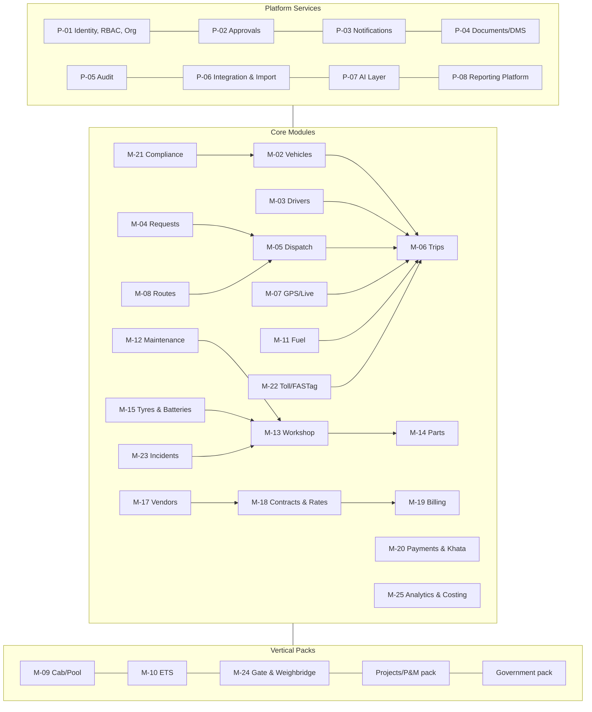
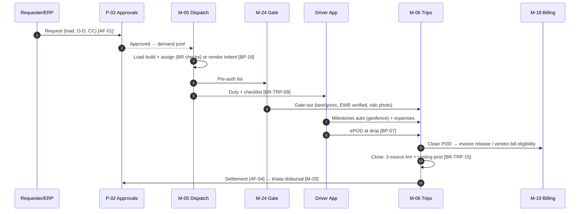
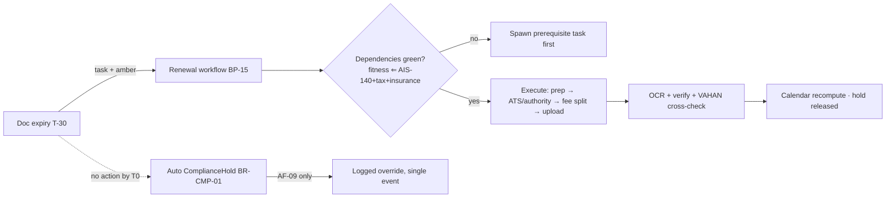

a# Enterprise Fleet Management System (FMS)
## Phase 3 — Product Requirements Document (PRD)

| Document Control | |
|---|---|
| Document | Phase 3 of 6 — PRD · v1.0 · 13 Jul 2026 · For review |
| Upstream | P1 (domain research), P2/BRD (roles R-xx, processes BP-xx, approval flows AF-xx, rules BR-xx, KPIs KPI-xx, requirements REQ-xx) |
| Style | Deliberately compact. Specs **bind** BRD artifacts by ID instead of restating them. Anything not stated here inherits BRD defaults. |
| Downstream | Phase 4 (schema/APIs), Phase 5 (screens), Phase 6 (MVP split) |

**Spec skeleton per module:** Purpose · Features · Stories+AC (representative, not exhaustive; QA expands) · Rules (BR bindings) · Validations/Edge · Perms · Data (owned entities) · APIs (business-level; REST detail in Phase 4) · Depends.

---

## 1. Product Architecture (module map)

**Licensing bundles (per-vehicle/month; unlimited users — REQ-21/22):** *Track* (M-02/03/07/21-lite) → *Operate* (+M-04/05/06/08/11/22/23) → *Maintain* (+M-12/13/14/15) → *Commercial* (+M-17/18/19/20/25) → packs à la carte (M-09/10/24, Projects, Government). All bundles include platform services.

---

## 2. Platform Services

### P-01 Identity, RBAC & Org
**Purpose:** authn/authz + org hierarchy for every module. **Features:** SSO (SAML/OIDC), SCIM, MFA, org tree (group→entity→region→site→CC), role builder on P2 §5.1 taxonomy, role-stacking with segregation validation (P2 §5.3), scoped API tokens, delegation, break-glass. **Stories+AC:** *R-01 creates a custom role* → capabilities×scopes picker; conflicting stacks rejected with named constraint (BR-FIN-02 class); change requires AF-12. *User transfers site* → scope re-binding effective immediately; historical records retain original scope. **Rules:** BR-SEC-01..05, BR-FIN-02. **Edge:** user in 2 entities (dual employment) = 2 memberships, one login; vendor users always external-typed (no internal role grantable). **Data:** users, roles, grants, org nodes, sessions, tokens. **APIs:** identity CRUD, token issue, org query. **Depends:** none (root).

### P-02 Approvals Engine
**Purpose:** execute AF-01..12 declaratively. **Features:** chain builder (conditions on amount/type/CC/org node), parallel steps, SLA timers with remind→escalate, delegation windows, modify-and-return, regularization lane (flagged, 72h), budget-commitment hook (BR-FIN-03), email/WhatsApp actionable approvals, full trail. **Stories+AC:** *R-18 approves from email* → one-click signed action, context panel (cost, budget remaining, policy flags); action recorded with channel; token single-use. *Approver on leave* → auto-delegate per window; chain never stalls silently (SLA breach → escalation event). **Rules:** BR-FIN-02/03, AF catalog. **Edge:** approver loses role mid-flight (step re-resolves to role, not person); amount edited after step 1 (chain re-evaluates, prior approvals invalidated if threshold crossed). **Data:** flow defs (versioned), instances, steps, actions. **APIs:** submit, act, query-inbox, flow-config. **Depends:** P-01, P-03.

### P-03 Notifications
**Purpose:** REQ-19 — right alert, right person, right channel, measured. **Features:** event catalog (§7 matrix), channels: in-app, push, email, SMS, WhatsApp, IVR-fallback (critical driver events); per-site/role policies, severity tiers, quiet hours, dedup/digest (T−30 expiries roll into daily digest, T−7 fire individually), suppression learning, delivery receipts, KPI-65 self-measurement. **Stories+AC:** *R-02 tunes overspeed alert* → threshold+duration per site; simulation shows last-30-day would-have-fired count before save. **Rules:** BR-CMP-02 cadences; BR-ETS-10 (SOS non-dismissible). **Edge:** channel failure cascade (push→SMS for critical); vendor/driver language preference per recipient. **Data:** event defs, policies, deliveries. **APIs:** emit, subscribe, policy CRUD, webhook fan-out. **Depends:** P-01.

### P-04 Documents/DMS
**Purpose:** evidence-grade store for every artifact (P1 F.8). **Features:** typed documents (taxonomy per BR-CMP), OCR+field extraction (P-07), validity dates, verification workflow (BR-CMP-04), as-on-date snapshots (BR-CMP-05), driver-offline document wallet, watermarked exports (BR-SEC-03), retention classes. **AC sample:** upload insurance PDF → insurer, policy no., IDV, validity auto-extracted ≥95% field accuracy on printed docs; human verify to activate. **Data:** documents, versions, snapshots, extraction results. **APIs:** upload, verify, query-by-entity, snapshot. **Depends:** P-01, P-07.

### P-05 Audit
**Purpose:** immutable, queryable trail (G8). **Features:** append-only event store (actor, ts, before/after, reason), tamper-evident chaining, override register, permission-change log, R-20 workspace (sampling, lineage viewer request→payment), register exports. **Rules:** BR-SEC-01/04. **Edge:** PII in audit views masked per data-class grants — audit sees *that* a field changed, value visibility needs the class grant. **APIs:** query (scoped), export pack. **Depends:** P-01.

### P-06 Integration & Import
**Purpose:** D6/D7 — live in the customer's landscape from day 1. **Features:** import wizards (vehicles/drivers/vendors/rates/opening khata; validate→preview→commit→rollback), connector framework: ERP (Tally, SAP file/IDoc, Oracle file), HRMS roster, weighbridge (serial/IP listener), OMC fuel APIs/statements, FASTag issuer statements, verification aggregators (VAHAN/SARATHI/challan), EWB API, insurer/broker, webhook + public REST API with dev portal. **AC sample:** 5,000-row vehicle import with 300 errors → error file with row-level reasons; clean rows commit; re-import idempotent. **Rules:** A1–A7 assumptions; BR-VND-05 (no external bill without system trip). **Data:** connector configs, job logs, mapping templates. **Depends:** P-01, P-05.

### P-07 AI Layer (v1 scope; detail §10)
**Purpose:** REQ-27 — AI on operations exhaust, shipped with v1, honest about confidence. **Features v1:** document OCR/extraction; NL query in EN/HI ("पिछले महीने किस गाड़ी का डीज़ल खर्च सबसे ज्यादा था?") with role-scoped answers; fuel anomaly model (square deviations); route/trip anomaly (deviation, halt patterns); predictive-maintenance triage (DTC+history ranked queue); alert-suppression learning. **v2+:** demand forecast, dispatch recommendation, driver-risk prediction, voice assistant. **AC sample:** NL query returns data-grounded answer with drill-link and confidence; never invents numbers (guardrail: query compiler → verified aggregates only). **Depends:** P-08 (semantic layer), all module data.

### P-08 Reporting Platform
**Purpose:** every §9 KPI + §8 reports without new manual entry (P2 design law). **Features:** semantic layer over module data, scheduled deliveries (email/WhatsApp PDF), export (xlsx/csv/pdf), report builder (saved views, pivots), statutory register generators (BR-CMP-11), board-pack composer, embedded drill-through. **Data:** report defs, schedules, snapshots. **Depends:** P-01, all modules.

---
## 3. Core Modules — Assets & People

### M-01 Dashboard (role workspaces)
**Purpose:** each role's morning ritual (P1 F.7) — exceptions first, data second. **Features:** role-default layouts (§8), widget library (KPI tiles, queues, maps, heatmaps, aging lists), quick actions, wallboard mode (control room), mobile scorecard (R-19). **AC sample:** R-02 dashboard loads ≤2s with yesterday-close data + live exception counts; every tile drills to source records. **Perms:** widgets respect underlying module scopes automatically. **Depends:** P-08, all modules.

### M-02 Vehicle Management
**Purpose:** vehicle master + lifecycle per P1 C.1. **Features:** vehicle 360° (identity, class/body/capacity/tare, meters, documents, devices, financials, history), state machine enforcement, commissioning checklist (BP-01), disposal workflow (BP-02, AF-08), dual meters km+hours (REQ-23), meter-offset workflow, transfer/requisition (AF-03) with recharge rates, idle board (BR-VEH-08), asset accounting fields (depreciation params, book value, IDV). **Stories+AC:** *R-03 onboards vehicle from RC* → VAHAN pull pre-fills ≥15 fields; checklist gates Active (BR-VEH-07). *Odometer entered below last* → blocked; meter-replacement flow preserves continuity (BR-VEH-03). *Disposal* → strip-checklist enforced (BR-VEH-15); TCO report auto-generated. **Rules:** BR-VEH-01..15, BR-CMP-08. **Edge:** hired-vehicle lite records (vendor-owned; documents+tracking only, no financials); body-built chassis interim state; group transfer = re-registration task + recharge entry. **Perms:** R-03 ✔, R-02 ✔, R-04 👁, vendor own-fleet ▲. **Data:** vehicles, meters, states, checklists, asset-accounting, transfers. **APIs:** CRUD, state-transition, availability-query, 360°-read. **Depends:** M-21 (holds), P-04.

### M-03 Driver Management
**Purpose:** driver lifecycle per P1 C.2 + khata identity. **Features:** driver 360° (credentials, eligibility matrix, duty-hour ledger, khata, scorecard, training, incidents), onboarding pipeline (BP-08) with verification API integrations, roster module (BP-09) with legal-pack validation, substitution cascade, blacklist registry (group-wide), separation workflow (BR-DRV-13), driver app profile (vernacular, income statements). **Stories+AC:** *R-13 onboards driver* → SARATHI DL verification inline; police-verification tracker; Active only when battery passes. *Roster publish* → violating drafts blocked with named rule (BR-DRV-06); drivers acknowledge in-app. *R-10 views khata* → statement in chosen language; line-item dispute opens case ≤2 taps. **Rules:** BR-DRV-01..15. **Edge:** vendor drivers (lite record, vendor-attested, same DL-API gate BR-DRV-15); dual-role staff (driver+mechanic) = one person, two role bindings; DL suspension mid-employment → CredentialHold cascade to today's assignments (re-plan alerts). **Perms:** R-13 personnel ✔, R-03 ▲, R-10 own ▲. **Data:** drivers, credentials, eligibility, rosters, duty-ledger, blacklist. **APIs:** CRUD, eligibility-check, roster, duty-ledger. **Depends:** P-01/04, M-20 (khata).

### M-04 Transport Requests
**Purpose:** BP-03/04 intake + entitlements. **Features:** request forms (goods/passenger/requisition) with smart defaults, templates/standing requests, entitlement matrix engine, AF-01/02/03 binding, budget commitment display, requester tracking view, regularization lane, bulk/event requests. **AC sample:** *R-17 books in-entitlement cab* → auto-approved ≤5s, vehicle details on assignment; out-of-entitlement → routed with reason shown. **Rules:** BR-TRP-01/02, BR-ETS-01. **Edge:** requester leaves company mid-request (reassign-or-cancel task); recurring template expiry. **Perms:** R-17 own ✔, R-05 intake ✔, R-18 approve. **Data:** requests, templates, entitlements. **APIs:** create, status, approve-hook, ERP-order ingest. **Depends:** P-02, M-05.

### M-05 Dispatch
**Purpose:** the flagship screen (P1 B.26, REQ-07) — demand→plan→publish→re-plan. **Features:** dispatch board (demand lane / capacity lane / assignment canvas, drag-drop), availability computation (BR-VEH-01 chain), live conflict checking, load builder (weight/volume/compat per BR-VEH-04/05, LIFO sequencing), owned-first-fill policy + one-click vendor spill (BP-18), pre-dispatch checklist (BR-TRP-09: docs/FASTag/inspection), gate pre-auth publication, plan-change reason codes, re-plan operations (swap/split/defer) preserving lineage. **Stories+AC:** *R-04 assigns load* → eligible vehicles ranked (proximity, utilization fairness, cost); ineligible greyed with named rule; commit is transactional (overlap-safe under concurrent dispatchers — BR-VEH-02/BR-DRV-03 at DB level). *Vendor spill* → indent per scorecard-share policy (BR-VND-08); cascade on silence (BR-VND-04). *Overload attempt* → hard stop with axle math shown (BR-TRP-11). **Rules:** BR-TRP-01..11, BR-DRV-04/08. **Edge:** two urgent orders one vehicle → priority escalation to R-02 in-flow; plan frozen for gate-curfew windows; mass re-plan tooling (strike/flood day). **Perms:** R-04 ✔, R-02 override. **Data:** plans, assignments, indents, change-log. **APIs:** plan CRUD, assign, spill, publish. **Depends:** M-02/03/04/08/17/18/21, P-02/03.

### M-06 Trip Management
**Purpose:** trip lifecycle per P1 C.3 — the atomic costing unit. **Features:** trip object with full lineage (request→approval→trip→POD→bill), geofence auto-milestones, e-way bill binding + expiry projection (BR-TRP-06/07), transshipment workflow (BR-TRP-08), multi-leg/multi-drop with per-leg PODs, ePOD hybrid capture + exception typing (BP-07), detention clocks (BR-TRP-14), expense capture (driver app, OCR), 3-source km reconciliation at close (P1 F.3, BR-VEH-10/11), auto-costing post (BR-TRP-15), return-leg planning + inbound-outbound matching view (P1 B.31), force-close with audit flag (BR-TRP-12/13). **Stories+AC:** *Driver completes drop* → ePOD ≤60s incl. photo; clean POD triggers invoice-release event ≤5s. *EWB expiring en route* → alert at 8h-window opening with one-tap extension task. *Mid-trip breakdown swap* → transship wizard relinks load docs + updates EWB Part B; both trips retain lineage. **Rules:** BR-TRP-01..15. **Edge:** offline ePOD (queued, geo-stamped at capture time); POD refused by consignee (paper-photo mode); trip spanning period close (cost accrual split). **Perms:** R-04 ✔, R-10 own ▲, R-05 duty-close ▲. **Data:** trips, legs, milestones, PODs, expenses, detention. **APIs:** lifecycle ops, ePOD, track-share links, customer webhooks. **Depends:** M-05/07/22, P-04.

### M-07 GPS / Live Tracking
**Purpose:** REQ-10 — honest, device-agnostic telemetry. **Features:** multi-protocol ingestion (AIS-140 vendors, OBD, OEM feeds via partner adapters, SIM-consent, driver-app), normalization, live map (5k+ concurrent, clustering), trip auto-stitching, geofence engine (sites, corridors, plazas), alert rules (overspeed, harsh, idle, night, deviation, halt) with per-site tuning, device-health console (ping-age, power-cut, tamper — BR-VEH-14, BR-CMP-12), replay (90-day warm), evidence archive (incident-sealed), privacy modes (BR-SEC-02: off-duty masking). **AC sample:** ingest→map latency ≤5s at P95 for 10s-ping devices; ping-age displayed on every vehicle marker (honesty rule). **Edge:** device swap between vehicles (re-pair workflow, history integrity); duplicate devices on one vehicle (primary election); GPS drift/jump filtering. **Perms:** scope-based map visibility; vendor sees own vehicles only. **Data:** devices, telemetry (tiered), geofences, alerts. **APIs:** ingest, live-query, replay, geofence CRUD, webhook events. **Depends:** P-03/06.

### M-08 Route Management
**Purpose:** P1 B.25's three problems, pragmatically. **Features:** route master (corridor library: waypoints, toll plazas, no-entry windows, restriction layer), learned-actuals overlay (preferred paths from history), toll+fuel+time route economics at planning, multi-stop sequencer (TSP for beats/milk-runs), VRP engine binding for ETS (M-10) and secondary distribution, delivery-point coordinate overrides (learned geocoding). **AC sample:** route compare shows 2–3 corridor options with ₹ (toll+fuel) and ETA each; chosen route becomes deviation-alert reference. **Edge:** monsoon/closure tags on corridors; ODC route surveys attached. **Data:** routes, restrictions, stop masters, learned paths. **APIs:** route query, optimize (stops), economics. **Depends:** M-07/22, P-07.

## 4. Core Modules — Fuel, Maintenance, Materials

### M-11 Fuel Management
**Purpose:** REQ-03 — the reconciliation square as product. **Features:** unified fuel ledger (card API/statements, own-station, bowser, cash-OCR), auto-binding to vehicle+trip+GPS, exception engine (BR-FUEL-02/03/05/06/07 types with evidence panels), norm engine (model+route+season; AF-12 dual-control changes), own-station module (tanker GRN with density, daily dips, variance ledger BR-FUEL-08), bowser module (geo-stamped issues, BR-FUEL-09), card console (limits, blocks, per-trip auto-limits BR-FUEL-04), OMC statement matcher, rebate tracker, driver km/l league with incentive computation. **Stories+AC:** *Card txn at Ambala, GPS at Jaipur* → exception ≤5 min with map evidence; disposition workflow; confirmed → recovery + pump flag. *R-09 monthly close* → OMC match ≥98% auto; residuals worklist. **Rules:** BR-FUEL-01..10. **Edge:** sensor-less vehicles (3-source tolerance); PTO/DG consumption (hour-norms); dual-fuel vehicles. **Perms:** R-09 ✔, R-14 👁. **Data:** fuel events, norms, stations, bowsers, cards, exceptions. **APIs:** event ingest, exception ops, norm query. **Depends:** M-06/07, P-06/07.

### M-12 Maintenance (PM)
**Purpose:** REQ-08 — breakdowns → scheduled work. **Features:** multi-trigger schedule engine (km/hours/time/condition/statutory per model — Service A/B/C kits), due-list with ops calendar overlay, slot negotiation flow (recorded arbitration R-06↔R-04), auto job-card + parts reservation, grace/lock ladder (BR-MNT-01 + AF-05 override), DTC-triggered defect cards (BR-MNT-09, R-07 rules), counter-integrity handling, PM effectiveness analytics (KPI-30/31). **AC sample:** vehicle crosses PM grace → allocation blocked; override records next-slot commitment; breakdown within 30 days of PM auto-annotates the PM job for quality review. **Rules:** BR-MNT-01..11. **Edge:** idle-fleet time triggers (batch PM); en-route PM retro entry; warranty-period routing (BR-MNT-07). **Data:** schedules, due items, triggers. **Depends:** M-02/07/13.

### M-13 Workshop
**Purpose:** job-card factory per P1 C.4/B.37. **Features:** job-card lifecycle (Draft→…→CostPosted) with WaitingParts visibility, estimate builder + AF-05 approvals (technical parallel R-07), bay+mechanic scheduling board (skills matrix), task clock-on/off, standard-time library (BR-MNT-11 flags), outside-work POs, QC + road-test gates (BR-MNT-03), mechanic mobile (R-08: ≤30s interactions, vernacular, photo defect-found), repeat-repair flags (BR-MNT-05), downtime costing visible for prioritization. **AC sample:** *R-08 clocks task* → 2 taps; parts pick list pre-staged from reservation; defect-found → photo+voice-note → estimate revision task. **Rules:** BR-MNT-01..12. **Edge:** jobs waiting surveyor (accident lock, M-23 dependency); warranty rejection converts to paid mid-job (re-approval if threshold crossed). **Perms:** R-06 ✔, R-08 own-tasks ▲, R-07 tech ✔. **Data:** job cards, tasks, estimates, bays, mechanics, standard times. **APIs:** job lifecycle, board query. **Depends:** M-12/14/23, P-02.

### M-14 Parts Inventory
**Purpose:** REQ-09/OQ-2 — fleet-scoped stores with lite procurement. **Features:** parts master with cross-references + fitment mapping (P1 B.36 — the Fleetio gap), multi-store, min/max + reorder alerts, indent→quote→PO→GRN (BP-21) with quality-check photos, issue strictly against job cards (BR-MNT-06), returns/cores/warranty routing (BR-MNT-07), cannibalization transfers (BR-MNT-12), cycle counts with variance workflow, ABC/VED views. **AC sample:** issue without job-card reference impossible in UI and API; GRN against PO mismatch (qty/rate) → hold queue. **Edge:** emergency local purchase lane (capped, retro-PO); serialized items (tyres/batteries) bypass to M-15 registries. **Perms:** R-23 ✔, R-06 demand ▲. **Data:** parts, stock, POs, GRNs, issues, counts. **Depends:** M-13, P-02/06.

### M-15 Tyres & Batteries
**Purpose:** REQ-17/26 — serialized lifecycle assets. **Features (tyres):** per-tyre registry (serial/RFID), fitment/position/rotation history with odometer stamps, inspection capture (tread, pressure, photos; TPMS ingest), removal reason codes, retread round-trips (vendor, cost, life count), scrap+claim workflows, CPK analytics per brand/pattern/position (KPI-39/40), gate serial-audit hooks (with M-24). **Features (batteries):** serialized registry, pro-rata warranty engine (auto-claim math — KPI-41), core-credit tracking, PM health checks; EV pack (SoH/BMS ingest) flagged roadmap. **AC sample:** tyre removed at 3mm → retread task with vendor round-trip tracking; casing CPK updates across lives. **Rules:** BR-MNT-08 (tread floor block). **Edge:** serial unreadable → re-branding flow; mixed-fitment warning (radial/bias). **Data:** tyres, positions, inspections, retreads, batteries, claims. **Depends:** M-13/14, M-24 hooks.

## 5. Core Modules — Commercial

### M-17 Vendor Management
**Purpose:** REQ-01/05 — white space #1. **Features:** vendor 360° (KYC, fleet, drivers, contracts, performance, financials), empanelment pipeline (BP-17) with API verifications + scored audits + probation caps (BR-VND-10), vendor portal + app (indent inbox, placement, documents, bills, scorecard) + WhatsApp-bridge actions (PP-01), document compliance engine reuse for vendor vehicles (BR-CMP-09), scorecard engine (weights configurable) with business-share policy loop (BR-VND-08), blacklist registry (BR-VND-12), concentration monitor (BR-VND-09), spot-hire lite flow (BP-20: API verification, rate history, exposure caps). **AC sample:** vendor accepts indent on WhatsApp → placement record with vehicle+driver; offered vehicle with red document auto-rejected pre-gate (BR-CMP-09) with fix-it note to vendor. **Rules:** BR-VND-01..12. **Edge:** vendor supplies sub-hired vehicle against dedicated contract (declaration mismatch flag); vendor merger/GST change (re-KYC). **Perms:** R-12 ✔, R-11 own ▲. **Data:** vendors, empanelment, scorecards, spot records. **Depends:** M-18, P-02/04/06.

### M-18 Contracts & Rate Cards
**Purpose:** REQ-02's brain. **Features:** contract objects (validity, terms, penalties, free-time/detention, MG clauses), rate-card studio: per km/trip/tonne/shift/month-fixed+km/per-seat models, lane matrices, slabs, **diesel-escalation formula builder** (index source, base date, pass-through %) with auto-recompute (BR-VND-03), internal recharge rate cards (AF-03), customer rate cards (3PL mode), version control + dual-control activation (BR-VND-02), simulation ("this trip on this contract = ₹X" preview). **AC sample:** diesel index moves → affected lanes re-priced from effective date; every trip stores its rate computation snapshot (BR-VND-06 auditability). **Edge:** retroactive renegotiation (R-14-gated recompute run with delta report); multi-currency (GCC roadmap). **Data:** contracts, rate cards, versions, index series. **Depends:** M-17/19, P-02.

### M-19 Billing (vendor bills + customer invoices)
**Purpose:** REQ-02/12 — close the money loop. **Features:** vendor-bill workbench (BP-19): auto-match to trips, expected-vs-billed with computation drill, tolerance auto-pass (BR-VND-06), deviation queue, evidence-linked debit notes (BR-VND-07); customer invoicing (3PL/contractor mode): POD-triggered release (PP-12), annexure auto-build (per-trip schedules — PP: A.10), e-invoice/GST fields, disputed-line tracking; GTA tax engine (RCM/FCM per contract, GST 2.0 rates — BR-FIN-04), TDS (BR-FIN-05). **AC sample:** vendor bill within tolerance → payment queue untouched by humans; bill referencing unknown trip → hard queue (BR-VND-05), never auto-passes. **Edge:** partial-delivery invoicing; credit notes; period-close accruals for undelivered trips. **Perms:** R-15 process, R-12 deviations, R-14 release. **Data:** bills, invoices, lines, debit/credit notes, tax records. **Depends:** M-06/18, P-02, ERP export.

### M-20 Payments & Driver Khata
**Purpose:** REQ-06 — settlement transparency. **Features:** khata ledger (advances, expenses, bhatta, incentives, recoveries) auto-built from trip events (BP-10), vernacular in-app statement + dispute lane, AF-04 approvals, UPI disbursal batches (maker-checker BR-FIN-07), advance caps (BR-FIN-06), challan-recovery integration (BP-16), payroll export (files v1 — OQ-5), vendor payment runs (from M-19), FASTag float + fuel-card credit ledgers. **AC sample:** trip closes → settlement draft ≤1 min; driver sign-off or dispute in-app; disbursal ≤72h (KPI-54). **Edge:** absconding freeze (BR-DRV-12); negative khata carry with aging; cash-paid legacy drivers (voucher print mode). **Data:** khata entries, settlements, disbursal batches. **Depends:** M-06/19, P-02.

### M-25 Analytics & Costing
**Purpose:** REQ-16 — the CFO number of record. **Features:** costing engine (full stack per P1 B.34; allocation rules for shared costs), per-vehicle P&L, cost/km · tonne-km · hour · employee-trip · case grains, cost-center recharge journal (BP-27) + ERP export, budget module (heads, commitments via P-02 hook, variance packs AF-11), utilization suite (KPI-01..07 with drill), right-sizing pack generator (BP-28), owned-vs-hired comparator at allocation time, cost/km league auto-publication (P1 F.1), lifecycle TCO + replacement analysis (P1 B.35 crossover charts). **AC sample:** month-end close blocked until cost-sweep exceptions cleared (BR-TRP-15); league table published to R-02 on close. **Data:** cost events (ledger), allocations, budgets, P&L snapshots. **Depends:** every money-emitting module, P-08.

## 6. Compliance, Incidents & Packs

### M-21 Compliance Suite (documents, permits, insurance, fitness, PUC, tax, AIS-140)
**Purpose:** REQ-04/28 — the dependency-graph engine (P1 Finding 3). **Features:** document registry per taxonomy (vehicle/driver/vendor/trip classes), India rule packs with state profiles + versioned effective dates (BR-CMP-10/15), dependency graph evaluation (BR-CMP-03), auto-hold engine (BR-CMP-01 → C.1 ComplianceHold), T−30/15/7 cadence (BR-CMP-02), renewal workflows (BP-15) incl. fitness pre-inspection+ATS appointment chains, sub-renewal tracking (permit authorization/composite fee — BR-CMP-13), VAHAN/SARATHI cross-verification via aggregators, challan workbench (BP-16, BR-CMP-07), insurance module (fleet policies, endorsements BR-CMP-14, IDV/NCB per vehicle, claim tracker with M-23), compliance heatmap + zero-expiry KPI (KPI-42/43), AIS-140 device linkage status (BR-CMP-12), statutory register outputs (BR-CMP-11). **AC sample:** fitness renewal task auto-verifies AIS-140-active + tax + insurance before booking ATS; missing prerequisite spawns its task first (graph walk). Insurance lapses at midnight → vehicle ComplianceHold at 00:00, dispatch board reflects by 00:01, AF-09 is the only door. **Rules:** BR-CMP-01..15. **Edge:** authority suspension (immediate hold + legal track); document under appeal (state with expiry override by R-02 + legal note); NCR age-cap pipeline (BR-CMP-08). **Perms:** R-21/R-03 ✔, R-02 override, all 👁 status. **Data:** documents (P-04), rule packs, holds, renewals, challans, policies, claims. **APIs:** status-query (used by M-05 gates), renewal ops, challan sync. **Depends:** P-04/06/07, M-02/03.

### M-22 Toll & FASTag
**Purpose:** REQ-15. **Features:** tag registry (issuer, status, balance where API), pre-dispatch health check surfaced in M-05 (BR-TRP-09), recharge/float workflow (finance thresholds), debit ingestion (statements/APIs), GPS-path auto-matching (plaza + MLFF gantry geofences), exception types (double-deduction, phantom plaza, class mismatch, personal-detour → khata proposal), dispute tracker to refund, cash-toll OCR fallback, corridor toll analytics feeding M-08, annual-pass misuse detection (P1 I.2 — commercial vehicle on pass = deactivation risk). **AC sample:** duplicate debit detected ≤24h of statement ingest; dispute pack (GPS trace + txn) auto-assembled. **Data:** tags, debits, matches, disputes. **Depends:** M-06/07, P-06.

### M-23 Incidents (breakdowns + accidents)
**Purpose:** BP-13/14 — one incident object, four tracks. **Features:** driver SOS (offline-queued, logged-out available), severity triage, response dispatch (garage geo-directory, OEM RSA, towing), transshipment sub-flow (with M-06), accident four-track workspace: emergency checklist, legal (FIR, statements, **as-on-date document snapshot auto-sealed** BR-CMP-05), insurance (intimation SLA timers, surveyor-before-repair gate, claim milestones), internal (root-cause coding, HR inquiry link, corrective actions), telematics 60s evidence auto-attach, dashcam clip pull (partner APIs), night/remote SOP wizard (P1 F.12), downtime + cost booking, vendor-vehicle liability tagging. **AC sample:** SOS → control-room alert ≤10s with location + vehicle + trip context; accident record created → insurer intimation draft ready ≤15 min (SLA timer running). **Rules:** BR-MNT-08, BR-CMP-05, AF-10. **Edge:** accident-vs-breakdown reclassification (tracks re-open); MACT case tail (years — record persists past vehicle disposal). **Data:** incidents, responses, claims, investigations. **Depends:** M-06/07/13/21, P-03/04.

### M-09 Cab / Pool Booking (pack)
**Purpose:** BP-04/P1 B.23. **Features:** booking app on entitlements (M-04 reuse), duty slips digital (OTP/e-sign closure), package billing engine (4/40, 8/80, extra-km/hr, night, outstation bhatta), pool-first allocation + vendor spill, personal-use recovery (BR-FIN-09), misuse analytics (odd-hour/weekend movement). **AC:** duty closes only with passenger confirmation; billing computed from GPS km vs package automatically. **Depends:** M-04/05/06/18.

### M-10 Employee Transportation — ETS (pack)
**Purpose:** REQ-14, BP-24 — product-within-product (OQ-1: fast-follow release 2). **Features:** HRMS roster ingestion + delta handling, constraint routing engine (capacity, ride-time BR-ETS-08, zones, **women-safety BR-ETS-03 as solver constraint**), escort management, employee app (OTP board/drop, ETA, SOS BR-ETS-10), no-show wait-timer (BR-ETS-06), safe-drop live board (BR-ETS-04 — open until 100%), backup-cab SLA flow, GPS-verified vendor billing (BR-ETS-09) with dead-km rules, adhoc/night bookings (BR-ETS-07), compliance audit pack (KPI-49). **AC sample:** 500-employee roster delta at 21:00 → routes re-solved ≤10 min; no route violates escort constraint (hard infeasibility surfaced, never silently relaxed). **Data:** rosters, routes, stops, escorts, confirmations. **Depends:** M-05/06/07/17/18/19, P-07 (solver).

### M-24 Gate & Weighbridge (pack)
**Purpose:** REQ-11/25, BP-25. **Features:** gate console (plate/ANPR → verdict banner + checklist + camera), expected-vehicle pre-auth (from M-05), document verdicts from M-21, weighbridge capture (serial/IP adapters) auto-bound to trips (BR-GTE-04), overload hard-stop (BR-TRP-11), seal/photo capture, detention clock sealing (BR-GTE-02), gate-pass print, statutory register export, tyre-serial audit prompts (M-15 flags), visitor lite-log, offline paper-fallback with photo retro-entry (flagged). **AC:** red verdict cannot be cleared at gate (BR-GTE-01) — remote AF-09 only; gate event → detention clock state change ≤5s. **Depends:** M-05/06/15/21, P-06.

### Government & Projects packs (thin v1)
**Government:** digital log book (movement register format), requisition→duty-slip chain (M-04/09 skins), POL norms + coupon reconciliation, condemnation workflow (BP-02 board variant), GeM/MSTC disposal fields, CAG-format register exports, Hindi-first UI. **Projects/P&M (construction-mining):** project/cost-code allocation on M-02/06, internal hire rates (M-18 reuse), shift operations (allocation board, handover snapshots), hour-based everything (meters, PM, norms), bowser integration (M-11), contractor output billing (tonne/trip × rate with weighbridge/survey evidence). Both packs are configurations + thin features over core modules, not forks.

## 7. Key Workflows (sequence views; state machines are P1 Part C)

### 7.1 Goods trip end-to-end (happy path + money loop)

### 7.2 Compliance auto-hold & renewal

### 7.3 Breakdown with transshipment
Driver SOS → triage (drivable/roadside/tow) → response dispatch → *if load rescue:* replacement vehicle assigned → transship wizard (docs+EWB Part B relink) → original vehicle → workshop job card → root cause → PM feedback loop. (Full detail BP-13; states P1 C.1/C.3.)

## 8. Notification Matrix (condensed; policies per P-03)

Channels: **I**n-app · **P**ush · **E**mail · **S**MS · **W**hatsApp · IVR (critical driver fallback). Severity: 🔴 immediate · 🟠 same-hour · 🔵 digest.

| Event family | Recipients | Channels | Sev |
|---|---|---|---|
| Document T−30/15/7, expired; challan received | R-21/03/02; vendor for their docs | I+E; W vendor | 🔵→🟠→🔴 |
| Approval pending / SLA breach / escalation | R-18 chain | I+P+E(actionable)+W | 🟠→🔴 |
| Trip: dispatched, milestone, delayed >x, arrived, POD, force-close | R-04/05, requester/customer | I+P; W customer links | 🔵–🟠 |
| EWB expiring en route | R-04, driver | P+S+IVR | 🔴 |
| GPS: overspeed, harsh, deviation, long idle, night, geofence | R-04; digest R-02 | I+P | 🟠/🔵 |
| Device silent >24h / tamper / power-cut | R-03/01 | I+E | 🟠 |
| Breakdown/SOS/accident | R-04→R-02→R-19 ladder | P+S+call-tree | 🔴 |
| Fuel exceptions (theft-signature classes) | R-09, R-04 | I+P | 🔴/🟠 |
| FASTag low-balance/blacklist pre-dispatch | R-04, R-15 | I+P | 🟠 |
| PM due/overdue/locked | R-06/03; R-04 (availability) | I+E | 🔵→🟠 |
| Job card: estimate ready, waiting-parts, QC done | R-06/03/04 | I | 🔵 |
| Vendor: indent, cascade, placement fail, bill status, scorecard | R-11 (their slice), R-12 | W+I portal | 🟠 |
| Settlement ready / disputed / disbursed | R-10, R-05, R-15 | P+W (vernacular) | 🟠 |
| ETS: pickup ETA, OTP, no-show, safe-drop open, SOS | R-17, R-22, escort | P+S; SOS = call-tree | 🔵→🔴 |
| Budget threshold, period-close blockers | R-14, CC owners | E | 🟠 |
| Board flash: fatal accident, compliance breach, budget breach >x% | R-19 | P+S | 🔴 |

## 9. Role Dashboards (default layouts; widgets bind KPIs)

| Role | Top row (live) | Middle (queues) | Bottom (trends) |
|---|---|---|---|
| R-02 Head | Fleet status donut · compliance heatmap · today's exceptions | Approval inbox · override log · placement failures | Cost/km league · budget burn · KPI-11/13/46 trends |
| R-03 Fleet Mgr | Availability · holds · device health | Renewal pipeline · PM due · claims | Downtime Pareto · KPI-30/39/42 |
| R-04 Dispatcher | Dispatch board (IS the dashboard) · live map · gate queue | Unassigned demand · exceptions aging · indent cascade | Plan stability · KPI-11/15/18 |
| R-06 Workshop | Bay board · waiting-parts | Estimates pending · QC queue | KPI-08/33/35 |
| R-09 Fuel | Stock + variance tiles · exception queue | Norm outliers · statement match | KPI-21/24/26/27 |
| R-12 Vendor Mgr | Placement compliance today · deviation queue | Scorecard movers · concentration | KPI-13/55/56/58 |
| R-14 Finance | Budget vs actual+commit · payment runs | Close blockers · AF-11 queue | KPI-59/60/61/62 |
| R-21 Compliance | Zero-expiry tile (KPI-42/43) · challan aging | Renewal tasks by stage | Renewal cost variance |
| R-22 ETS | Safe-drop board (open drops) · on-time today | No-shows · adhoc queue | KPI-49 + occupancy/cost trends |
| R-19 Mgmt (mobile) | 5 tiles: cost/km Δ · availability · compliance · safety · service | — | Monthly pack link |
| R-10 Driver (app) | Today's duty · khata balance · my score | My documents · disputes | Monthly earnings |
| R-11 Vendor (app) | Indents awaiting · placement today · payment status | Doc fix-its | Scorecard trend |

## 10. AI Features (P-07 detail)

| Feature | v | Approach & data | Guardrail |
|---|---|---|---|
| Document OCR/extraction (RC, insurance, DL, bills, PODs, handwritten LRs) | 1 | Vision LLM + templates; P-04 pipeline | Human verify gate (BR-CMP-04); field-confidence shown |
| NL query EN/HI (text) | 1 | Query-compiler to semantic layer (P-08) | Answers only from verified aggregates + drill link; role-scoped |
| Fuel anomaly detection | 1 | Rules (BR-FUEL-02..06) + model on square residuals | Every alert carries evidence panel; precision tracked KPI-65 |
| Predictive maintenance triage | 1 | DTC + history + model ranking of due-list | Recommends priority; never auto-blocks (BR-MNT-01 does) |
| Route/trip anomaly (deviation, halt, detour-toll) | 1 | Corridor baseline + learned actuals | Severity-laddered; site-tunable |
| Alert-suppression learning | 1 | Dismissal feedback loop | Never suppresses 🔴 class |
| Trip cost prediction / owned-vs-hired advisor | 2 | Historical lane economics | Shown as range with basis |
| Demand forecast → capacity plan | 2 | Seasonal trip history | — |
| Smart dispatch recommendation | 2 | Assignment ranking learning from R-04 choices | Suggest-only |
| Driver risk prediction & coaching plans | 2 | Score trajectory + events | HR-policy gated (union sensitivity) |
| Voice assistant (vernacular, driver/coordinator) | 2 | Speech + NL layer | Read + capture only, no approvals |
| Fleet health score (composite) | 2 | KPI composite model | Explainable components |

## 11. Reports Catalog (P-08; all exportable, schedulable)

**Operational:** daily DSR (site), dispatch summary, exception log, unfilled demand, gate register, idle board, live-trip status. **Fleet:** availability, utilization suite, downtime Pareto, vehicle history dossier, right-sizing pack, TCO/replacement. **Fuel:** DSR, km/l league, exception register, station stock audit, OMC match, rebate. **Maintenance:** PM compliance, job cost vs estimate, repeat-repair, waiting-parts aging, warranty recovery, reliability (MTBF/MTTR). **Tyres/Battery:** CPK league, position wear, retread ratio, premature removals, warranty claims. **Compliance:** zero-expiry snapshot, expiry forecast 30/60/90, renewal cost, challan register, statutory registers (log book, duty-hour, gate, DGMS set), override register. **Vendor:** scorecards, placement compliance, deviation/leakage, settlement cycle, concentration. **Driver:** safety score league, duty-hour/OT statutory, settlement aging, churn. **Trip/Commercial:** trip P&L, lane economics, detention billed/recovered, POD aging, invoice aging, customer profitability. **Financial:** cost/km pack, per-vehicle P&L, budget variance, CC recharge journal, GST/GTA & TDS registers, AP/AR aging. **ETS:** on-time, occupancy, safe-drop audit, vendor km reconciliation, cost/employee. **Executive:** monthly board pack, ROI-vs-baseline (G1–G9), incident flashes. **System:** adoption (KPI-63/64), alert precision (KPI-65), data-quality, user-access review.

## 12. Traceability & Handoff

**Coverage check:** REQ-01..28 → modules (all bound; REQ-26 EV portion and REQ-27 v2 items → roadmap). BR-catalog: every rule bound to ≥1 module above. KPI-01..65 → P-08 semantic layer + §9 dashboards. BP-01..28 → module features (BP-24→M-10, BP-25→M-24, BP-27→M-25 …). AF-01..12 → P-02 configs. **Open questions carried to Phase 6:** OQ-1 (ETS release timing — spec'd here as release 2), OQ-3 (customer portal), OQ-4 (video partners), OQ-7 (gov tier timing).

**Phase 4 will deliver:** ERD + schema (master/transaction/history/audit/config tables), REST API surface (auth, CRUD, workflow, analytics, GPS ingest, webhooks), services architecture (modular monolith → extraction path), integration architecture, NFRs (performance under burst per P1 D.8, security/DPDP/SOC2, DR/backup), deployment tiers (SaaS / single-tenant / on-prem gov).

*— End of Phase 3 —*

