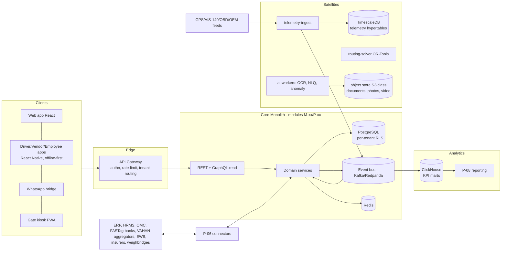
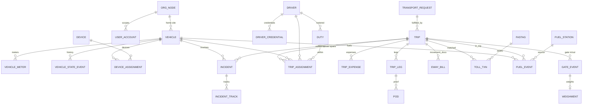
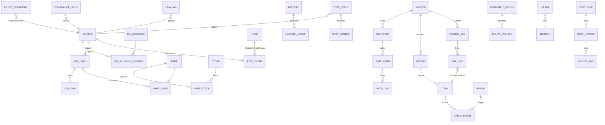

# Enterprise Fleet Management System (FMS)
## Phase 4 — System Design Document (SDD)

| Document Control | |
|---|---|
| Document | Phase 4 of 6 — System Design · v1.0 · 13 Jul 2026 · For review |
| Upstream | P1 (domain), P2/BRD (rules/RBAC), P3/PRD (modules M-xx, platform P-xx) |
| Downstream | Phase 5 (UI/UX), Phase 6 (roadmap/estimates) |
| Style | Concise. Decisions recorded ADR-style (§9). Naming: tables `snake_case`, APIs `kebab-case`, IDs ULID. |

---

## 1. Architecture Overview

**Style: modular monolith + 3 satellite services.** One deployable core (module boundaries = P3's M-xx/P-xx, enforced at code level, each module owning its schema namespace) with independently scaled satellites: **telemetry-ingest** (protocol adapters, high-write), **routing-solver** (VRP/TSP, CPU-burst), **ai-workers** (OCR/inference queues). Rationale: 10–20 dev team, one product, transactionally coupled domains (trip↔fuel↔costing); microservices-first would tax velocity (extraction path preserved via module boundaries + event bus — ADR-01).

**Tech stack (recommended defaults — ADR-02):** TypeScript/Node (NestJS) core; PostgreSQL 16 (+RLS multi-tenancy, PostGIS); TimescaleDB for telemetry; Kafka/Redpanda event bus; Redis (cache, queues, locks); ClickHouse analytics; S3-compatible object store; OR-Tools (routing); Python workers for AI (LLM-agnostic gateway); React web; React Native mobile (shared offline sync core); OpenTelemetry + Grafana stack; Kubernetes (EKS/GKE or on-prem k3s for gov tier).

**Multi-tenancy (ADR-03):** shared DB, shared schema, `tenant_id` on every row + Postgres RLS enforced at connection context; org-node scoping (P2 §5.3) via `org_node_id` + closure table. Gov/enterprise single-tenant = same build, dedicated namespace/cluster. Telemetry partitioned by tenant+time.

**Event backbone:** every domain mutation emits a versioned event (`trip.closed.v1`, `document.expired.v1`, `fuel.exception.raised.v1`). Consumers: rules engine (auto-holds), notifications, analytics sink, webhooks, audit. Outbox pattern guarantees emit-with-commit.

**Offline sync (mobile):** local SQLite queue; mutations are idempotent commands with client ULIDs; server reconciles with field-capture-wins + server-flag policy (P2 C2); media uploads resumable.

## 2. Cross-Cutting Mechanisms

| Mechanism | Design |
|---|---|
| AuthN | OIDC (internal IdP) + SAML/OIDC SSO federation; MFA; mobile = device-bound refresh tokens; API = scoped PATs + OAuth2 client-credentials |
| AuthZ | Policy engine (module.capability.scope per P2 §5.1) evaluated at gateway (coarse) + service (fine, incl. data-class overlays rates/financial/personal); segregation validation at grant time |
| Rules engine | Declarative rule packs (BR catalog) as versioned config with effective dates (BR-CMP-10); evaluated on events + at action gates (allocation, gate-out); override path = AF-09 API |
| Approvals | P-02 as internal service: flow defs (JSON), instances, timers (durable via bus + scheduler); budget-commitment hook posts to costing ledger |
| Audit | Append-only `audit_events` (hash-chained per tenant/day); writes via bus consumer; UI redaction per data-class; no delete path exists |
| Documents | Object store + `documents` metadata; AV scan, OCR pipeline (ai-workers), immutable versions; as-on-date snapshot = version pin set (BR-CMP-05) |
| Numbering | Per-tenant, per-entity statutory sequences (invoice, gate pass, job card) — gap-monitored |
| i18n | UI string packs (EN/HI + 2 regional at v1); data fields stored raw; NLQ bilingual |
| Time | Store UTC; site-timezone rendering; duty-day boundary configurable (BR-DRV edge: midnight-spanning duties) |

## 3. Data Design

### 3.1 ERD — operations core

### 3.2 ERD — maintenance & commercial

### 3.3 Table catalog (grouped; ~90 tables; key columns only)

**Config/master (per-tenant):** `org_nodes` (closure), `cost_centers`, `users`, `roles`, `role_grants`, `vehicle_classes`, `vehicle_models` (norms, PM kits), `vehicles` (regn, class, body, capacities, tare, home_org, state), `vehicle_meters`, `drivers` (identity, eligibility_matrix), `driver_credentials`, `vendors`, `customers`, `contracts`, `rate_cards`/`rate_lines` (versioned), `index_series` (diesel), `parts`, `part_xrefs`, `stores`, `pm_schedules`/`pm_tasks`, `routes`/`route_waypoints`/`route_restrictions`, `stop_masters` (learned geocodes), `geofences`, `toll_plazas`, `fuel_stations` (own), `fuel_cards`, `fastags`, `devices`, `document_types`, `rule_packs` (versioned, effective dates), `approval_flows` (versioned), `entitlement_matrix`, `notification_policies`, `norm_sets` (fuel), `budgets`, `holidays/calendars`.

**Transaction:** `transport_requests`, `dispatch_plans`, `trips`, `trip_legs`, `trip_assignments` (exclusion-constrained), `duties`, `duty_ledger` (hours), `pods`, `trip_expenses`, `eway_bills`, `gate_events`, `weighments`, `indents`, `placements`, `fuel_events`, `fuel_stock_ledger` (station/bowser), `fuel_exceptions`, `toll_txns`, `toll_disputes`, `job_cards`, `job_tasks`, `estimates`, `part_pos`/`grns`/`part_issues`/`part_counts`, `tyre_events`, `battery_events`, `warranty_claims`, `incidents`, `incident_tracks`, `claims`, `challans`, `renewal_tasks`, `compliance_holds`, `vendor_bills`/`bill_lines`, `cust_invoices`/`invoice_lines`, `debit_notes`, `khata_entries`, `settlements`, `disbursal_batches`, `payments`, `cost_events` (THE ledger: vehicle, CC, period, source_ref, class), `budget_commitments`, `approval_instances`/`approval_steps`, `notifications`, `ets_rosters`/`ets_routes`/`ets_stops`/`boarding_events`/`escort_assignments`, `import_jobs`, `integration_runs`.

**History/audit (append-only):** `audit_events` (hash-chained), `vehicle_state_events`, `driver_state_events`, `trip_state_events`, `document_versions`, `document_snapshots` (incident-sealed), `rate_computation_snapshots` (per trip — BR-VND-06), `override_register`, `permission_change_log`, `login_history`, `config_versions`.

**Telemetry (TimescaleDB hypertables):** `telemetry_points` (device_ts, tenant, vehicle, lat/lng, speed, ignition, fuel_level, odo, io_flags — 10s grain; compression after 7d; warm 90d; cold → object-store parquet), `telemetry_events` (derived: overspeed, harsh, idle, geofence in/out), `device_health` (ping-age snapshots).

**Analytics (ClickHouse, event-fed):** `fact_trip`, `fact_cost`, `fact_fuel`, `fact_maintenance`, `fact_compliance_day` (KPI-42 snapshots), `fact_vendor_perf`, `fact_ets`, dimension mirrors.

### 3.4 Integrity rules in schema (not just app code)
- `trip_assignments`: **Postgres exclusion constraint** on (vehicle_id, tstzrange) and (driver_id, tstzrange) — BR-VEH-02/BR-DRV-03 at DB level.
- `vehicle_meters`: trigger-enforced monotonicity with offset records (BR-VEH-03).
- `cost_events`: NOT NULL (vehicle_id, cost_center_id, period, source_type, source_id) — BR-FIN-01.
- `part_issues.job_card_id` NOT NULL — BR-MNT-06.
- Soft delete only (`deleted_at`, actor, reason); no DELETE grants on transactional tables — BR-SEC-01.
- Period-close lock via `accounting_periods.status` checked by trigger on money tables — BR-FIN-08.

---
## 4. API Design

**Conventions:** REST, `/api/v1/…`; ULID ids; cursor pagination; `fields`/`expand` sparse responses; idempotency keys on all POSTs (offline clients); RFC7807 errors carrying violated rule IDs (`"rule": "BR-VEH-02"`); optimistic concurrency via `etag`; rate limits per token; all list endpoints filter by org-scope automatically. GraphQL read-only gateway for dashboard composition. Public dev portal with OpenAPI + sandbox tenant (Geotab-openness posture — P1 G.2.2).

### 4.1 Surface (business-level; representative)

| Family | Endpoints (abridged) |
|---|---|
| Auth | `POST /auth/token`, `/auth/sso/…`, `POST /auth/pat`, SCIM `/scim/v2/*` |
| Org/Users | `/org-nodes`, `/users`, `/roles`, `/grants` (+validate-stack) |
| Vehicles | `/vehicles` CRUD, `POST /vehicles/{id}/transitions`, `GET /vehicles/{id}/availability`, `/vehicles/{id}/meters`, `/vehicles/{id}/timeline` |
| Drivers | `/drivers` CRUD, `/drivers/{id}/eligibility-check?vehicle=`, `/drivers/{id}/duty-ledger`, `/rosters` (+`POST /rosters/{id}/publish` → validates BR-DRV-06) |
| Requests | `/transport-requests` CRUD, `POST /{id}/submit` (→AF), `GET /{id}/status` |
| Dispatch | `/dispatch-plans`, `POST /assignments` (transactional; 409 + rule id on overlap), `POST /assignments/{id}/spill-to-vendor`, `POST /plans/{id}/publish` |
| Trips | `/trips` lifecycle verbs (`dispatch`, `close`, `force-close`, `transship`), `/trips/{id}/milestones`, `/trips/{id}/expenses`, `/trips/{id}/pod`, `/trips/{id}/track-link` |
| GPS | ingest (satellite, §4.3); `/vehicles/live`, `/vehicles/{id}/replay?from&to`, `/geofences` CRUD, `/devices/{id}/health`, `/alerts` + `/alert-policies` |
| Fuel | `/fuel-events` (+bulk import), `/fuel-exceptions` (+`POST /{id}/disposition`), `/fuel-stations/{id}/stock`, `/norms`, `/fuel-cards/{id}/limits` |
| Maintenance | `/pm-schedules`, `/pm-due`, `/job-cards` lifecycle, `/estimates` (+approval hook), `/parts`, `/purchase-orders`, `/grns`, `/part-issues`, `/tyres/{serial}/events`, `/batteries/{serial}/events` |
| Vendors | `/vendors` CRUD, `/empanelments`, `/indents` (+`accept|decline`), `/placements`, `/scorecards`, `/spot-hires` |
| Commercial | `/contracts`, `/rate-cards` (+`simulate`), `/vendor-bills` (+`auto-verify` result), `/invoices`, `/debit-notes`, `/khata/{driver}/entries`, `/settlements` (+`dispute`), `/disbursal-batches` |
| Compliance | `/documents` (+upload/verify), `/compliance/status?vehicle=` (used by dispatch gate), `/renewal-tasks`, `/holds`, `/challans`, `/policies` (insurance), `/claims` |
| Toll | `/fastags`, `/toll-txns` (+import), `/toll-disputes`, `/toll-estimate?route=` |
| Incidents | `/incidents` (+tracks), `POST /sos` (unauthenticated-tolerant, device-signed) |
| ETS | `/ets/rosters` (+ingest), `POST /ets/solve`, `/ets/routes`, `/boarding-events`, `/safe-drop-board` |
| Gate | `/gate-events`, `/weighments`, `/expected-vehicles`, `/gate-verdict?vehicle=` |
| Approvals | `/approvals/inbox`, `POST /approvals/{id}/act`, `/approval-flows` config |
| Analytics | `/kpis/{id}?grain&range`, `/reports/{id}/run`, `/costing/vehicle/{id}/pnl`, `/right-sizing-pack` |
| AI | `POST /nlq` (role-scoped), `/ocr-jobs`, `/anomalies` |
| Admin | `/imports` (+template, validate, commit), `/connectors`, `/webhooks`, `/audit-events` (scoped) |

### 4.2 Webhooks (outbound; HMAC-signed, retried w/ backoff, replayable)
`trip.dispatched|milestone|delivered|closed` · `pod.captured|exception` · `document.expiring|expired` · `hold.applied|released` · `fuel.exception.raised` · `incident.created|updated` · `indent.issued|accepted|failed` · `bill.verified|deviation` · `settlement.ready|disbursed` · `alert.fired` · `device.offline` · `approval.pending|acted` · `ets.sos` · `gate.in|out`.

### 4.3 Telemetry ingest (satellite)
Protocol adapters (per device vendor; certified-partner SDK) → normalize to `TelemetryPoint v1` (protobuf) → Kafka `telemetry.raw` → stream jobs: dedupe/order-tolerant enrich (vehicle bind, geofence eval, event derivation) → Timescale write + `telemetry.events` topic. **Targets:** 10K vehicles × 10s pings ≈ 1K msg/s sustained, 5× burst; ingest→live-map P95 ≤5s; adapter isolation (one vendor's malformed stream never stalls others). Device-health job flags silent devices (BR-VEH-14).

## 5. Integration Architecture (P-06)

| System | Pattern | Notes |
|---|---|---|
| ERP (Tally/SAP/Oracle) | v1: file export (Tally XML, SAP-friendly CSV/IDoc layouts) + inbound order CSV/API; v2: native connectors | `cost_events`/vouchers, CC recharge journal (BP-27), AP/AR |
| HRMS (roster/attendance) | SFTP/CSV spec + REST pull where available | ETS rosters (BP-24), leave feeds |
| Verification aggregators (VAHAN/SARATHI/challan — Surepass-class) | REST, provider-pluggable behind `VerificationService`; cached; fallback provider | P1 I.4; unit-cost metering per call |
| e-Way Bill (NIC/GSP) | GSP API; Part B updates on transship; Aug-2026 changes (ship-to GSTIN, closure) in adapter config | BR-TRP-06/07 |
| OMC fuel programs | API where offered; statement-file parsers per program | BP-11; parser library grows per bank/OMC |
| FASTag issuers | statement parsers + API where offered; NETC dispute formats | BP-26 |
| Weighbridge | edge agent (serial/TCP) posting `weighments`; offline buffer | P1 D.6 |
| ANPR/gate cameras | webhook/RTSP-event adapters | M-24 |
| Insurers/brokers | email-parse + portal APIs where available; claim milestone webhooks | M-21/23 |
| Dashcam partners | clip-pull APIs (OQ-4: 2 partners) | M-23 evidence |
| WhatsApp Business | template messages + interactive actions via BSP | P-03, vendor/driver flows |
| Payments | UPI payout rails via PA/PG partner; maker-checker in-app | BR-FIN-07 |

## 6. Non-Functional Requirements (targets, testable)

| Area | Target |
|---|---|
| Performance | API P95 ≤300ms (reads) / ≤600ms (writes); dashboard load ≤2s; live map 5K markers ≤3s initial, ≤5s update lag; dispatch assign commit ≤1s; ETS solve 500 employees ≤10 min; report run ≤30s or async |
| Scale (design point) | 50K vehicles/tenant, 500K vehicles platform; 2K concurrent web users; 100K app MAU; 1K msg/s telemetry sustained (5× burst — P1 D.8); 10M cost_events/tenant/yr |
| Availability | Core SaaS 99.9% monthly; telemetry ingest 99.95% (buffering absorbs core downtime); RPO ≤5 min (PITR), RTO ≤2h; DR = warm standby second region; gate/driver apps degrade offline |
| Security | TLS 1.2+; AES-256 at rest; field-level encryption for DPDP-sensitive (addresses, bank, DL numbers); secrets in vault; RLS multi-tenancy; OWASP ASVS L2; annual VAPT (CERT-In empanelled for gov tier); SSO/MFA; IP allowlists (enterprise) |
| Privacy/compliance | DPDP Act: consent registry, purpose tags on data classes, retention per class (telemetry 90d warm/2y cold default; financial 8y; personal minimized), DSR tooling (export/erase-where-lawful); SOC 2 Type II + ISO 27001 program from GA (P1 D.10); GDPR-ready posture for GCC/EU expansion |
| Auditability | 100% mutations in `audit_events` ≤2s lag; hash-chain verification job daily; override register immutable |
| Observability | OpenTelemetry traces; RED dashboards per module; SLO burn alerts; per-tenant usage metering; alert-precision telemetry (KPI-65) |
| Caching | Redis: sessions, availability computations (invalidated by events), compliance verdicts (TTL 60s + event bust), rate-card lookups; CDN for static/app bundles |
| Backup | PITR WAL + daily snapshots (35-day retention); object-store versioning; quarterly restore drills |
| Data quality | Import validation (REQ-20); master completeness scores surfaced (R-01 dashboard) |

## 7. Deployment Tiers

| Tier | Model | Notes |
|---|---|---|
| SaaS (default) | Multi-tenant, India region (data residency), 2-AZ + warm DR region | Monthly terms (REQ-22) |
| Enterprise dedicated | Single-tenant namespace/cluster, custom SSO/IP, optional customer-managed keys | Same build, config-gated |
| Government/on-prem | k3s/OpenShift bundle, air-gap-tolerant (offline license, local object store), CERT-In VAPT pack, Hindi-first | Year-2 GTM (OQ-7); no fork — feature flags |

## 8. Environments & Delivery
`dev → staging (tenant-cloned anonymized data) → prod`; trunk-based, feature flags (packs = flags); DB migrations expand-contract (zero-downtime); contract tests on public APIs + connector suite against provider sandboxes/mocks; load tests at 5× burst before GA; seed "demo tenant" with realistic Indian fleet data for sales/UAT.

## 9. Architecture Decision Records (abridged)

| ADR | Decision | Why (alternatives rejected) |
|---|---|---|
| 01 | Modular monolith + 3 satellites | Team size/velocity; transactional coupling (vs microservices sprawl) |
| 02 | Node/NestJS + Postgres core; Python AI workers | Hiring pool, one language web↔api; Python only where ML libs demand |
| 03 | Shared-schema RLS multi-tenancy | Cost + ops simplicity at 100s of tenants (vs schema-per-tenant migration pain); single-tenant tier covers outliers |
| 04 | TimescaleDB for telemetry (not raw Kafka→S3 only) | SQL replay/geo queries, compression; parquet cold tier keeps cost flat |
| 05 | ClickHouse KPI marts fed by events (not read-replica reporting) | KPI-heavy product; protects OLTP; P-08 semantic layer needs columnar speed |
| 06 | Exclusion constraints for overlaps in Postgres | BR-VEH-02/DRV-03 must survive concurrent dispatchers; app-level checks race |
| 07 | OR-Tools solver as stateless satellite | CPU burst isolation; replaceable with commercial solver later |
| 08 | Provider-pluggable verification layer | Aggregator churn/pricing (P1 I.4 [C]) must not touch domain code |
| 09 | WhatsApp as first-class channel via BSP | P1 F.15; owned apps remain system of record |
| 10 | Offline-first mobile with idempotent command queue | P1 D.2 non-negotiable; conflict policy field-capture-wins + flags |

**Phase 5 next:** screen-by-screen UX spec (layouts, components, tables/forms, mobile/desktop behavior, dark mode, accessibility) built on P3 modules and this SDD's API surface.

*— End of Phase 4 —*

