# Enterprise Fleet Management System (FMS)
## Phase 6 — Roadmap & Delivery Plan

| Document Control | |
|---|---|
| Document | Phase 6 of 6 — Roadmap & Delivery Plan |
| Product | Enterprise Fleet Management System (working name: **FleetOS**) |
| Version | 1.0 |
| Date | 20 July 2026 |
| Status | Final |
| Audience | Product, Design, Engineering, QA, DevOps, PMO, Executive Sponsors |
| Upstream | [Phase 1 (Domain)](file:///Users/akshaypratappandey/Documents/fleet%20management%20system/01-Phase1-Domain-Research-and-Industry-Analysis.md) $\rightarrow$ [Phase 2 (BRD)](file:///Users/akshaypratappandey/Documents/fleet%20management%20system/02-Phase2-Business-Requirements-Document.md) $\rightarrow$ [Phase 3 (PRD)](file:///Users/akshaypratappandey/Documents/fleet%20management%20system/03-Phase3-Product-Requirements-Document.md) $\rightarrow$ [Phase 4 (SDD)](file:///Users/akshaypratappandey/Documents/fleet%20management%20system/04-Phase4-System-Design-Document.md) $\rightarrow$ [Phase 5 (UI/UX)](file:///Users/akshaypratappandey/Documents/fleet%20management%20system/05-Phase5-UIUX-Specification.md) |

---

## 1. Executive Summary

This document establishes the execution and delivery roadmap for **FleetOS**. Building upon the business requirements (Phase 2), system design (Phase 4), and UI/UX layout (Phase 5), this roadmap schedules the development of FleetOS into **5 logical delivery milestones** over a **28-week cycle**. 

The goal is to launch a secure, hardware-agnostic, multi-tenant fleet management portal that delivers immediate value, starting with essential compliance and tracking, transitioning to automated dispatch and financials, and culminating in full workshop inventory management and bilingual AI utilities.

---

## 2. Release & Delivery Phases

```mermaid
gantt
    title FleetOS 28-Week Implementation Timeline
    dateFormat  X
    axisFormat W%H
    
    section Foundation & Track (MVP)
    P-01, P-05 (Identity, Audit)   :active, 0, 4
    M-02, M-03 (Vehicles, Drivers)  :active, 2, 6
    M-07, M-21 (GPS, Comply Lite)   :active, 4, 6
    
    section Operations & Dispatch
    M-04, M-05 (Requests, Dispatch) : 6, 10
    M-06, M-08 (Trips, Routes)      : 8, 12
    P-02, P-03 (Approvals, Alerts)  : 9, 12
    
    section Maintenance & Workshop
    M-12, M-13 (PM, Workshop Board) : 12, 16
    M-14, M-15 (Parts, Tyres/Batts) : 14, 18
    
    section Commercial & Costing
    M-17, M-18, M-19 (Vendors/Bills): 18, 22
    M-22, M-25 (Toll, Costing/P&L)  : 20, 24
    
    section Advanced AI & Mobile
    P-07, P-04 (AI NLQ, Document OCR): 24, 28
```

### 2.1 Milestone 1: Foundation & Core Track (MVP) — Weeks 1 to 6
* **Objective**: Launch the core database schema, RBAC engine, basic asset repositories, and device-agnostic live GPS tracking.
* **Scope**:
  * **P-01 Identity, RBAC, Org**: Single layouts, hierarchy scoping (Entity $\rightarrow$ Site $\rightarrow$ CC), permission-based view triggers.
  * **P-05 Audit Logs**: Append-only transaction records for security verification.
  * **M-02 Vehicle Management & M-03 Driver Management**: Asset 360° repositories, VAHAN/SARATHI API queries for automatic data validation, commissioning checklists.
  * **M-07 GPS / Live Tracking (Lite)**: GPS ingestion endpoint, live map updates with ping-age indicator, status-colored markers.
  * **M-21 Compliance Center (Lite)**: Essential certificate tracking and automated expiry warnings.
* **Key Deliverable**: A fully functioning dashboard where admins can onboard drivers/vehicles, view active compliance documents, and live-track their fleet with under 10-second latencies.

### 2.2 Milestone 2: Operations & Dispatch Console — Weeks 7 to 12
* **Objective**: Provide dispatchers with interactive Gantt-charts for trip allocations, and automate the request-to-trip lifecycle.
* **Scope**:
  * **M-04 Requests & M-05 Dispatch**: Smart request intake forms, drag-and-drop Gantt assignment board, eligibility ranking lists, axle load capacity validations.
  * **M-06 Trip Management & M-08 Routes**: Multi-drop/multi-leg trip state-machine lifecycle, corridor route geo-fencing, ePOD capture, transshipment flows.
  * **P-02 Approvals Engine**: Modular approval workflow chains linked to trip creation, and SLA escalation alerts.
  * **P-03 Notifications (Alerts)**: Email/WhatsApp alert engine for critical geo-fence and speed violations.
* **Key Deliverable**: An automated dispatcher cockpit enabling drag-and-drop trip assignments and real-time ePOD verification.

### 2.3 Milestone 3: Maintenance & Workshop Loops — Weeks 13 to 18
* **Objective**: Introduce workshop operations, preventive maintenance schedulers, and tyre/battery rotation tracking.
* **Scope**:
  * **M-12 Preventive Maintenance Planner**: Mileage/hour-based PM task scheduling, automatic service locks.
  * **M-13 Workshop Board**: Kanban bay allocation board (Job Cards), mechanic labor assignment charts, symptoms triage checklist.
  * **M-14 Parts Inventory**: Min/max storage thresholds, barcode integrations, external PO generation.
  * **M-15 Tyres & Batteries**: Virtual 3D axle-position tyre mapping, tread gauge tracking logs, warranty claims checklists.
* **Key Deliverable**: A complete maintenance console that transitions workshop operations from manual logs to automated bay/parts tracking.

### 2.4 Milestone 4: Commercials, Billing & Toll Reconcile — Weeks 19 to 24
* **Objective**: Resolve freight billing leakage, automate driver khata ledger settlements, and reconcile toll data.
* **Scope**:
  * **M-17 Vendors & M-18 Contracts**: Rate cards with diesel price escalation index, vendor scorecards.
  * **M-19 Billing**: Bill workbench for verifying billed trip costs against expected contract margins.
  * **M-20 Payments & Khata**: Driver advance logs, en-route expense uploads, final trip balance reconciliations.
  * **M-22 Toll / FASTag**: GPS path plaza validation vs FASTag debit charges.
  * **M-25 Analytics & Costing**: real-time Cost-per-kilometer (CPK) metric dashboard.
* **Key Deliverable**: An audit-ready costing panel showing live trip margins, automated driver khata balances, and matched toll logs.

### 2.5 Milestone 5: Advanced AI Layer & Document OCR — Weeks 25 to 28
* **Objective**: Integrate natural language query interfaces and OCR scanning engines to complete the digital transformation.
* **Scope**:
  * **P-07 AI Layer**: Bilingual (English/Hindi) Semantic Natural Language Search Engine for fleet analytics ("पिछले महीने किस गाड़ी का डीज़ल खर्च सबसे ज्यादा था?").
  * **P-04 DMS & Document OCR**: Automatic text extraction from scanned RCs, Permits, and Insurances with validation checks.
  * **Predictive Maintenance Triage**: Machine-learning queues ranking vehicle error codes based on breakdown risk.
* **Key Deliverable**: Document upload portals with automatic text parsing, and a voice/text semantic search engine for business metrics.

---

## 3. High-Risk Operational Areas & Mitigations

| Risk Area | Threat Level | Technical Impact | Mitigation Strategy |
|---|---|---|---|
| **Telemetry Ingestion Bottlenecks** | **High** | Under 10-second AIS-140 GPS pings from 10K+ concurrent devices will lock database threads. | Partition tracking logs using **TimescaleDB hypertables**. Process incoming streams via a **Kafka/Redpanda** event-bus to decouple write queries. |
| **Offline-First Sync Conflicts** | **Medium** | Drivers/mechanics capturing PODs/Job Cards in remote valleys will cause dirty writes during sync. | Generate all record IDs client-side using **ULIDs**. Reconcile incoming synchronization queues using deterministic field-capture-wins logic. |
| **VAHAN API Quota Limits** | **Medium** | Excessive query calls for real-time RC/Challan status will hit vendor rate limits or raise expenses. | Implement a local metadata validation cache. Limit third-party API hits to onboarding and monthly/weekly scheduled checks. |
| **Driver & Operator Adoption** | **High** | Opaque monitoring interfaces will invite union backlash and faked log entries. | Build icon-first interfaces. Support English/Hindi vernacular localization. Introduce privacy-mode masking during off-duty hours. |

---

## 4. Rollout & Training Guidelines

1. **Dual-System Parallel Running (Weeks 1–4 post-launch)**:
   * Keep physical log books and Excel sheets active alongside FleetOS.
   * Verify system data against legacy logs at the end of every week to validate data pipelines.
2. **Train-the-Trainer Modules**:
   * Conduct interactive training workshops for **Dispatchers** (Gantt board keyboard commands) and **Workshop Managers** (parts issuance rules).
3. **Staged Vehicle Enrollment**:
   * Day 1: Onboard a pilot batch of 10 owned vehicles and 10 drivers.
   * Day 15: Scale to regional transporters and hired vendors.
   * Day 30: Complete remaining site migrations.
