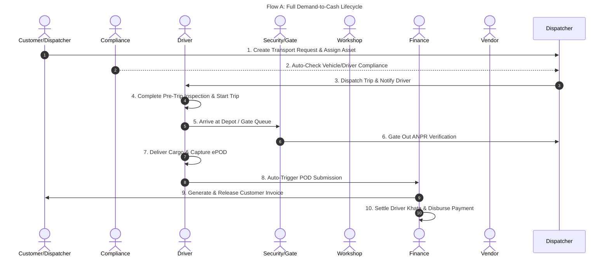
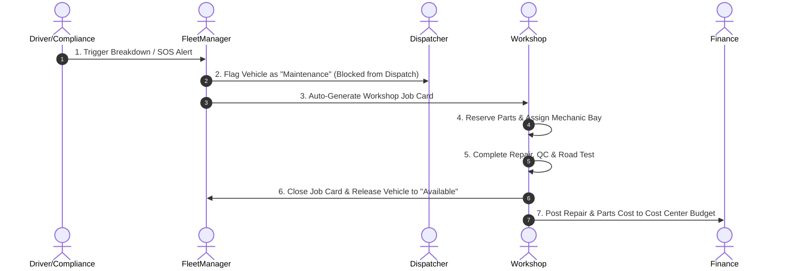
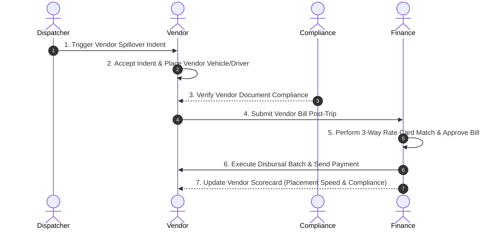

# ArgoLogics Fleet Management System (FMS)
## Master Manual Testing Guide & Inter-Portal Workflow Verification

This document provides a complete, step-by-step manual testing framework for the ArgoLogics Fleet Management System (FMS). It covers independent portal feature testing and multi-portal end-to-end data propagation workflows to verify real-time data sync, state transitions, and compliance enforcement across portals.

---

## 1. System Setup & Fast Access Credentials

### 1.1 Prerequisites & Launch Commands
Ensure both the backend API and frontend dev server are running:

```bash
# Terminal 1: Backend API (http://localhost:3000)
cd backend
npx prisma db push
npx prisma db seed
npm run start:dev

# Terminal 2: Frontend Client (http://localhost:5173)
cd frontend
npm run dev
```

### 1.2 Seeded Test Accounts
The login screen (`http://localhost:5173/login`) provides **⚡ Fast Access 1-Click Auto-Fill** buttons for instant session creation:

| Portal Workspace | User Email | Password | Role | Primary Scope |
| :--- | :--- | :--- | :--- | :--- |
| 🔧 **Administrator** | `admin@fleetos.com` | `password123` | `ADMIN` | Full System & Direct Switch |
| ⚡ **Dispatcher** | `dispatcher@fleetos.com` | `password123` | `DISPATCHER` | Trip Scheduling & Gate Queue |
| 🚚 **Fleet Manager** | `manager@fleetos.com` | `password123` | `FLEET_MANAGER` | Vehicle/Driver Asset Master |
| ⚖️ **Compliance Manager** | `compliance@fleetos.com` | `password123` | `COMPLIANCE_MANAGER` | Statutory, Penalties & Holds |
| 🛠️ **Workshop Manager** | `workshop@fleetos.com` | `password123` | `WORKSHOP_MANAGER` | Repair Cards, Bays & PM |
| 💰 **Finance Manager** | `finance@fleetos.com` | `password123` | `FINANCE_MANAGER` | Budgets, Bills & Disbursal |
| 🤝 **Vendor Portal** | `vendor@fleetos.com` | `password123` | `VENDOR` | Indents & Bill Submission |
| 📱 **Driver Portal** | `driver@fleetos.com` | `password123` | `DRIVER` | Trips, ePOD & Driver Khata |

---

## 2. Individual Portal Feature Testing Workflows

---

### 🔧 2.1 Admin Suite (`/admin/*`)

#### Overview
The Admin Suite governs organizational structures, role-based access controls (RBAC), approval engine flows, rule pack definitions, integrations, and tamper-evident audit logging.

#### Key Routes & Modules
- `/admin/dashboard` — Admin Direct Switch Portal & System Metrics
- `/admin/org` — Visual Hierarchy Tree (Org → Region → Hub → Depot)
- `/admin/cost-centers` — Cost Center & Budget Allocation Register
- `/admin/users` — User Directory & Role Assignment Matrix
- `/admin/roles` — Role Capability Matrix & Scope Definitions
- `/admin/approval-flows` — Multi-Tier Approval Chain Configurator
- `/admin/rule-packs` — Regulatory & Compliance Rule Engine
- `/admin/integrations` — Telematics Connectors & Third-Party APIs
- `/admin/audit` — Immutable Hash-Chained Audit Trail Log

#### Test Scenarios

##### Test Case ADM-01: Organization Hierarchy & Cost Center Binding
1. Navigate to `/admin/org`.
2. Expand the tree nodes (`Delhi Regional Hub` → `North Depot`).
3. Click **"Add Sub-Node"**, enter name `East Hub Annex`, select type `HUB`, and click Save.
4. Navigate to `/admin/cost-centers` and click **"Create Cost Center"**.
5. Input code `CC-NORTH-09`, assign department `Logistics Operations`, and link to `East Hub Annex`.
6. **Expected Result**: The new node displays in the visual org tree, and the cost center is successfully created and queryable in financial transactions.

##### Test Case ADM-02: Role Capabilities & Segregation of Duties (SoD) Enforcement
1. Navigate to `/admin/roles` and click **"Create Custom Role"**.
2. Select base capability `TRIP_DISPATCH_CREATE` and attempt to add conflicting capability `VENDOR_BILL_APPROVE`.
3. Click Save.
4. **Expected Result**: System triggers Segregation of Duties (SoD) validation rule (`BR-FIN-02`), displaying a warning banner preventing a single user role from dispatching trips and approving self-generated vendor bills.

##### Test Case ADM-03: Tamper-Evident Audit Lineage Inspection
1. Navigate to `/admin/audit`.
2. Filter events by Entity `Vehicle` or Action `COMPLIANCE_OVERRIDE`.
3. Select an audit entry and view the SHA-256 hash hash-chain sequence (`hash` vs `prevHash`).
4. **Expected Result**: Complete event payload is rendered including `actorEmail`, `timestamp`, `beforeState`, `afterState`, and parent lineage link.

---

### ⚡ 2.2 Dispatcher Workspace (`/dispatcher/*`)

#### Overview
The Dispatcher Workspace manages incoming transport demand, vehicle-driver matching, live dispatch execution, gate queue management, and exception handling.

#### Key Routes & Modules
- `/dispatcher/dashboard` — Live Fleet Duty Board & Dispatch Metrics
- `/dispatcher/requests` — Transport Demand Intake & Approval Queue
- `/dispatcher/vehicles` — Vehicle Availability & Eligibility Matrix
- `/dispatcher/drivers` — Driver Roster & Duty Hour Counters
- `/dispatcher/trips` — Active Trip Dispatch & Live Tracking
- `/dispatcher/gate-queue` — ANPR Camera Feed & Gate Pass Register
- `/dispatcher/exceptions` — Geofence, Overspeed & Telematics Alerts

#### Test Scenarios

##### Test Case DISP-01: Transport Request Ingestion & Matching
1. Navigate to `/dispatcher/requests`.
2. Click **"Create Transport Request"** (e.g., Customer `Amazon North`, Origin `Delhi Hub`, Destination `Jaipur Site`, Capacity `10 Tonnes`, Priority `HIGH`).
3. Save request. The request status updates to `Unassigned`.
4. Click **"Dispatch / Assign Vehicle"**.
5. Inspect the eligibility matrix list.
6. **Expected Result**: Vehicles failing document compliance, fitness, or resting timers are disabled/greyed out with exact disqualification reason tags (e.g., `Insurance Expired`, `Rest Timer Pending`).

##### Test Case DISP-02: Trip Dispatch Creation
1. Select an available vehicle (`DL-01-EQ-9988`) and driver (`Rajesh Kumar`).
2. Click **"Confirm Trip Dispatch"**.
3. **Expected Result**:
   - Trip is generated with status `Scheduled`.
   - Vehicle status transitions from `Available` to `In Transit`.
   - Driver duty status transitions to `On Duty`.

##### Test Case DISP-03: ANPR Gate Pass Processing
1. Navigate to `/dispatcher/gate-queue`.
2. Locate entry for `DL-01-EQ-9988` or click **"Simulate ANPR Scan"**.
3. Upload/confirm security checklist photos (Seal Photo, Odometer Photo).
4. Click **"Authorize Gate Out"**.
5. **Expected Result**: Entry status updates to `Exited`, timestamp recorded, and trip state moves to `In Transit`.

---

### 🚚 2.3 Fleet Manager Portal (`/fleet/*`)

#### Overview
The Fleet Manager Portal handles physical asset management, telematics hardware monitoring, preventive maintenance tracking, and safety scoring.

#### Key Routes & Modules
- `/fleet/dashboard` — Fleet Asset Overview & Utilization Gauges
- `/fleet/vehicles` — Vehicle 360° Master Registry & Meter Logs
- `/fleet/drivers` — Driver Profiles, Credentials & Safety Rankings
- `/fleet/compliance` — Fleet Document Expiry Status Matrix
- `/fleet/maintenance` — PM Schedule & Breakdown Logs
- `/fleet/devices` — GPS Telematics Unit Status & Ping Logs

#### Test Scenarios

##### Test Case FLT-01: Vehicle Onboarding & Meter Management
1. Navigate to `/fleet/vehicles` and click **"Add New Vehicle"**.
2. Input Registration `HR-55-AB-1234`, Category `Owned`, Class `Container 32ft`, Initial Odometer `45,000 km`.
3. Click Save.
4. Open the vehicle 360° profile view.
5. Attempt to record an odometer entry of `44,500 km` (lower than current).
6. **Expected Result**: System rejects the entry with error `BR-VEH-03: Odometer value cannot be lower than current reading`.

##### Test Case FLT-02: Telematics Device Diagnostics
1. Navigate to `/fleet/devices`.
2. Search for device IMEI linked to vehicle `DL-01-EQ-9988`.
3. Inspect ping age and status indicators (`Online`, `Offline`, `Tampered`).
4. Select **"Trigger Diagnostics Ping"**.
5. **Expected Result**: Telematics latency, battery voltage, and raw GPS fix details update in real-time.

---

### ⚖️ 2.4 Compliance Manager Portal (`/compliance/*`)

#### Overview
The Compliance Manager Portal ensures statutory adherence across documents (RC, Fitness, Insurance, PUC, Permits), processes traffic challans, handles insurance claims, and manages emergency compliance holds.

#### Key Routes & Modules
- `/compliance/dashboard` — Compliance Heatmap & Active Hold Queue
- `/compliance/renewals/tasks` — Expiry Worklist & Statutory Tasks
- `/compliance/renewals/ocr` — Document Scan OCR Parser & Verifier
- `/compliance/challans/workbench` — Traffic Offense & Tribunal Builder
- `/compliance/insurance/policies` — Active Insurance Policy Registry
- `/compliance/incidents/360` — Incident & Breakdown Command Center

#### Test Scenarios

##### Test Case CMP-01: OCR Document Renewal Processing
1. Navigate to `/compliance/renewals/ocr`.
2. Upload a sample vehicle insurance PDF / image.
3. Click **"Run Intelligent OCR Extraction"**.
4. **Expected Result**: OCR auto-extracts Policy Number, Insurer Name, Valid From, Valid To, and IDV with high confidence score.
5. Click **"Verify & Apply to Master"**. Vehicle compliance status updates to `Valid`.

##### Test Case CMP-02: Compliance Hold & Authorization Override
1. Navigate to `/compliance/dashboard`.
2. Find vehicle `MH-12-PQ-4455` flagged with `Fitness Expired`.
3. Click **"Impose Compliance Hold"**. Status updates to `ComplianceHold`.
4. Click **"Emergency Override Authorization"**.
5. Input legal justification note and select temporary expiry grace window (24 Hours).
6. **Expected Result**: Temporary override badge is displayed, override audit event is written, and vehicle is temporarily unblocked for urgent movement.

---

### 🛠️ 2.5 Workshop Manager Portal (`/workshop/*`)

#### Overview
The Workshop Manager Portal executes repair job cards, preventive maintenance (PM) routines, mechanic assignment, bay scheduling, and inventory parts requests.

#### Key Routes & Modules
- `/workshop/dashboard` — Bay Occupancy & Active Maintenance Board
- `/workshop/job-cards` — Work Order Creation & Status Lifecycle
- `/workshop/board` — Visual Workshop Kanban Board
- `/workshop/pm-due` — PM Calendar & Grace/Lock Controls
- `/workshop/estimates` — Repair Cost Estimation & Approvals
- `/workshop/parts-demand` — Parts Requisition & Stock Allocations
- `/workshop/mechanics` — Mechanic Roster & Skill Assignment

#### Test Scenarios

##### Test Case WSH-01: Job Card Creation & Bay Assignment
1. Navigate to `/workshop/job-cards` and click **"Create Job Card"**.
2. Select Vehicle `DL-01-EQ-9988`, Complaint `Brake Pad Wear & Clutch Slipping`, Priority `HIGH`.
3. Assign Bay `Bay 02 - Heavy Repairs` and Lead Mechanic `Suresh Verma`.
4. Save Job Card.
5. Navigate to `/workshop/board`.
6. **Expected Result**: Job card card displays in `In Progress` column; `Bay 02` status transitions from `Available` to `Busy`.

##### Test Case WSH-02: Parts Demand & Stock Issuance
1. Open Job Card `JC-2026-0042` and switch to the **Parts Requisition** tab.
2. Add Part `Brake Pad Set Front` (Qty: 2) and Part `Clutch Plate Assembly` (Qty: 1).
3. Click **"Submit Parts Demand"**.
4. Navigate to `/workshop/parts-demand`.
5. Click **"Fulfill & Issue Parts"**.
6. **Expected Result**: Parts status changes to `Reserved / Issued`, job card estimate cost updates dynamically, and inventory stock is deducted.

##### Test Case WSH-03: Quality Check (QC) & Road Test Completion
1. Move Job Card status to `QC Pending`.
2. Complete QC Checklist items (Torque check, Fluid levels, Safety check). Mark all as `Passed`.
3. Set Road Test Status to `Passed` with inspector notes.
4. Click **"Close & Post Job Card Costs"**.
5. **Expected Result**: Job Card status moves to `Completed`, bay is released to `Available`, vehicle maintenance status updates in Fleet Portal.

---

### 💰 2.6 Finance Manager Portal (`/finance/*`)

#### Overview
The Finance Manager Portal controls department budgets, vendor bill matching, customer invoicing, payment disbursals, driver khata settlements, and ERP ledger integration.

#### Key Routes & Modules
- `/finance/dashboard` — Financial KPI Overview & Cash Flow Metrics
- `/finance/budget` — Cost Center Budget vs Actual Tracker
- `/finance/vendor-bills` — Vendor Bill 3-Way Match & Deviation Queue
- `/finance/customer-invoices` — Customer Billing & POD Release Trigger
- `/finance/payments` — Disbursal Batch Runs (Bank/FASTag/Fuel Card)
- `/finance/driver-settlements` — Driver Advance, Bhatta & Expense Settlement
- `/finance/approvals` — Financial Multi-Step Approvals Desk
- `/finance/exports` — ERP Data Export Hub (SAP, Tally, CSV)

#### Test Scenarios

##### Test Case FIN-01: Vendor Bill 3-Way Auto-Matching & Tolerance Engine
1. Navigate to `/finance/vendor-bills` and click **"Ingest Vendor Bill"**.
2. Input Bill No `INV-VND-9921`, Vendor `Northline Logistics`, Trip Ref `TRIP-2026-8801`, Billed Amount `₹45,500`.
3. System checks expected trip rate (`₹45,000`). Deviation is `₹500` (within 2% tolerance threshold).
4. Click **"Run Automated 3-Way Match"**.
5. **Expected Result**: Auto-match status evaluates to `Matched (Auto-Passed)`, bill transitions to `Approved`, skipping manual deviation queue.

##### Test Case FIN-02: Customer POD-Triggered Invoice Generation
1. Navigate to `/finance/customer-invoices`.
2. Locate Trip `TRIP-2026-8801` with verified ePOD.
3. Click **"Generate Customer Invoice"**.
4. Review base freight charges, loading charges, and GST calculation (12% GTA).
5. Click **"Approve & Release Invoice"**.
6. **Expected Result**: Customer Invoice status becomes `Released`, invoice pdf generation is enabled, and AR ledger entry is posted.

##### Test Case FIN-03: Driver Settlement & Payment Batch Run
1. Navigate to `/finance/driver-settlements`.
2. Select Trip `TRIP-2026-8801` for Driver `Rajesh Kumar`.
3. Review auto-computed figures: Trip Advance `₹5,000`, Bhatta Allowances `₹1,200`, Fuel Receipts `₹8,500`, Net Disbursal `₹4,700`.
4. Click **"Approve Settlement Draft"**.
5. Navigate to `/finance/payments` and click **"Create Payment Batch"**.
6. Select payment mode `UPI Batch`, add driver settlement, and click **"Execute Batch Run"**.
7. **Expected Result**: Payment batch status transitions to `Released`, bank transaction reference is stored, driver khata balance updates.

---

### 🤝 2.7 Vendor Portal (`/vendor/*`)

#### Overview
The Vendor Portal enables external transport vendors to accept indents, assign market vehicles/drivers, track vehicle compliance, submit bills, and inspect performance scorecards.

#### Key Routes & Modules
- `/vendor/dashboard` — Vendor Operational Summary & Indent Feed
- `/vendor/indents` — Open Trip Indents & Spot Bidding Inbox
- `/vendor/placements` — Vehicle & Driver Placement Console
- `/vendor/fleet` — Vendor Managed Vehicles & Documents
- `/vendor/drivers` — Vendor Driver Roster & Verifications
- `/vendor/bills` — Vendor Bill Submission & Status Tracking
- `/vendor/scorecard` — Vendor Performance & Placement Rating

#### Test Scenarios

##### Test Case VND-01: Spot Indent Acceptance & Vehicle Placement
1. Log in as Vendor (`vendor@fleetos.com`) and navigate to `/vendor/indents`.
2. Locate unassigned indent `IND-2026-0089` (Route: `Delhi → Jaipur`).
3. Click **"Accept Indent"**.
4. In `/vendor/placements`, assign Vendor Vehicle `RJ-14-GC-5544` and Driver `Vikram Singh`.
5. Upload driver DL scan and click **"Confirm Placement"**.
6. **Expected Result**: Placement record updates to `Placed`; assigned vehicle details populate in Dispatcher Workspace.

##### Test Case VND-02: Vendor Bill Submission
1. Navigate to `/vendor/bills` and click **"Submit New Bill"**.
2. Select completed trip `TRIP-2026-8801`, attach bill PDF, input claimed amount `₹45,000`.
3. Click **"Submit for Verification"**.
4. **Expected Result**: Bill status changes to `Submitted / Pending Audit`; bill appears instantly in Finance Manager's Vendor Bill workbench.

---

### 📱 2.8 Driver App / Portal (`/driver/*`)

#### Overview
The Driver App handles trip execution, route navigation, electronic Proof of Delivery (ePOD), fuel/expense logging, driver khata statement inspection, and emergency SOS alerts.

#### Key Routes & Modules
- `/driver/dashboard` — Current Active Trip & Quick Actions
- `/driver/trips` — Assigned Trip History & Route Checkpoints
- `/driver/inspection` — Pre-Trip Safety Checklist
- `/driver/pod` — Electronic Proof of Delivery (ePOD) Capture
- `/driver/khata` — Personal Driver Khata & Bhatta Ledger
- `/driver/sos` — Emergency Breakdown & Incident Trigger

#### Test Scenarios

##### Test Case DRV-01: Pre-Trip Inspection & Trip Commencement
1. Log in as Driver (`driver@fleetos.com`) and open `/driver/inspection`.
2. Complete inspection checklist: Tyres Check (`Pass`), Brake Inspection (`Pass`), Lights & Signals (`Pass`), Fuel Level (`85%`).
3. Take photo of vehicle front and click **"Submit Pre-Trip Inspection"**.
4. Navigate to `/driver/trips` and click **"Start Trip"**.
5. **Expected Result**: Inspection log is stored; trip status moves to `In Transit`; location updates start emitting.

##### Test Case DRV-02: Electronic Proof of Delivery (ePOD) Upload
1. Navigate to `/driver/pod` for active trip `TRIP-2026-8801`.
2. Enter Recipient Name `Amit Sharma`, Receiver Gate Stamp ID `STAMP-882`, Upload photo of signed delivery receipt.
3. Capture digital signature on canvas.
4. Click **"Submit ePOD"**.
5. **Expected Result**: ePOD status updates to `Completed / Uploaded`, trip milestone updates to `Delivered`, trigger sent to Finance for invoicing.

##### Test Case DRV-03: Emergency SOS Alert Activation
1. Tap the **"🚨 SOS Emergency"** button from any driver screen.
2. Select Incident Type `Breakdown / Engine Failure`, input location note `NH-48 Km 112`.
3. Click **"Send Emergency SOS"**.
4. **Expected Result**: High-priority alert banner triggers across Dispatcher and Compliance dashboards with precise vehicle coordinates.

---

## 3. End-to-End Inter-Portal Connectivity Workflows

This section tests cross-portal data propagation, multi-role interactions, and system state synchronization.



---

### 🔄 Thread A: Demand-to-Cash End-to-End Lifecycle

#### Objective
Verify that creating a transport request flows seamlessly through dispatching, compliance verification, driver execution, gate exit, POD capture, customer invoicing, and driver settlement.

#### Step-by-Step Execution Path

1. **Step 1: Create Demand (Dispatcher Workspace)**
   - Log in as **Dispatcher** (`dispatcher@fleetos.com`).
   - Navigate to `/dispatcher/requests` → Click **"Create Transport Request"**.
   - Input: Customer `Tata Steel`, Route `Delhi Hub → Mumbai Depot`, Cargo `Steel Coils`, Required Capacity `24 Tonnes`.
   - Result: Request `REQ-2026-9901` is created with status `Unassigned`.

2. **Step 2: Asset Matching & Dispatch (Dispatcher Workspace)**
   - Click **"Assign Vehicle & Driver"**.
   - Select Vehicle `DL-01-EQ-9988` and Driver `Rajesh Kumar`.
   - Click **"Confirm Trip Dispatch"**.
   - Result: Trip `TRIP-2026-9901` is generated; vehicle status changes to `In Transit`.

3. **Step 3: Pre-Trip Checklist & Trip Start (Driver App)**
   - Switch session / log in as **Driver** (`driver@fleetos.com`).
   - Open `/driver/inspection` → Complete Pre-trip safety checklist → Click **"Submit Inspection"**.
   - Open `/driver/trips` → Click **"Start Trip"**.
   - Result: Pre-trip log is saved; Trip `TRIP-2026-9901` state updates to `In Transit`.

4. **Step 4: Gate Pass Clearance (Dispatcher Gate Queue)**
   - Switch to **Dispatcher** (`dispatcher@fleetos.com`) → Navigate to `/dispatcher/gate-queue`.
   - Locate `DL-01-EQ-9988` → Verify Security Seal & Odometer photo → Click **"Authorize Gate Out"**.
   - Result: Gate Entry status changes to `Exited`; timestamp logged in trip state timeline.

5. **Step 5: ePOD Capture (Driver App)**
   - Switch to **Driver** (`driver@fleetos.com`) → Navigate to `/driver/pod`.
   - Capture recipient signature and upload delivery document photo → Click **"Submit ePOD"**.
   - Result: Trip status changes to `Completed`; POD document link attached to trip.

6. **Step 6: Customer Invoicing (Finance Manager Portal)**
   - Log in as **Finance Manager** (`finance@fleetos.com`) → Navigate to `/finance/customer-invoices`.
   - Filter by completed trip `TRIP-2026-9901`.
   - Verify POD document attachment → Click **"Generate Customer Invoice"**.
   - Result: Customer Invoice `INV-2026-5511` is created with status `Released`.

7. **Step 7: Driver Khata Settlement (Finance Manager Portal)**
   - Navigate to `/finance/driver-settlements`.
   - Locate settlement for `TRIP-2026-9901` (Driver: `Rajesh Kumar`).
   - Click **"Approve & Execute Settlement"**.
   - Result: Net settlement amount credited to Driver Khata ledger; transaction audited in `/admin/audit`.

---

### 🔄 Thread B: Vehicle Breakdown, Maintenance & Workshop Cost Posting Flow

#### Objective
Verify that logging a vehicle breakdown blocks the vehicle from dispatch, routes it to the workshop for repair, consumes parts inventory, updates maintenance records, and posts costs back to finance.



#### Step-by-Step Execution Path

1. **Step 1: Breakdown Notification (Driver App / Compliance Portal)**
   - Log in as **Driver** (`driver@fleetos.com`) or **Compliance Manager** (`compliance@fleetos.com`).
   - Trigger SOS/Breakdown alert for vehicle `HR-55-AB-1234` (Reason: `Engine Overheating`).
   - Result: Incident `INC-2026-031` logged; vehicle status transitions to `Maintenance`.

2. **Step 2: Dispatch Block Verification (Dispatcher Workspace)**
   - Log in as **Dispatcher** (`dispatcher@fleetos.com`) → Navigate to `/dispatcher/vehicles`.
   - Attempt to assign vehicle `HR-55-AB-1234` to a new transport request.
   - Result: Vehicle is disabled with reason tag `Under Active Workshop Repair (INC-2026-031)`.

3. **Step 3: Job Card Execution & Bay Assignment (Workshop Manager Portal)**
   - Log in as **Workshop Manager** (`workshop@fleetos.com`) → Navigate to `/workshop/job-cards`.
   - Open auto-created Job Card `JC-2026-088` for `HR-55-AB-1234`.
   - Assign Bay `Bay 01` and Mechanic `Anil Sharma`.
   - Change status to `In Progress`.
   - Result: Workshop Board reflects bay occupancy; vehicle downtime counter starts.

4. **Step 4: Parts Allocation & Inventory Deduction (Workshop Manager Portal)**
   - Within Job Card `JC-2026-088`, navigate to **Parts Requisition**.
   - Add Part `Radiator Coolant Assembly` (Qty: 1) and `Thermostat Valve` (Qty: 1) → Click **"Submit & Issue Parts"**.
   - Result: Inventory stock for parts is updated; actual cost updates on Job Card.

5. **Step 5: QC Completion & Asset Release (Workshop Manager Portal)**
   - Complete QC checklist and Road Test → Click **"Close & Release Job Card"**.
   - Result: Job card status becomes `Completed`; vehicle status automatically returns to `Available` in Fleet and Dispatcher portals.

6. **Step 6: Financial Cost Posting (Finance Manager Portal)**
   - Log in as **Finance Manager** (`finance@fleetos.com`) → Navigate to `/finance/budget`.
   - Inspect Cost Center `CC-NORTH-01` (Maintenance Expense Head).
   - Result: Actual repair expenses from `JC-2026-088` are posted against the allocated monthly budget.

---

### 🔄 Thread C: Vendor Indent, Placement, Billing & Scorecard Update Flow

#### Objective
Verify end-to-end data transfer when dispatching an unassigned load to a third-party vendor, tracking vehicle placement, validating vendor bills against contracts, and updating vendor scorecards.



#### Step-by-Step Execution Path

1. **Step 1: Spillover Indent Trigger (Dispatcher Workspace)**
   - Log in as **Dispatcher** (`dispatcher@fleetos.com`).
   - Select Transport Request `REQ-2026-7744` → Click **"Trigger Vendor Indent Spill"**.
   - Select Preferred Vendor `Northline Logistics`.
   - Result: Indent `IND-2026-091` published to vendor inbox.

2. **Step 2: Indent Acceptance & Asset Placement (Vendor Portal)**
   - Log in as **Vendor** (`vendor@fleetos.com`) → Navigate to `/vendor/indents`.
   - Click **"Accept Indent"** for `IND-2026-091`.
   - Navigate to `/vendor/placements` → Assign Vehicle `RJ-14-GC-5544` and Driver `Vikram Singh` → Click **"Confirm Placement"**.
   - Result: Placement record updates to `Placed`.

3. **Step 3: Document Validation (Compliance Manager Portal)**
   - Compliance system runs background verification on `RJ-14-GC-5544`.
   - Result: Vehicle documents are verified `Valid`; vehicle is cleared for gate entry.

4. **Step 4: Bill Submission (Vendor Portal)**
   - Upon trip completion, vendor logs into `/vendor/bills` → Clicks **"Submit Vendor Bill"**.
   - Select Trip `TRIP-2026-091`, Enter Claimed Amount `₹38,000`, attach invoice PDF → Click **"Submit"**.
   - Result: Bill `VBILL-2026-441` submitted to Finance queue.

5. **Step 5: 3-Way Rate Matching & Disbursal (Finance Manager Portal)**
   - Log in as **Finance Manager** (`finance@fleetos.com`) → Navigate to `/finance/vendor-bills`.
   - Select `VBILL-2026-441` → Click **"Run Automated 3-Way Match"**.
   - System matches contract rate (`₹38,000`) vs billed (`₹38,000`) → Status: `Matched`.
   - Navigate to `/finance/payments` → Add bill to **Payment Run** → Click **"Release Disbursal"**.
   - Result: Payment status set to `Paid`.

6. **Step 6: Scorecard Update (Vendor Portal & Admin Suite)**
   - Navigate to `/vendor/scorecard` as Vendor or Admin.
   - Result: Vendor score increases based on on-time placement (100%) and document compliance (100%).

---

### 🔄 Thread D: Statutory Compliance Expiry, Auto-Hold & Emergency Override

#### Objective
Verify that when a vehicle document expires, the system automatically imposes a `ComplianceHold`, blocking dispatch across portals, and tests the emergency override audit trail.

#### Step-by-Step Execution Path

1. **Step 1: Trigger Document Expiry (Compliance Manager Portal)**
   - Log in as **Compliance Manager** (`compliance@fleetos.com`).
   - Navigate to `/compliance/dashboard`.
   - Select Vehicle `MH-12-PQ-4455` and set Fitness Document status to `Expired` (or simulate expiry).
   - Result: System engine immediately sets vehicle status to `ComplianceHold`.

2. **Step 2: Verify Inter-Portal Dispatch Block (Dispatcher Workspace)**
   - Log in as **Dispatcher** (`dispatcher@fleetos.com`) → Navigate to `/dispatcher/requests`.
   - Attempt to assign `MH-12-PQ-4455` to an active request.
   - Result: Vehicle is disabled with hard-stop banner: `BLOCKED: Vehicle is under ComplianceHold (Fitness Expired)`.

3. **Step 3: Emergency Override Authorization (Compliance Manager Portal)**
   - Log in as **Compliance Manager** (`compliance@fleetos.com`) → Navigate to `/compliance/dashboard`.
   - Select `MH-12-PQ-4455` → Click **"Emergency Override Authorization"**.
   - Input Reason: `Medical Supply Emergency Transit - 24h Waiver`, Select Manager Password authentication.
   - Result: Temporary override tag applied; vehicle temporarily unblocked for 24 hours.

4. **Step 4: Dispatch Under Override (Dispatcher Workspace)**
   - Return to `/dispatcher/requests` → Assign `MH-12-PQ-4455`.
   - Result: Dispatch succeeds; trip record stores flag `Dispatched under Compliance Override`.

5. **Step 5: Inspect Immutable Audit Trail (Admin Suite)**
   - Log in as **Administrator** (`admin@fleetos.com`) → Navigate to `/admin/audit`.
   - Search for Action `COMPLIANCE_OVERRIDE`.
   - Result: SHA-256 hash-chained event records `actorEmail`, `justification`, `timestamp`, and `targetVehicleId`.

---

## 4. Multi-Portal Data Synchronization Verification Matrix

Use this checklist during manual testing to confirm data propagation across portals:

| Initiating Action | Source Portal | Target Portal | Expected Synchronized State | Status |
| :--- | :--- | :--- | :--- | :---: |
| Assign Trip | Dispatcher | Driver Portal | Trip appears in active trips inbox with route checkpoints | [ ] |
| Submit Pre-Trip Inspection | Driver Portal | Fleet Manager | Odometer & pre-trip safety log update in Vehicle 360° | [ ] |
| Authorize Gate Out | Dispatcher | Driver & Fleet | Trip status moves to `In Transit`; gate log timestamp added | [ ] |
| Upload ePOD Photo | Driver Portal | Finance Portal | Customer invoice release trigger unlocked for trip | [ ] |
| Log Vehicle Breakdown | Driver / Compliance | Dispatcher & Fleet | Vehicle status transitions to `Maintenance`; dispatch blocked | [ ] |
| Open Job Card | Workshop Portal | Fleet Manager | Vehicle downtime counter starts in Fleet Maintenance board | [ ] |
| Complete Job Card | Workshop Portal | Dispatcher & Fleet | Vehicle status returns to `Available`; repair cost posted | [ ] |
| Accept Vendor Indent | Vendor Portal | Dispatcher Workspace | Vendor vehicle & driver assigned to dispatch run | [ ] |
| Document Expiry | Compliance | Dispatcher Workspace | Vehicle marked `ComplianceHold` and disabled in assignment | [ ] |
| Override Compliance Hold | Compliance | Admin Suite | SHA-256 audit entry written to immutable audit log | [ ] |
| Post Actual Expenses | Workshop / Driver | Finance Portal | Expenses deducted from Cost Center monthly budget | [ ] |
| Execute Disbursal Batch | Finance Portal | Vendor / Driver | Payment status updated to `Paid` in Vendor Bills & Khata | [ ] |

---

## 5. Summary & Manual Testing Best Practices

1. **Database Resets**: If test data becomes dirty or invalid during manual testing, run `npx prisma db seed` in `backend/` to reset database records to the clean initial state.
2. **Multi-Browser Testing**: Open two different browser windows (e.g., Chrome Normal Window for `Dispatcher` / `Finance` and Incognito Window for `Driver` / `Vendor`) to test real-time inter-portal updates side-by-side.
3. **Audit Hash Verification**: Always verify that critical financial and compliance overrides generate audit events in `/admin/audit`.
